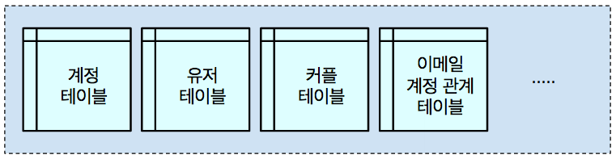
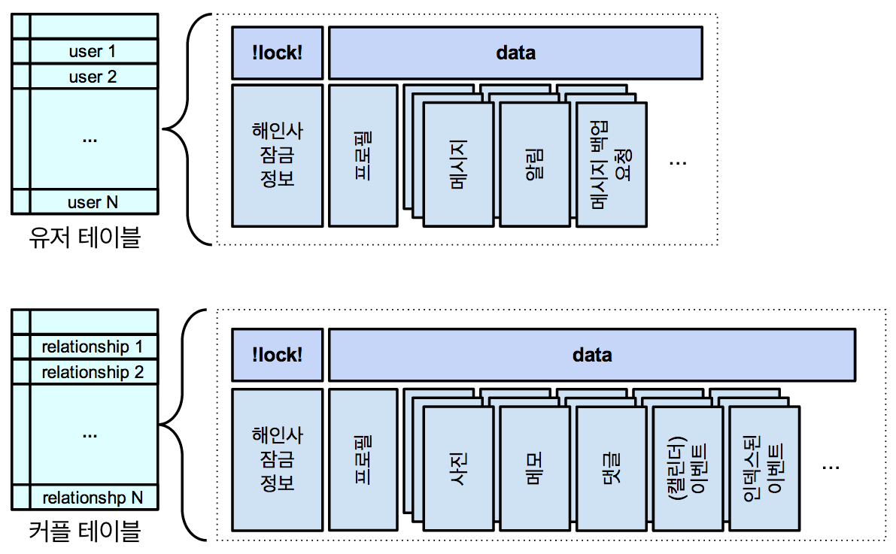
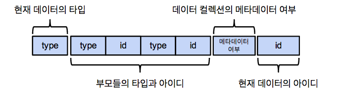
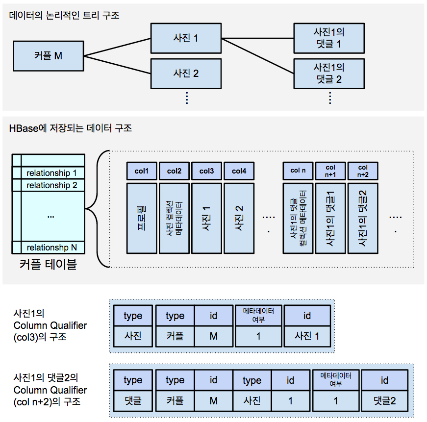

[비트윈]에서는 [HBase]를 메인 데이터베이스로 이용하고 있습니다.
유저 및 커플에 대한 정보와 커플들이 주고받은 메시지, 업로드한 사진 정보, 메모, 기념일, 캘린더 등 서비스에서 만들어지는 다양한 데이터를 HBase에 저장합니다.
HBase는 일반적인 NoSQL과 마찬가지로 스키마를 미리 정의하지 않습니다. 대신 주어진 API를 이용해 데이터를 넣기만 하면 그대로 저장되는 성질을 가지고 있습니다.
이런 점은 데이터의 구조가 바뀔 때 별다른 스키마 변경이 필요 없다는 등의 장점으로 설명되곤 하지만, 개발을 쉽게 하기 위해서는 데이터를 저장하는데 어느 정도의 규칙이 필요합니다.
이 글에서는 비트윈이 데이터를 어떤 구조로 HBase에 저장하고 있는지에 대해서 이야기해 보고자 합니다.

## [비트윈에서 HBase에 데이터를 저장하는 방법](id:hbase-schema-summary)

- **[Thrift]를 이용해 데이터 저장**: Apache Thrift는 자체적으로 정의된 문법을 통해 데이터 구조를 정의하고 이를 직렬화/역직렬화 시킬 수 있는 기능을 제공합니다.
  비트윈에서는 서버와 클라이언트가 통신하기 위해 Thrift를 이용할 뿐만 아니라 HBase에 저장할 데이터를 정의하고 데이터 저장 시 직렬화를 위해 Thrift를 이용합니다.
- **하나의 Row에 여러 Column을 트리 형태로 저장**: HBase는 Column-Oriented NoSQL로 분류되며 하나의 Row에 많은 수의 Column을 저장할 수 있습니다.
  비트윈에서는 Column Qualifier를 잘 정의하여 한 Row에 여러 Column을 논리적으로 트리 형태로 저장하고 있습니다.
- **추상화된 라이브러리를 통해 데이터에 접근**: 비트윈에서는 HBase 클라이언트 라이브러리를 직접 사용하는 것이 아니라
  이를 래핑한 Datastore라는 라이브러리를 구현하여 이를 이용해 HBase의 데이터에 접근합니다.
  [GAE]의 [Datastore]와 인터페이스가 유사하며 실제 저장된 데이터들을 부모-자식 관계로 접근할 수 있게 해줍니다.
- **트랜잭션을 걸고 데이터에 접근**: HBase는 일반적인 NoSQL과 마찬가지로 트랜잭션을 제공하지 않지만
  비트윈에서는 자체적으로 제작한 트랜잭션 라이브러리인 [Haeinsa]를 이용하여 Multi-Row ACID 트랜잭션을 걸고 있습니다.
  Haeinsa 덕분에 성능 하락 없이도 데이터 무결성을 유지하고 있습니다.
- **Secondary Index를 직접 구현**: HBase에서는 데이터를 Row Key와 Column Qualifier를
  사전식 순서(lexicographical order)로 정렬하여 저장하며 정렬 순서대로 Scan을 하거나 바로 임의 접근할 수 있습니다.
  하지만 비트윈의 어떤 데이터들은 하나의 Key로 정렬되는 것으로는 충분하지 않고 Secondary Index가 필요한 경우가 있는데, HBase는 이런 기능을 제공하지 않고 있습니다.
  비트윈에서는 Datastore 라이브러리에 구현한 Trigger을 이용하여 매우 간단한 형태의 Secondary Index를 만들었습니다.

## [비트윈 HBase 데이터 구조 해부](id:anatomy-of-schema)

[페이스북의 메시징 시스템][facebookmsgschema]에 관해 소개된 글이나,
GAE의 [Datastore에 저장되는 구조][gaedatastoreschema]를 설명한 글을 통해 HBase에 어떤 구조로 데이터를 저장할지 아이디어를 얻을 수 있습니다.
비트윈에서는 이 글과는 약간 다른 방법으로 HBase에 데이터를 저장합니다. 이에 대해 자세히 알아보겠습니다.

### [전반적인 구조](id:data-schema-overview)

비트윈에서는 **데이터를 종류별로 테이블에 나누어 저장**하고 있습니다.
커플과 관련된 정보는 커플 테이블에, 유저에 대한 정보는 유저 테이블에 나누어 저장합니다.

<figcaption>각 객체와 관련된 정보는 각각의 HBase 테이블에 저장됩니다.</figcaption>

또한, **관련된 데이터를 하나의 Row에 모아 저장**합니다.
특정 커플과 관련된 사진, 메모, 사진과 메모에 달린 댓글, 기념일 등의 데이터는 해당 커플과 관련된 하나의 Row에 저장됩니다.
Haeinsa를 위한 Lock Column Family를 제외하면, **데이터를 저장하기 위한 용도로는 단 하나의 Column Family만 만들어 사용**하고 있습니다.

<figcaption>각 객체의 정보와 자식 객체들은 같은 Row에 저장됩니다. 
또한, 데이터는 기본적으로 하나의 Column Family에 저장됩니다.</figcaption>

이렇게 **한 테이블에 같은 종류의 데이터를 모아 저장하게 되면 [Region Split]하는 것이 쉬워**집니다.
HBase는 특정 테이블을 연속된 Row들의 집합인 [Region]으로 나누고 이 Region들을 여러 Region 서버에 할당하는 방식으로 부하를 분산합니다.
테이블을 Region으로 나눌 때 각 Region이 받는 부하를 고려해야 하므로 각 Row가 받는 부하가 전체적으로 공평해야 Region Split 정책을 세우기가 쉽습니다.
비트윈의 경우 커플과 관련된 데이터인 사진이나 메모를 올리는 것보다는 유저와 관련된 데이터인 메시지를 추가하는 트래픽이 훨씬 많은데,
한 테이블에 커플 Row와 유저 Row가 섞여 있다면 각 Row가 받는 부하가 천차만별이 되어 Region Split 정책을 세우기가 복잡해집니다.
[RegionSplitPolicy]를 구현하여 Region Split 정책을 잘 정의한다면 가능은 하지만 좀 더 쉬운 방법을 택했습니다.

또한, **한 Row에 관련된 정보를 모아서 저장하면 성능상 이점**이 있습니다.
기본적으로 한 커플에 대한 데이터들은 하나의 클라이언트 요청을 처리하는 동안 함께 접근되는 경우가 많습니다.
HBase는 같은 Row에 대한 연산을 묶어 한 번에 실행시킬 수 있으므로 이 점을 잘 이용하면 성능상 이득을 얻을 수 있습니다.
비트윈의 데이터 구조처럼 특정 Row에 수많은 Column이 저장되고 같은 Row의 Column들에 함께 접근하는 경우가 많도록 설계되어 있다면 성능 향상을 기대할 수 있습니다.
특히 Haeinsa는 한 트랜잭션에 같은 Row에 대한 연산은 커밋시 한 번의 RPC로 묶어 처리하므로 RPC에 드는 비용을 최소화합니다.
실제 비트윈에서 가장 많이 일어나는 연산인 메시지 추가 연산은 그냥 HBase API를 이용하여 구현하는 것보다 Haeinsa Transaction API를 이용해 구현하는 것이 오히려 성능이 좋습니다.

### [Column Qualifier의 구조](id:column-qualifier-structure)

비트윈은 커플들이 올린 사진 정보들을 저장하며, 또 사진들에 달리는 댓글 정보들도 저장합니다.
한 커플을 Root라고 생각하고 커플 밑에 달린 사진들을 커플의 자식 데이터, 또 사진 밑에 달린 댓글들을 사진의 자식 데이터라고 생각한다면,
비트윈의 데이터들을 논리적으로 트리 형태로 생각할 수 있습니다.
비트윈 개발팀은 **Column Qualifier를 잘 정의하여 실제로 HBase에 저장할 때에도 데이터가 트리 형태로 저장되도록 설계**하였습니다.
이렇게 트리 형태로 저장하기 위한 Key구조에 대해 자세히 알아보겠습니다.

Column Qualifier를 설계할 때 성능을 위해 몇 가지 사항들을 고려해야 합니다.
HBase에서는 한 Row에 여러 Column이 들어갈 수 있으며 Column들은 Column Qualifier로 정렬되어 저장됩니다.
[ColumnRangeFilter]를 이용하면 Column에 대해 정렬 순서로 Scan연산이 가능합니다.
이 때 원하는 데이터를 순서대로 읽어야 하는 경우가 있는데 **이를 위해 Scan시, 최대한 Sequential Read를 할 수 있도록 설계**해야 합니다.
또한, HBase에서 데이터를 읽어올 때, 실제로 데이터를 읽어오는 단위인 Block에 대해 캐시를 하는데 이를 [Block Cache]라고 합니다.
실제로 같이 접근하는 경우가 빈번한 데이터들이 **최대한 근접한 곳에 저장되도록 설계해야 Block Cache의 도움**을 받을 수 있습니다.

![HBase에 저장되는 데이터들의 Column Qualifier 예시][physicalrowstructure]

비트윈에서는 특정 커플의 사진이나 이벤트를 가져오는 등의 특정 타입으로 자식 데이터를 Scan해야하는 경우가 많습니다.
따라서 **특정 타입의 데이터를 연속하게 저장하여 최대한 Sequential Read가 일어나도록** 해야 합니다.
이 때문에 Column Qualifier가 가리키는 데이터의 타입을 맨 앞에 배치하여 같은 타입의 자식 데이터들끼리 연속하여 저장되도록 하였습니다.
만약 가리키는 데이터의 타입과 아이디가 Parent 정보 이후에 붙게 되면 사진 사이사이에 각 사진의 댓글 데이터가 끼어 저장됩니다.
이렇게 되면 사진들에 대한 데이터를 Scan시, 중간중간 저장된 댓글 데이터들 때문에 완벽한 Sequential Read가 일어나지 않게 되어 비효율적입니다.

이렇게 특정 타입의 자식들을 연속하게 모아 저장하는 묶음을 컬렉션이라고 합니다.
컬렉션에는 컬렉션에 저장된 자식들의 개수나 새로운 자식을 추가할 때 발급할 아이디 등을 저장하는 Metadata가 있습니다.
이 Metadata도 특정 Column에 저장되므로 Metadata를 위한 Column Qualifier가 존재합니다.
이를 위해 Column Qualifier에는 Column Qualifier가 자칭하는 데이터가 Metadata인지 표현하는 필드가 있는데, 특이하게도 메타데이터임을 나타내는 값이 1이 아니라 0입니다.
이는 Metadata가 컬렉션의 맨 앞쪽에 위치하도록 하기 위함입니다.
컬렉션을 읽을 때 보통 맨 앞에서부터 읽는 경우가 많고, 동시에 Metadata에도 접근하는 경우가 많은데,
이 **데이터가 인접하게 저장되어 있도록 하여 Block Cache 적중이 최대한 일어나도록** 한 것입니다.

### [Datastore 인터페이스](id:datastore-interface)

비트윈에서는 이와 같은 데이터 구조에 접근하기 위해 Datastore라는 라이브러리를 구현하여 이를 이용하고 있습니다.
HBase API를 그대로 이용하는 것보다 좀 더 쉽게 데이터에 접근할 수 있습니다.
[GAE]의 [Datastore]와 같은 이름인데, 실제 인터페이스도 매우 유사합니다. 이 라이브러리의 인터페이스에 대해 간단히 알아보겠습니다.

**`Key`는 Datastore에서 HBase에 저장된 특정 데이터를 지칭하기 위한 클래스**입니다.
논리적으로 트리 형태로 저장된 데이터 구조를 위해 부모 자식 관계를 이용하여 만들어 집니다.

    Key parentKey = new Key(MType.T_RELATIONSHIP, relId);
    Key photoKey = new Key(parentKey, MType.T_PHOTO, photoId); // 특정 커플 밑에 달린 사진에 대한 키

Datastore는 `Key`를 이용해 Row Key와 Column Qualifier를 만들어 낼 수 있습니다.
Datastore는 이 정보를 바탕으로 **HBase에 새로운 데이터를 저장하거나 저장된 데이터에 접근**할 수 있는 메서드를 제공합니다.
아래 코드에서 `MUser` 클래스는 Thrift로 정의하여 자동 생성된 클래스이며, Datastore에서는 이 객체를 직렬화 하여 HBase에 저장합니다.

    MUser user = new MUser();
    user.setNickname("Alice");
    user.setGender(Gender.FEMALE);
    user.setStatus("Hello World!");

    Key userKey = new Key(MType.T_USER, userId);
    getDatastore().put(userKey, user);
    user = getDatastore().get(userKey);
    getDatastore().delete(userKey);

또한, Datastore는 **`Key`를 범위로 하여 Scan연산이 할 수 있도록 인터페이스를 제공**합니다.
Java에서 제공하는 [Try-with-resource]문을 이용하여 [ResultScanner]를 반드시 닫을 수 있도록 하고 있습니다.
내부적으로 일단 특정 크기만큼 배치로 가져오고 더 필요한 경우 더 가져오는 식으로 구현되어 있습니다.

    try (CloseableIterable<KeyValue<Key, MPhoto>> entries =
            getDatastore().subSibling(fromKey, fromInclusive, toKey, toInclusive)) {
        for (KeyValue<Key, MPhoto> entry : entries) {
            // do something
        }
    }

### [Secondary Index 구현 방법](id:secondary-index)

HBase는 데이터를 Row Key나 Column Qualifier로 정렬하여 저장합니다.
이 순서로만 Sequential Read를 할 수 있으며 Key값을 통해 특정 데이터를 바로 임의 접근할 수 있습니다.
비트윈에서는 특정 달에 해당하는 이벤트들을 읽어오거나 특정 날짜의 사진들의 리스트를 조회하는 등 id 순서가 아니라 특정 값을 가지는 데이터를 순서대로 접근해야 하는 경우가 있습니다.
이럴 때에도 효율적으로 데이터에 접근하기 위해서는 id로 정렬된 것 외에 특정 값으로 데이터를 정렬할 수 있어야 합니다.
하지만 HBase에서는 이와 같은 Secondary Index 같은 기능을 제공하지 않습니다.
비트윈 개발팀은 이에 굴하지 않고 **Secondary Index를 간단한 방법으로 구현하여 사용**하고 있습니다.

구현을 간단히 하기 위해 **Secondary Index를 다른 데이터들과 마찬가지로 특정 타입의 데이터로 취급하여 구현**하였습니다.
따라서 Index에 대해서도 Column Qualifier가 발급되며, 이때, Index에 해당하는 id를 잘 정의하여 원하는 순서의 Index를 만듭니다.
이런 식으로 원하는 순서로 데이터를 정렬하여 저장할 수 있으며 이 인덱스를 통해 특정 필드의 값의 순서대로 데이터를 조회하거나 특정 값을 가지는 데이터에 바로 임의 접근할 수 있습니다.
또한, Index에 실제 데이터를 그대로 복사하여 저장하여 [Clustered Index]처럼 동작하도록 하거나, Reference만 저장하여 [Non-Clustered Index]와 같이 동작하게 할 수도 있습니다.
Datastore 라이브러리에는 특정 데이터가 추가, 삭제, 수정할 때 특정 코드를 실행할 수 있도록 Trigger 기능이 구현되어 있는데, 이를 통해 Index를 업데이트합니다.
**데이터의 변경하는 연산과 Index를 업데이트하는 연산이 하나의 Haeinsa 트랜잭션을 통해 원자적으로 일어나므로 데이터의 무결성이 보장**됩니다.

## [못다 한 이야기](id:some-more-things)

각 테이블의 특정 Row의 Column들에 대한 Column Qualifier외에도 Row에 대한 Row Key를 정의 해야 합니다.
비트윈에서는 각 Row가 표현하는 Root객체에 대한 아이디를 그대로 Row Key로 이용합니다.
새로운 Root객체가 추가될 때 발급되는 **아이디는 랜덤하게 생성하여 객체가 여러 Region 서버에 잘 분산**될 수 있도록 하였습니다.
만약 Row Key를 연속하게 발급한다면 특정 Region 서버로 연산이 몰리게 되어 성능 확장에 어려움이 생길 수 있습니다.

데이터를 저장할 때 Thrift를 이용하고 있는데, Thrift 때문에 생기는 문제가 있습니다.
비트윈에서 서버를 업데이트할 때 서비스 중지 시간을 최소화하기 위해 [롤링 업데이트][betweenrollingupdate]를 합니다.
Thrift 객체에 새로운 필드가 생기는 경우, 롤링 업데이트 중간에는 일부 서버에만 새로운 Thift가 적용되어 있을 수 있습니다.
업데이트된 서버가 새로운 필드에 값을 넣어 저장했는데, **아직 업데이트가 안 된 서버가 이 데이터를 읽은 후 데이터를 다시 저장한다면 새로운 필드에 저장된 값이 사라지게** 됩니다.
Google [Protocol Buffer]의 경우, 다시 직렬화 할 때 [정의되지 않은 필드도 처리][protocol buffer updating]해주기 때문에 문제가 없지만, Thrift의 경우에는 그렇지 않습니다.
비트윈에서는 새로운 Thrift를 적용한 과거 버전의 서버를 먼저 배포한 후, 업데이트된 서버를 다시 롤링 업데이트를 하는 식으로 이 문제를 해결하고 있습니다.

<!--앞서 언급한 것과 같이, [ColumnRangeFilter]를 이용하여 Column들을 Scan합니다.
하지만 비트윈 개발 초기에는 [HBase에서 이 필터를 제공해 주지 않고][HBASE-3684] 있었습니다.
그래서 **처음에는 [직접 구현][CustomColumnRangeFilter]하여 사용**하였고, 지금은 HBase에서 제공하는 ColumnRangeFilter를 사용합니다.
공교롭게도 비트윈에서 구현한 클래스의 이름은 나중에 HBase에 추가된 클래스와 이름이 똑같습니다.-->

[비트윈]: http://between.us/
[hbase]: https://hbase.apache.org/
[thrift]: http://thrift.apache.org/
[haeinsa]: https://github.com/vcnc/haeinsa
[gae]: https://developers.google.com/appengine/
[datastore]: https://developers.google.com/appengine/articles/storage_breakdown
[ibmschema]: http://www.slideshare.net/Eweaver/bluerunner-building-an-email-service-in-the-cloud
[facebookmsgschema]: https://www.facebook.com/note.php?note_id=10150162742108920
[facebookmsgtimestampasid]: http://qconlondon.com/dl/qcon-london-2011/slides/KannanMuthukkaruppan_HBaseFacebook.pdf
[gaedatastoreschema]: https://developers.google.com/appengine/articles/storage_breakdown
[columnrangefilter]: https://hbase.apache.org/0.94/apidocs/org/apache/hadoop/hbase/filter/ColumnRangeFilter.html
[hbase-3684commit]: https://github.com/apache/hbase/commit/9a1d98f247cc9560c5450629ee9b5569af12a2e3
[hbase-3684]: https://issues.apache.org/jira/browse/HBASE-3684
[regionsplitpolicy]: http://hbase.apache.org/apidocs/org/apache/hadoop/hbase/regionserver/RegionSplitPolicy.html
[region split]: http://hortonworks.com/blog/apache-hbase-region-splitting-and-merging/
[block cache]: http://hortonworks.com/blog/hbase-blockcache-101/
[betweenrollingupdate]: https://speakerdeck.com/vcnc/biteuwin-seobeo-akitegceowa-geue-ddareun-baepo-bangbeob
[protocol buffer]: https://code.google.com/p/protobuf/
[protocol buffer updating]: https://developers.google.com/protocol-buffers/docs/proto#updating
[customcolumnrangefilter]: https://gist.github.com/eincs/674cefcaa1c6cb2859cd
[region]: https://hbase.apache.org/book/regions.arch.html
[try-with-resource]: http://docs.oracle.com/javase/tutorial/essential/exceptions/tryResourceClose.html
[resultscanner]: https://hbase.apache.org/apidocs/org/apache/hadoop/hbase/client/ResultScanner.html
[clustered index]: http://en.wikipedia.org/wiki/Database_index#Clustered
[non-clustered index]: http://en.wikipedia.org/wiki/Database_index#Non-clustered
