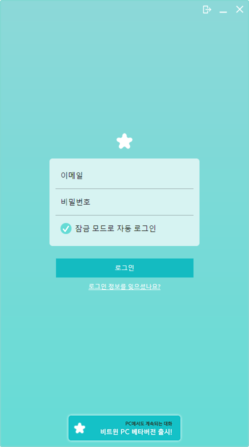
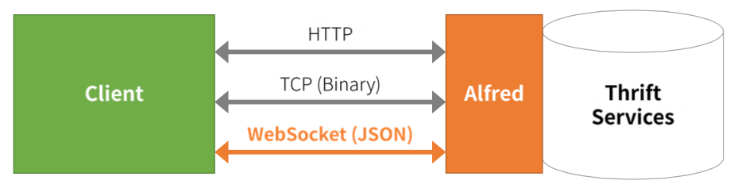
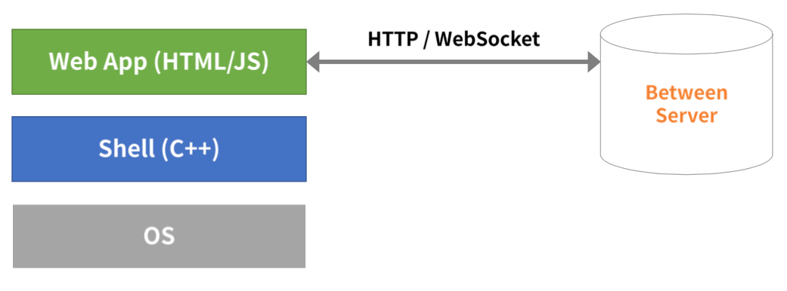

지난 10월 20일, [비트윈 PC 버전]의 오픈 베타 테스트를 시작했습니다. PC 버전
덕분에 컴퓨터 앞에서 일과 시간을 보내는 직장인들도 편리하게 비트윈으로 연인과
대화할 수 있게 되었습니다. 이 글에서는 PC 버전에 어떤 기술이 사용되었는지
소개하고 약 4개월의 개발 기간 동안 겪은 시행착오를 공유합니다.

<figcaption>비트윈 PC 버전 스크린샷</figcaption>

## 개발 플랫폼 선택

PC 버전 개발을 본격적으로 시작하기 전에 어떤 개발 플랫폼을 선택할 것인지 많은
고민을 했습니다. MFC나 WinForms 같은 네이티브 플랫폼, Qt 등의 크로스 플랫폼
라이브러리, 그리고 웹 기반 앱 등의 여러 후보를 가지고 토론을 거쳐 웹 앱으로
개발하기로 했습니다.

**웹 기반으로 개발하게 된 가장 큰 이유는 생산성입니다.** PC 버전 팀이 웹 기술에는
이미 익숙하지만 다른 플랫폼은 경험이 많지 않았습니다. 또한, 비교적 자유롭게
UI를 구성할 수 있으며 기존의 각종 개발 도구를 이용하면 빠른 이터레이션이 가능할
것으로 예상했습니다.

단, 사용자가 기존에 설치한 웹 브라우저를 통해 접속하는 방식이 아니라 **브라우저
엔진을 내장한 실행 파일을 배포하는 방식을 택하기로 했습니다.** 여러 브라우저
환경에 대응하지 않아도 되고, 브라우저에서 지원하지 않는 일부 시스템 기능을 직접
확장해서 사용할 수 있기 때문입니다.

## 서버 아키텍처의 변화

비트윈 서버의 서비스 로직은 [Thrift] 서비스로 구현되어 있습니다. 그리고
Alfred라는 자체 개발 라이브러리를 사용하여 Thrift 서비스를 [Netty] 기반의
서버로 구동합니다.

기존의 비트윈 모바일 클라이언트는 채팅 서버와 Thrift의 바이너리 프로토콜로
통신하고 있습니다.[^1] 그러나 웹 플랫폼에서는 서버와 지속적으로 양방향 연결을
유지하려면 [WebSocket] 프로토콜을 사용해야 하므로 **Alfred에 WebSocket 프로토콜
지원을 추가**하였습니다. 애플리케이션이 아닌 라이브러리 수준의 변화였기 때문에
**기존 서비스 코드에 영향을 거의 주지 않고 새로운 프로토콜을 지원**할 수 있었습니다.

<figcaption>Alfred에 웹소켓 지원을 추가하였습니다.</figcaption>

## 비트윈 PC 버전 셸

비트윈 PC 버전은 크게 **HTML과 자바스크립트로 작성된 웹 앱 부분**과 웹 앱을
브라우저 엔진으로 구동해주고 플랫폼 API를 제공하는 **셸 (Shell) 부분**으로 구성되어
있습니다.

<figcaption>비트윈 PC 버전 구조</figcaption>

**PC 버전 셸은 [Chromium Embedded Framework] (CEF)를 사용**합니다. 이름에서도 알 수
있듯이 Chromium 브라우저 엔진을 애플리케이션에 내장하기 쉽도록 감싸놓은
라이브러리입니다. CEF는 Evernote나 Steam 등 웹 브라우저를 내장한
애플리케이션에서 널리 사용되고 있어 선택하게 되었습니다.[^2]

**자바스크립트에서 셸이 제공하는 플랫폼 API를 호출할 때는 CEF의
[Message Router][cefmessagerouter]를 사용**하였습니다. Chromium은 멀티 프로세스
구조로 이루어져 있어, 렌더 프로세스에서 작동하는 자바스크립트 코드가 브라우저
프로세스에서 작동하는 C++ 코드를 호출하고 결과를 돌려받기 위해서는 별도의
처리가 필요합니다.
Message Router는 이 두 프로세스 사이의 비동기 통신을 지원합니다. 이를 통해 창 투명도
조절이나 트레이 알림 표시 등 원래는 웹 플랫폼에서 지원하지 않는 기능을 확장하여
지원할 수 있었습니다.

CEF에서는 [Chrome 개발자 도구][chromedevtools]를 사용할 수 있어 디버깅이
용이했고, **디자이너 옆에서 바로바로 좌표나 색상 등을 바꿔볼 수 있어 협업에도
도움**이 되었습니다.

그러나 PC 버전을 개발하면서 가장 많은 시행착오를 겪은 부분이 CEF를 다루는
것이었습니다.

- 문서화가 잘 되어있지 않습니다. 그래서 실제 작동 방식을 확인하기 위해 직접
  소스 코드를 읽어야 하는 경우가 많았습니다
- 일반적인 웹 브라우저에서는 잘 작동하는 API를 CEF가 자원하지 않거나 버그가
  있어 다른 방식으로 구현해야 할 때가 있습니다.
- CEF에 노출된 API에만 접근할 수 있어 Chromium에서 제공하는 플랫폼 추상화
  레이어를 활용할 수 없었습니다.

## 비트윈 PC 버전 웹 앱

비트윈 PC 버전의 주요 애플리케이션 코드는 HTML과 자바스크립트로 작성되어 있습니다.
자바스크립트로 큰 규모의 애플리케이션을 작성할 때 발생하는 여러 가지 어려움을 피하고자
[React] 라이브러리 및 최신 자바스크립트 기술을 적극적으로 활용하였습니다.

### React

[React]는 Facebook에서 개발한 오픈 소스 자바스크립트 UI 라이브러리입니다.
일반적인 웹사이트보다는 비교적 복잡한 인터페이스를 구현해야 했기 때문에
jQuery처럼 **간단한 라이브러리로는 부족할 것으로 생각하여 비트윈 PC 버전은
처음부터 React를 사용**하였습니다.

전통적인 개발 방식에서는 UI를 변경해야 할 때 기존에 렌더링 된 DOM 요소에 명령을
내립니다. 예를 들어 어떤 항목을 삭제하려면 그 요소를 찾아서 삭제 명령을 내리게
됩니다. React를 사용할 때는 이와 달리 해당 요소가 사라진 DOM 트리 전체를 다시
생성하면 React가 이전 트리와 새 트리를 비교하여 바뀐 부분만 반영해줍니다.
전체를 다시 렌더링하기 때문에 기존에 DOM 트리가 어떤 상태였는지 신경 쓰지
않고도 원하는 상태로 쉽게 변경할 수 있어 **UI 코드의 복잡도를 줄일 수 있습니다.**

또한, React의 컴포넌트 시스템은 독립적인 UI 요소들을 서로 영향을 주지 않고
조합할 수 있도록 해주어, 한가지 컴포넌트를 수정했을 때 의도하지 않은 다른
컴포넌트와 간섭하는 문제가 적게 발생합니다. 비트윈 PC 버전에는 약 40가지의 React
컴포넌트가 쓰이고 있습니다.

### 자바스크립트 모듈 시스템

모든 코드를 한 파일에 넣으면 코드를 관리하기가 힘들어집니다. 따라서 서로 관련
있는 코드끼리 모듈로 나누어야 하는데, 자바스크립트에는 모듈 시스템이
기본적으로는 제공되지 않습니다. 비트윈 PC 버전에서는 **[CommonJS] 표준을 따라서
모듈을 나누고, 이를 웹 브라우저가 해석할 수 있는 형태로 합쳐주는 [Webpack] 빌드
툴을 사용**했습니다.

Webpack은 자바스크립트뿐만 아니라 CSS나 이미지, JSON 파일 등도 모듈로 취급할 수
있고, 플러그인으로 지원하는 모듈 종류를 추가할 수 있습니다. 비트윈 PC 버전을
빌드할 때 실제로 사용하는 플러그인은 다음과 같은 것들이 있습니다.

- **[jsx-loader]**: React에서 사용하는 JSX 코드를 자바스크립트로 변환합니다.
  또한, 미래의 자바스크립트 문법을 현재 브라우저에서 지원하는 형태로 변환합니다.
- **[less-loader]**: [LESS] 파일을 CSS 파일로 변환합니다.
- **[css-loader]**: CSS에서 참조하는 외부 리소스를 인식하여 의존성을 파악해줍니다.
- **[url-loader]**: 파일 크기가 일정 이하인 리소스를 Base64 인코딩으로 내장해줍니다.

### ECMAScript 6

[ECMAScript 6]는 차기 자바스크립트 표준입니다. **현재 자바스크립트의 불편한 점을
많이 해소**하기 때문에 장점이 많이 있습니다. 일부 기능은 이미 브라우저에 구현되어
있지만, 아직 지원되지 않는 기능도 있어서 [jstransform]을 통해 ECMAScript 5
코드로 변환하여 사용하였습니다.

- **[화살표 함수][es6arrowfunc]**: 익명 함수를 `(a, b) => a + b`와 같은 문법으로
  훨씬 간단하게 선언할 수 있습니다.
  또한, `this` 변수의 스코프를 현재 코드 상의 위치에 따라 결정해줍니다.
- **[클래스][es6classes]**: 다른 언어와 유사한 클래스 문법을 제공합니다.
  상속이나 접근 제한도 가능합니다.
- **[해체(destructuring) 대입][es6destructuring]**: 객체의 필드를 바로 같은 이름의
  변수에 대입할 수 있습니다. 예를 들어, `var {a, b} = {a: 1, b: 2};` 같은 코드를
  작성할 수 있습니다.

### 기타 사용된 패키지

- **[RSVP.js]**: [Promise/A+] 구현을 제공하는 라이브러리로, Promise 패턴을 사용하여
  비동기 로직을 알아보기 쉬운 형태로 작성했습니다.
- **[FormatJS]**: 다국어, 국제화 지원을 위한 라이브러리입니다.
  UI 메시지 번역이나 날짜, 시간 등의 포매팅에 사용했습니다.

## 정리

- 비트윈 PC 버전은 개발 비용을 줄이기 위해 웹 플랫폼 기반의 네이티브
  애플리케이션으로 개발되었습니다.
- 비트윈 서버에서 사용하는 Alfred 라이브러리에 WebSocket 프로토콜 지원을 추가하였습니다.
- [Chromium Embedded Framework]를 브라우저 엔진으로 사용하여 웹 앱을 구동하고
  웹 플랫폼에서 제공하지 않는 기능을 확장하여 사용했습니다.
- 자바스크립트 코드의 복잡도를 줄이기 위해 [React], [CommonJS], [ECMAScript 6] 등의
  기술을 활용하였습니다.

[^1]: VCNC Engineering Blog, [비트윈 시스템 아키텍처](/2013-04-18-between-system-architecture), 2013년 4월
[^2]: Wikipedia, [Chromium Embedded Framework - Applications using CEF](http://en.wikipedia.org/wiki/Chromium_Embedded_Framework#Applications_using_CEF)

[비트윈 pc 버전]: http://between.us/pc/
[websocket]: https://www.websocket.org/
[thrift]: http://thrift.apache.org/
[netty]: http://netty.io/
[chromium embedded framework]: https://code.google.com/p/chromiumembedded/
[cefmessagerouter]: https://code.google.com/p/chromiumembedded/wiki/GeneralUsage#Asynchronous_Bindings
[chromedevtools]: https://developer.chrome.com/devtools
[nsis]: http://nsis.sourceforge.net/
[react]: http://facebook.github.io/react/
[commonjs]: http://www.commonjs.org/
[webpack]: http://webpack.github.io/
[less]: http://lesscss.org/
[jsx-loader]: https://www.npmjs.org/package/jsx-loader
[less-loader]: https://www.npmjs.org/package/less-loader
[css-loader]: https://www.npmjs.org/package/css-loader
[url-loader]: https://www.npmjs.org/package/url-loader
[jstransform]: https://www.npmjs.org/package/jstransform
[ecmascript 6]: http://tc39wiki.calculist.org/es6/
[es6arrowfunc]: http://wiki.ecmascript.org/doku.php?id=harmony:arrow_function_syntax
[es6classes]: https://people.mozilla.org/~jorendorff/es6-draft.html#sec-class-definitions
[es6destructuring]: https://people.mozilla.org/~jorendorff/es6-draft.html#sec-destructuring-assignment
[promise/a+]: https://promisesaplus.com/
[rsvp.js]: https://www.npmjs.org/package/rsvp
[formatjs]: http://formatjs.io/
