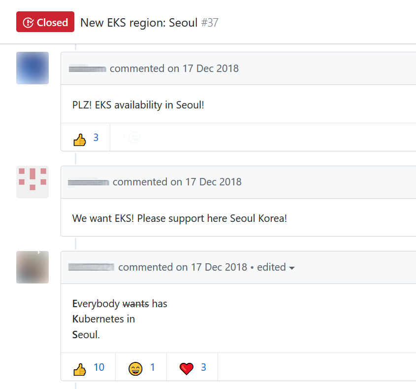
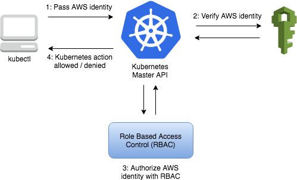
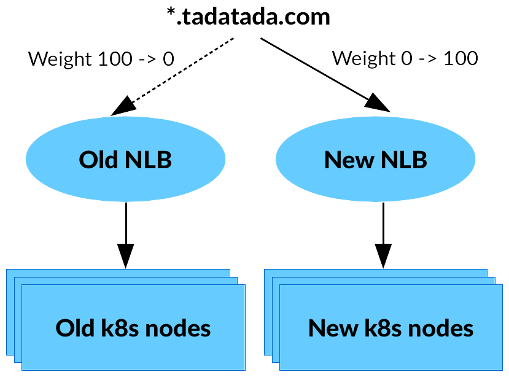

[Amazon EKS](https://aws.amazon.com/ko/eks/)는 AWS의 관리형 Kubernetes 서비스입니다. 2017년 11월 AWS re:Invent에서 프리뷰 버전이 출시되었고, 2018년 6월에 상용(GA) 버전이 미국 리전에만 출시되었습니다. 그래서 서울 리전을 사용해야 했던 [타다 프로젝트](/2019-01-28-tada-system-architecture/)에서는 Kubernetes 클러스터를 직접 [kops](https://github.com/kubernetes/kops)로 설치하여 운영할 수 밖에 없었습니다.

2019년 1월, 오랜 기다림 끝에 드디어 [서울 리전에 EKS가 출시](https://aws.amazon.com/ko/about-aws/whats-new/2019/01/amazon-eks-available-in-seoul-region/)되어 기쁜 마음으로 EKS로 옮겨가게 되었습니다. 이 글에서는 직접 구축한 클러스터 대비 EKS의 특징에는 어떤 것이 있는지 살펴보고, 서비스 중단 없이 EKS로 옮기기 위한 전략을 공유하고자 합니다.

<figcaption><a href="https://github.com/aws/containers-roadmap/issues/37">EKS 서울 리전 출시를 염원하던 한국인(?)들</a></figcaption>

## EKS는 뭐가 다른가요?

### AWS에서 마스터 노드를 관리해줍니다.

Kubernetes 클러스터는 마스터 노드와 워커 노드로 구성되어 있습니다. EKS는 이 중에서 마스터 노드를 직접 EC2로 띄울 필요 없이 AWS에서 관리해주는 서비스입니다. RDS를 사용할 때 직접 DB 인스턴스를 생성하지 않는 것과 비슷합니다. 별도의 설정 없이도 알아서 여러 가용 영역에 마스터 노드를 실행하여 HA(고가용성) 구성을 해주고, 비정상 마스터 노드를 자동으로 감지하고 교체합니다. 또한 자동화된 버전 업그레이드 및 패치를 지원합니다. EKS를 사용하더라도 워커 노드는 직접 EC2 인스턴스를 생성·관리해야 합니다.

EKS 클러스터의 요금은 2019년 2월 현재 시간당 $0.20입니다. 타다에서는 기존에 t2.medium 3대를 마스터 노드로 사용하고 있었기 때문에 관리를 직접 하지 않는 대신 비용이 약간 증가하게 되었습니다.

### AWS IAM 기반 인증을 사용합니다.

VCNC에서는 기존에 Kubernetes API에 접속할 때 가장 간단한 basic auth 인증 방식을 사용했습니다. 그 대신 외부 네트워크에서 접근할 수 없게 해두고 필요한 경우 Bastion 호스트를 통해 SSH 터널링하여 접속했습니다.

EKS의 API 서버는 인터넷에 노출되어 있으며, 별도로 네트워크 접근 제한 설정을 할 수 없고 AWS IAM으로 사용자를 인증합니다. (물론 공개망에 노출되어 있으면 Kubernetes API 서버에 보안 취약점이 발견되는 경우 안전하지 않을 수 있는 단점이 있습니다. 앞으로 [PrivateLink가 지원되면](https://github.com/aws/containers-roadmap/issues/22) 해결될 것입니다.)

IAM은 인증에만 사용되고, 특정 작업을 할 수 있는 권한은 Kubernetes 기본 RBAC로 관리됩니다. IAM 사용자나 역할을 RBAC 그룹에 매핑할 수 있습니다.

<figcaption>EKS 인증 흐름도</figcaption>

### 워커 노드 당 Pod 개수 제한이 있습니다.

예를 들어 c5.large 인스턴스에는 29개의 Pod을 띄울 수 있습니다. ([표 참고](https://github.com/awslabs/amazon-eks-ami/blob/7f6c8cb3597e17f6e5f7df96d12bccf5604dc909/files/eni-max-pods.txt)) 그러므로 기존 클러스터에서 노드 당 Pod이 몇 개나 되는지 미리 확인할 필요가 있습니다. 왜 이런 제약이 있을까요?

Kubernetes에서는 네트워킹 플러그인으로 Pod 사이에 네트워크 통신하는 방식을 다양하게 설정할
수 있습니다. EKS는 기본적으로 [amazon-vpc-cni-k8s](https://github.com/aws/amazon-vpc-cni-k8s)를 사용합니다. 이 네트워킹 플러그인은 VPC 상에서 유효한 실제 IP를 Pod에 할당합니다.

그러기 위해서는 하나의 EC2 인스턴스에서 여러 개의 IP를 받아와야 하고, 이를 위해 추가적인 네트워크 인터페이스(ENI)를 붙입니다. 그런데 인스턴스 타입에 따라 추가할 수 있는 ENI 수와 ENI 당 IP 수에 제한이 있습니다. 따라서 이 제한이 워커 노드 하나에 띄울 수 있는 Pod 개수 제한이 됩니다.

[flannel](https://github.com/coreos/flannel) 등 오버레이 네트워크 기반의 다른 네트워크 플러그인을 사용하면 이러한 제약을 피할 수 있습니다. 하지만 EKS에서 기본 제공하는 방법을 그대로 사용하는 것이 좋고, Pod을 엄청나게 많이 띄워야 하는 상황이 아니어서 시도하지 않았습니다.

## EKS로 중단 없이 넘어가기

### 개요

타다의 Kubernetes 클러스터에서 돌아가는 서비스들은 모두 영속적인(persistent) 상태를 가지고 있지 않습니다. 따라서 EKS 클러스터 위에 동일한 서비스를 띄우고 외부 트래픽을 옮겨주기만 하면 특별히 데이터를 옮기지 않고도 이전이 가능했습니다. 또한 거의 대부분의 Kubernetes 리소스는 [Helm](https://helm.sh/) 차트로 생성한 것이기 때문에 새로운 클러스터에 동일한 서비스를 띄우는 작업도 쉽게 할 수 있었습니다.

이전 작업은 다음과 같은 순서로 진행했습니다.

1. EKS 클러스터를 만들고 워커 노드를 생성
2. 모든 서비스 다시 설치
3. 트래픽을 새 클러스터로 보내기
4. 이전 클러스터 제거

### EKS 클러스터를 만들고 워커 노드를 생성

타다의 AWS 환경은 거의 모두 [Terraform](https://www.terraform.io/)으로 정의되어 관리되고 있습니다. EKS 클러스터와 워커 노드도 [HashiCorp Learn](https://learn.hashicorp.com/terraform/aws/eks-intro)의 문서를 참고해서 Terraform으로 생성했습니다. 해당 문서에 설명이 잘 되어
있어서 거의 그대로 따라할 수 있었습니다.

EKS 클러스터 설정은 재사용 가능하도록 Terraform 모듈로 만들었습니다. 덕분에 테스트용 클러스터와 실서비스용 클러스터를 동일한 모듈로 변수만 바꿔서 설정할 수 있었습니다.

### 모든 서비스 다시 설치

타다의 Kubernetes 리소스는 Helm 차트로 관리되고 있어서 기존 차트를 거의 그대로 설치할 수 있었습니다. 사용자에게 직접적인 영향을 덜 주는 워커 서비스를 먼저 설치해서 제대로 동작하는 것을 확인한 뒤, 마지막으로 프론트엔드 서비스를 설치하였습니다.

### 트래픽을 새 클러스터로 보내기

타다의 모든 트래픽은 [NLB](https://docs.aws.amazon.com/ko_kr/elasticloadbalancing/latest/network/introduction.html)로 들어온 뒤 NGINX를 거쳐 다시 적절한 Pod에 라우팅됩니다. 그러므로 타다의 모든 도메인은 NLB를 가리키고 있습니다.

타다는 Route 53을 DNS 서버로 사용합니다. Route 53에는 [가중치 기반 DNS 레코드](https://docs.aws.amazon.com/ko_kr/Route53/latest/DeveloperGuide/resource-record-sets-values-weighted-alias.html)를 설정할 수 있습니다. 이를 이용하여 일부 트래픽만 새 클러스터의 NLB로 보낼 수 있습니다. 처음에는 아주 적은 트래픽만 새 클러스터로 보내다가 문제 없이 작동하는 것을 확인한 다음 조금씩 트래픽을 늘려나갔습니다.

<figcaption>DNS 가중치 설정으로 일부 트래픽만 새 클러스터의 NLB로 보낼 수 있습니다.</figcaption>

DNS 설정에서 이전 클러스터로 가는 레코드를 완전히 제거한 뒤에도, DNS 캐시 등의 이유로 일부 클라이언트가 이전 클러스터에 접속할 수도 있습니다. 따라서, 이전 클러스터 NLB에 새 클러스터의 노드들을 붙여서 아직 DNS를 따라오지 못한 클라이언트들의 요청을 처리하였습니다.

### 이전 클러스터 제거

가장 신나면서 조심해야 하는 작업입니다. 먼저 이전 클러스터로 트래픽이 전혀 들어오지 않는 것을 확인하였습니다. 그 다음에는 Terraform에서 이전 클러스터 리소스에 대한 참조를 제거한 뒤, `terraform destroy` 명령으로 이전 클러스터와 관련된 리소스를 한번에 삭제할 수 있었습니다.

## 맺음말

Kubernetes는 깔끔한 추상화를 통해 컨테이너 기반 배포를 간단하게 만들어주지만, 직접 클러스터를 관리해야 하는 부담이 있었습니다. Amazon EKS는 이러한 부담을 많이 덜어주는 좋은 서비스입니다. 앞으로 EKS의 무궁한 발전을 기원합니다.

VCNC에는 오랫동안 쌓아온 AWS 인프라 운영 경험이 있습니다. 타다에서는 그동안의 경험과 비교적 최근에 시작한 프로젝트의 이점을 살려 컨테이너, Infrastructure as Code 등 업계 표준의 인프라 관리 방법론을 적극 도입하려고 노력하고 있습니다. 앞으로도 이에 관해 기술 블로그에 더 자세히 공유할 계획이니 기대해주세요. 또한 저희와 함께 안정적인 서비스를 만들어나갈 좋은 분들을 기다리고 있으니 VCNC 채용에도 많은 관심 부탁드립니다.
