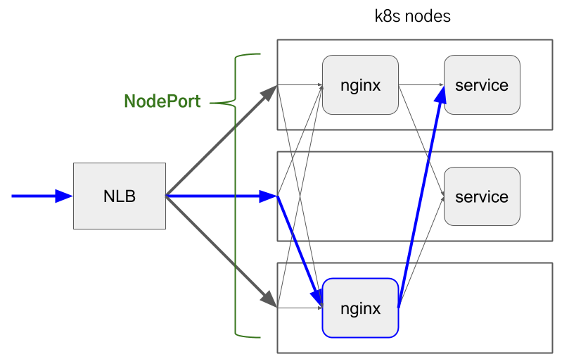
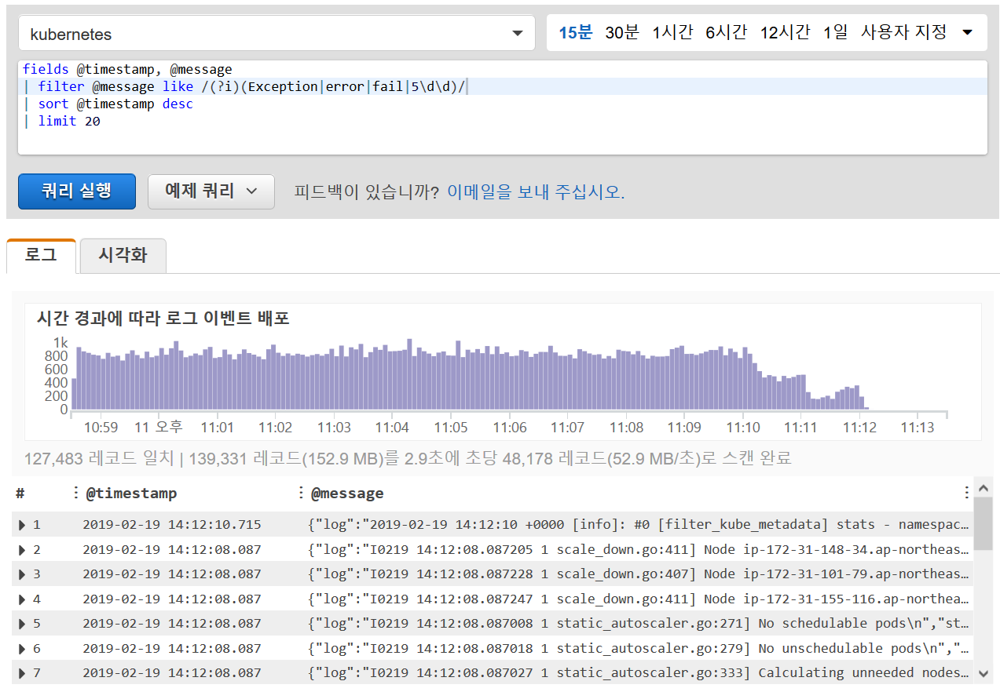
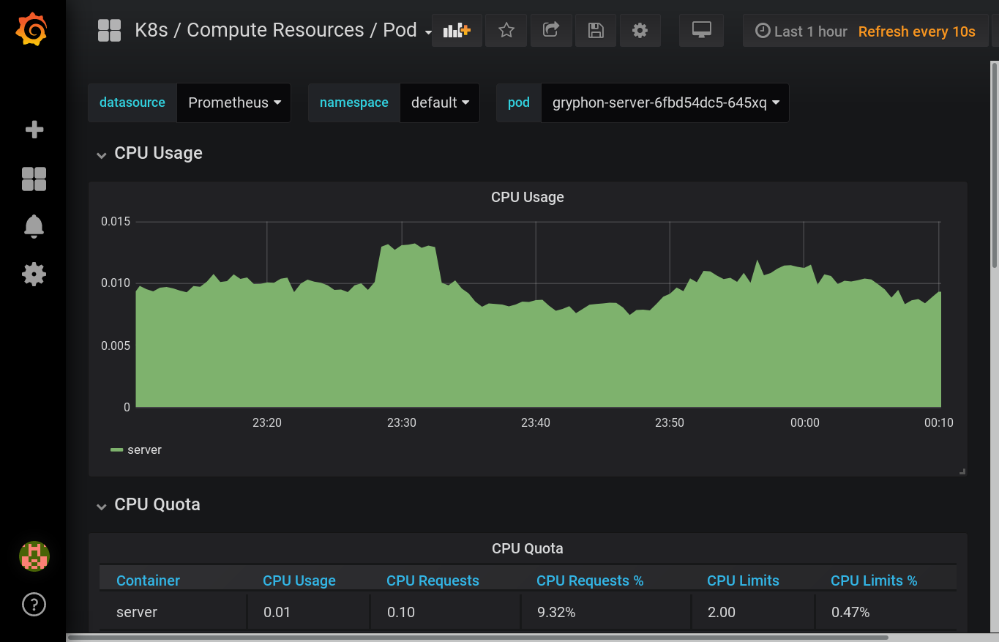

[Kubernetes](https://kubernetes.io) 클러스터를 상용 환경에서 운영하기 위해서는 몇 가지 추가 구성요소를 설치해야 합니다. 예를 들어 [Ingress](https://kubernetes.io/docs/concepts/services-networking/ingress/)를 만들더라도 실제로 트래픽을 받아줄 Ingress Controller를 설치해두지 않았으면 소용이 없습니다. 그리고 모니터링을 위해 컨테이너의 로그나 CPU/메모리 사용량 등을 수집, 조회할 수 있는 서비스도 필요합니다.

다행히 이러한 추가 구성요소 또한 Kubernetes 클러스터 위에서 일반 애플리케이션과 거의 같은 방식으로 작동하므로 설치하는 것이 어렵지는 않습니다. 다만 클러스터를 원하는 대로 구성할 수 있는 만큼 선택의 폭이 넓어서 여러 가지 해법을 놓고 고민하게 될 수 있습니다. 이 글에서는 [타다](https://tadatada.com) 서비스를 위해 Kubernetes 클러스터를 구성할 때 어떤 선택을 했는지, 특히 AWS 환경에서는 어떤 서비스들을 활용할 수 있는지 공유합니다.

## 서비스를 외부에 노출: NGINX Ingress Controller + NLB

### Ingress Controller 고르기

Kubernetes에서 클러스터 내부 서비스를 외부에 HTTP(S)로 노출할 때는 [Ingress](https://kubernetes.io/docs/concepts/services-networking/ingress/)를 사용할 수 있습니다. TLS 암호화, 로드밸런싱, 호스트명/경로 기반 라우팅 등을 제공해서 상당히 편리한데, Ingress가 실제로 작동하기 위해서는 Ingress Controller가 필요합니다.

시중에는 다양한 종류의 Ingress Controller 솔루션이 나와 있습니다. 그중 Kubernetes 프로젝트에서 공식 지원하는 [NGINX Ingress Controller](https://kubernetes.github.io/ingress-nginx/)와 AWS ALB 로드밸런서를 이용하는 [AWS ALB Ingress Controller](https://kubernetes-sigs.github.io/aws-alb-ingress-controller/)를 두고 고민을 했습니다.

타다에서는 클라이언트(모바일 앱)에 실시간 이벤트를 전달하기 위해 [gRPC](https://grpc.io)를 사용하고 있어서 gRPC를 지원하지 않는 ALB는 선택할 수 없었습니다. 그리고 AWS ALB Ingress Controller는 현재 Ingress 하나마다 ALB를 1개 생성하는 구조여서 앞으로 노출할 서비스 수가 늘어난다면 비용 효율이 떨어진다고 판단했습니다. 따라서 NGINX Ingress Controller를 선택하게 되었습니다.

NGINX Ingress Controller는 NGINX 웹서버를 기반으로 하므로 [gRPC 모듈](http://nginx.org/en/docs/http/ngx_http_grpc_module.html)을 비롯하여 다양한 NGINX 모듈을 통해 굉장히 세세한 부분까지 설정할 수 있습니다. NGINX Ingress Controller는 Ingress나 Ingress가 가리키는 서비스의 엔드포인트에 변화가 생길 때마다 동적으로 NGINX 설정을 업데이트하는 방식으로 동작합니다.

### NGINX Ingress Controller 로드밸런싱

NGINX Ingress Controller를 사용해도 외부에서 오는 트래픽을 적절히 분배해 줄 외부 로드밸런서는 필요합니다. AWS의 로드밸런서는 Classic ELB, ALB, NLB가 있습니다. 앞서 설명했듯이 ALB는 gRPC를 지원하지 않아서 Classic ELB를 TCP 모드로 사용하거나 NLB를 사용해야 합니다. [Classic ELB는 동시에 많은 연결을 처리하려면 웜 업이 필요한 단점이 있어](https://speakerdeck.com/vcnc/elbwa-ebsyi-akitegceoro-saenggaghaeboneun-sayongsang-juyihal-jeomdeul?slide=6) NLB를 사용하기로 하였습니다.

최근 NLB가 [TLS termination](https://aws.amazon.com/ko/blogs/aws/new-tls-termination-for-network-load-balancers/)을 지원하기 시작했지만, HTTP/2와 gRPC를 사용하기 위해 필요한 [ALPN 정보](https://en.wikipedia.org/wiki/Application-Layer_Protocol_Negotiation)를 설정할 수 없어서 NGINX 수준에서 TLS 암호화를 처리하고 있습니다. NLB 수준에서 TLS 처리를 하면 무료로 자동 갱신되는 [ACM 인증서](https://aws.amazon.com/ko/certificate-manager/)를 사용할 수 있는 등 여러 가지 이점이 있어서 아쉽습니다.

Kubernetes에서 `LoadBalancer` 타입의 서비스를 생성하면 알아서 AWS 로드밸런서를 만들어줍니다. 하지만 [이렇게 해서 NLB를 생성하는 방식은 아직 알파 기능입니다.](https://v1-13.docs.kubernetes.io/docs/concepts/services-networking/service/#network-load-balancer-support-on-aws-alpha) 따라서 먼저 [`NodePort` 타입의 서비스](https://kubernetes.io/docs/concepts/services-networking/service/#nodeport)를 생성하여 모든 노드의 특정 포트에 NGINX를 노출한 다음, 별도로 생성한 NLB에 노드들이 속한 오토스케일링 그룹을 연결해주는 방식으로 직접 설정하게 되었습니다.

정리해보면 외부에서 오는 트래픽을 처리할 때는 다음과 같은 과정을 거칩니다.

1. 모든 서브도메인(`*.tadatada.com`)은 NLB를 가리킵니다.
2. NLB의 443 포트로 암호화된 HTTP 또는 gRPC 요청이 들어옵니다. NLB는 적절한 Kubernetes 노드 중 하나의 특정 포트(예: 30000번)로 요청을 전달합니다.
3. Kubernetes 노드에서는 포트 번호를 보고 NGINX 서비스로 향하는 요청임을 알 수 있고 NGINX 컨테이너 중 하나로 요청을 전달합니다.
4. NGINX는 복호화를 한 다음 HTTP `Host` 헤더를 확인하여 요청을 전달할 Ingress를 알아냅니다. 그리고 해당 Ingress의 엔드포인트 중 하나로 복호화한 요청을 프록시합니다.
5. 애플리케이션 컨테이너가 요청을 처리합니다.


<figcaption>트래픽 흐름: NLB → NodePort → NGINX Ingress Controller → 내부 서비스</figcaption>

## Pod에 IAM 역할 부여: kube2iam

S3, SQS 등 IAM으로 인증하는 AWS 서비스에 접근하려면 인증 정보가 필요합니다. EC2에서는 액세스 키를 직접 넣는 대신 [EC2 인스턴스 프로파일로 인스턴스에 IAM 역할을 부여](https://docs.aws.amazon.com/ko_kr/AWSEC2/latest/UserGuide/iam-roles-for-amazon-ec2.html)할 수 있습니다. 하지만 하나의 Kubernetes 노드 (=EC2 인스턴스)에는 여러 Pod이 실행될 수 있기 때문에 Pod마다 다른 IAM 역할을 부여하기를 원한다면 인스턴스 프로파일을 활용할 수 없게 됩니다. (인스턴스 프로파일에는 하나의 IAM 역할만 부여 가능)

[kube2iam](https://github.com/jtblin/kube2iam)을 사용하면 다음과 같이 Pod 어노테이션으로 IAM 역할을 지정할 수 있습니다.

```yaml
apiVersion: v1
kind: Pod
metadata:
  name: aws-cli
  labels:
    name: aws-cli
  annotations:
    iam.amazonaws.com/role: role-arn
spec: ...
```

설치나 사용법은 문서를 참고하면 어렵지 않은데, 원리를 간단히 설명해 보겠습니다. EC2 인스턴스 안에서는 특정 IP 주소(`169.254.169.254`)로 접속하면 EC2 메타데이터 API에 접근할 수 있습니다. AWS SDK는 EC2 메타데이터 API를 통해서 인스턴스 프로파일에 붙은 IAM 역할과 IAM 역할에 해당되는 액세스 키 쌍을 받아오게 됩니다.

kube2iam은 모든 노드에 실행되면서 Pod 내부에서 EC2 메타데이터 서버 주소로 나가는 모든 요청을 가로챕니다. 그리고 인스턴스 프로파일 정보와 액세스 키 발급 요청을 kube2iam 서버가 대신 처리합니다. 따라서 Pod 안에서는 인스턴스 프로파일이 부여된 EC2 인스턴스 내부에 있는 것처럼 _느껴지게_ 됩니다.

추후 [AWS SDK에 EKS 지원이 추가되면](https://github.com/aws/containers-roadmap/issues/23) 별도로 데몬을 설치하지 않고도 Pod에 IAM 역할을 줄 수 있게 될 것으로 보입니다.

## 로그 수집: fluentd + CloudWatch Logs

Kubernetes의 컨테이너가 stdout/stderr로 출력하는 로그는 노드에만 쌓이고 컨테이너를 재시작하거나 삭제하면 함께 삭제됩니다. 또한 노드의 디스크가 꽉 차는 것을 방지하기 위해 일정 크기를 넘으면 오래된 로그는 없어집니다. 그러므로 로그가 사라지지 않도록 계속 어딘가에 모아두어야 합니다.

AWS에서 활용할 수 있는 로그 저장 서비스에는 [CloudWatch Logs](https://docs.aws.amazon.com/ko_kr/AmazonCloudWatch/latest/logs/WhatIsCloudWatchLogs.html)가 있습니다. [fluentd를 DaemonSet으로 노드마다 하나씩 실행](https://github.com/fluent/fluentd-kubernetes-daemonset)해서 컨테이너 로그를 CloudWatch Logs로 전송할 수 있습니다.

CloudWatch Logs에 저장한 로그는 최근 나온 [CloudWatch Logs Insights](https://docs.aws.amazon.com/ko_kr/AmazonCloudWatch/latest/logs/AnalyzingLogData.html)로 검색, 분석할 수 있습니다. 아직 나온 지 얼마 되지 않아서 기능이 많지는 않지만, 간단히 조회하는 용도로는 충분합니다.


<figcaption>CloudWatch Logs Insights 사용 예</figcaption>

## 모니터링: Prometheus

EC2 인스턴스 하나에 서비스 하나를 띄워서 사용할 때는 CloudWatch로 CPU 사용률 등의 지표를 측정할 수 있었습니다. 하지만 Kubernetes를 사용하면 여러 서비스가 하나의 인스턴스에서 동시에 실행될 것이므로 인스턴스 수준의 지표는 무의미합니다. 특히 최소 실행 단위인 컨테이너 수준의 CPU 사용률 같은 값을 측정해야 하는데, CloudWatch를 사용하기에는 과금 체계가 적합하지 않습니다.

기본 제공되는 5분 간격의 EC2 지표는 무료지만 CloudWatch에 커스텀 지표를 올리게 되면 지표 당 비용을 지불해야 합니다. 이 때 '지표'는 지표 이름 + 고유한 차원(dimension)의 조합입니다. 예를 들어 `CPUUtilization`이라는 이름의 지표가 `PodName=server-aaaaaaaa`과 `PodName=server-bbbbbbbb`라는 다른 차원으로 올라온다면 [각각을 다른 지표로 취급](https://docs.aws.amazon.com/ko_kr/AmazonCloudWatch/latest/monitoring/cloudwatch_concepts.html#dimension-combinations)합니다. 따라서 지표 수가 너무 많아지지 않게 조정해야 하는데 그러면 상세하게 모니터링하기가 어렵습니다.

비용 문제도 있고, Kubernetes의 여러 가지 정보를 CloudWatch로 내보내는 기존 도구가 없었기 때문에 다른 방법을 찾아보게 되었습니다. 그래서 Kubernetes 모니터링을 위해 많이 사용하는 [Prometheus](https://prometheus.io/)를 선택했습니다. Prometheus를 온전히 사용하기 위해서는 다양한 컴포넌트들이 필요한데, [Prometheus Operator Helm 차트](https://github.com/helm/charts/tree/master/stable/prometheus-operator)를 사용하면 비교적 쉽게 구축할 수 있습니다.

Prometheus는 Kubernetes 클러스터 모니터링 외에 애플리케이션 모니터링에도 사용할 수 있습니다. 타다의 애플리케이션들은 Spring Boot로 작성되어 있는데 [Spring Boot Actuator](https://docs.spring.io/spring-boot/docs/current/reference/html/production-ready-endpoints.html)와 [Micrometer의 Prometheus 지원](https://micrometer.io/docs/registry/prometheus)을 사용해서 애플리케이션 수준의 지표도 Prometheus로 모니터링하고 있습니다. 특히 Prometheus Operator를 사용하면 모니터링 대상을 추가할 때 Prometheus 설정 파일을 수정하지 않아도 Kubernetes에 `ServiceMonitor` 리소스를 등록하기만 하면 되어서 편리합니다.

Prometheus로 수집된 지표는 [Grafana](https://grafana.com/) 대시보드로 시각화하고, 정해진 조건에서 [Alertmanager](https://prometheus.io/docs/alerting/alertmanager/)를 통해 [PagerDuty](https://www.pagerduty.com/)와 Slack에 알림을 보냅니다.


<figcaption>Grafana 대시보드의 모습</figcaption>

## 자동 처리량 확장: Cluster Autoscaler

Kubernetes에서 자동 처리량 확장은 크게 두 종류로 나눌 수 있습니다. 먼저 [Horizontal Pod Autoscaler](https://kubernetes.io/docs/tasks/run-application/horizontal-pod-autoscale/)로 CPU, 메모리 사용량에 따라 Pod의 수를 자동으로 조정할 수 있습니다. HPA가 실제로 동작하기 위해서는 오토스케일링을 위한 지표를 제공하는 [Metrics Server](https://github.com/kubernetes-incubator/metrics-server)를 설치해야 합니다. 그런데 부하가 증가해서 HPA가 Pod 수를 늘리려고 할 때 워커 노드에 여유가 충분하지 않으면 새로운 Pod을 실행할 수 없어서 소용이 없습니다. 이 때 워커 노드의 수를 자동으로 조정해주는 것이 [Cluster Autoscaler](https://github.com/kubernetes/autoscaler/blob/master/cluster-autoscaler/cloudprovider/aws/README.md)입니다. Cluster Autoscaler는 노드 수를 증가시키기만 하는 것이 아니라 여유가 생겼을 때 노드 수를 자동으로 줄여서 불필요한 비용이 발생하지 않도록 해줍니다.

AWS 환경에서 Cluster Autoscaler는 EC2 API를 통해 EC2 오토스케일링 그룹의 Desired Capacity 값을 필요한 노드 수로 조정하는 방식으로 작동합니다. 따라서 Cluster Autoscaler에는 EC2 API를 호출할 수 있는 IAM 권한을 주어야 합니다. 이를 위해 위에서 소개한 kube2iam을 사용할 수 있습니다. 그리고 Cluster Autoscaler가 오토스케일링 그룹을 자동으로 발견할 수 있도록 미리 정해진 태그를 붙여야 합니다.

한 가지 주의할 점은 노드의 오토스케일링 그룹이 여러 가용 영역(AZ)에 걸쳐있으면 안 된다는 것입니다. [오토스케일링 그룹이 여러 AZ에 속한 경우 AZ 간 인스턴스 수의 균형을 맞추려고 하는데](https://docs.aws.amazon.com/ko_kr/autoscaling/ec2/userguide/auto-scaling-benefits.html#arch-AutoScalingMultiAZ) 이 과정에서 인스턴스가 예기치 않게 종료될 수 있습니다. 이 때 해당 노드에 실행되어 있던 Pod이 안전하게 종료되지 않을 수 있기 때문에 AZ마다 오토스케일링 그룹을 따로 만들고 AZ 간 균형은 Cluster Autoscaler가 맞추도록 설정해야 합니다.

## 도움이 되는 링크들

- 위에서 소개한 컴포넌트들은 다음과 같은 [Helm](https://helm.sh/) 차트를 통해 설치해서 사용하고 있습니다.
  - [stable/nginx-ingress](https://github.com/helm/charts/tree/master/stable/nginx-ingress)
  - [stable/kube2iam](https://github.com/helm/charts/tree/master/stable/kube2iam)
  - [incubator/fluentd-cloudwatch](https://github.com/helm/charts/tree/master/incubator/fluentd-cloudwatch)
  - [stable/prometheus-operator](https://github.com/helm/charts/tree/master/stable/prometheus-operator)
  - [stable/metrics-server](https://github.com/helm/charts/tree/master/stable/metrics-server)
  - [stable/cluster-autoscaler](https://github.com/helm/charts/blob/master/stable/cluster-autoscaler)
- [EKS Workshop](https://eksworkshop.com/): AWS 환경에서 Kubernetes 운영할 때 참고할 만한 정보가 많이 있습니다.
- [Kubernetes Slack 채널](http://slack.k8s.io/): #eks 채널에는 AWS 직원들도 접속해 있어서 높은 확률로 답변을 받을 수 있습니다.
