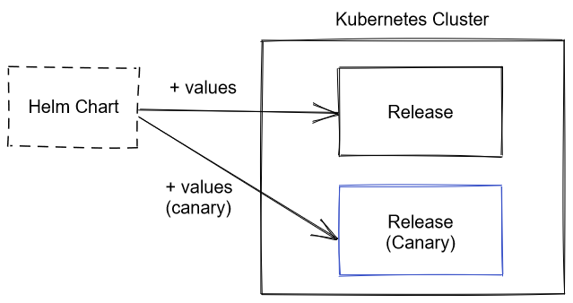

**카나리 배포**는 새로운 버전의 소프트웨어를 프로덕션에 배포할 때 위험을 줄이기 위해 변경 사항을 일부 사용자에게만 먼저 내보내는 기법입니다.
이 글에서는 Kubernetes 환경에서 타다 서버를 카나리 배포할 수 있도록 구성한 경험을 공유하려고 합니다.

## 발단

타다 서버는 Spring Boot 프레임워크로 작성되어 있습니다. 얼마 전 Spring Boot의 메이저 버전을 올리기로 했습니다.
Spring Boot는 여러 가지 서드 파티 라이브러리의 버전을 어느 정도 강제하고 있습니다. 따라서 Spring Boot 버전을 올리면 여러 의존 라이브러리의 버전도 같이 올라가서 상당히 큰 변화가 생깁니다.

물론 자동 테스트와 테스트 환경에서의 수동 테스트로 동작상의 큰 문제는 미리 확인할 수 있습니다.
하지만 미처 테스트하지 못한 부분이나 성능에서 문제가 발생할 수도 있으므로 프로덕션 환경에 바로 전체 적용하는 것은 위험 부담이 있었습니다.
따라서 안전한 배포를 위해 카나리 배포를 해보기로 하였습니다.

카나리 배포를 위해서 크게 3가지에 대해 고민이 필요했습니다.

1. **코드 관리**: 카나리 버전의 소스 코드와 빌드 결과물을 어떻게 관리할 것인지
2. **배포**: 카나리 버전의 서비스를 어떻게 한 벌 더 띄울 것인지
3. **부하 분배**: 워크로드를 어떻게 일부만 카나리 버전으로 보낼 것인지

## 코드 관리

현재 배포 환경별로 3개의 주 브랜치를 사용하고 있습니다. (개발용, QA용, 프로덕션용)
여기에 카나리를 위한 브랜치를 별도로 만들었습니다.
이 카나리 브랜치는 기본적으로 프로덕션 브랜치를 따라가고, 필요할 때 카나리 배포를 하고자 하는 변경사항을 추가로 적용합니다.

카나리 브랜치에 대한 변경 사항은 프로덕션 브랜치와 마찬가지로 풀 리퀘스트를 통해 팀원의 리뷰와 자동 테스트를 거친 후 머지합니다.
PR 머지로 새로운 커밋이 카나리 브랜치에 푸시되면, 자동으로 빌드가 실행되고 `canary` 태그가 붙은 Docker 이미지가 레지스트리에 올라갑니다.

카나리 테스트 도중에 프로덕션 브랜치에 새로운 변경사항이 머지될 수 있습니다. 그럴 때는 프로덕션 브랜치에서 카나리 브랜치를 향하는 풀 리퀘스트를 만들어서 카나리에도 같은 변경사항을 적용해야 합니다.

## 배포

타다 서버는 Kubernetes 환경에 Helm 패키지 매니저를 사용하여 배포하고 있습니다.
Helm 패키지는 '차트'라고 하는데, 차트를 Kubernetes 클러스터에 설치하면 '릴리스'가 생성됩니다.
또한 하나의 차트를 여러 번 설치할 수 있고 각각 다른 파라미터를 적용할 수 있습니다.
같은 차트를 Docker 이미지 태그 등이 다른 카나리 버전으로 한 벌 더 설치해서 카나리 배포를 할 수 있습니다.



그렇지만 Helm 차트가 여러 번 설치되어도 문제없도록 작성되어 있어야 합니다.
예를 들어 Kubernetes 리소스 이름이 겹치면 안 되기 때문에 릴리스 이름을 덧붙여서 구분할 수 있어야 합니다.
그리고 Kubernetes 레이블 셀렉터가 다른 릴리스의 리소스까지 선택하지 않도록 릴리스 이름을 레이블로 추가하고 셀렉터에 포함해야 합니다.

Helm 차트를 설치할 때 사용하는 파라미터 파일은 서버 소스 코드와 함께 저장소에서 관리되고 있습니다.
배포 환경별로 `values-{배포 환경}.yaml` 파일이 있는데 여기에 카나리 배포를 위한 `values-prod-canary.yaml` 파일을 추가했습니다.

## 부하 분배

Helm 차트를 한 벌 더 설치하기만 해서는 부하가 카나리 버전으로 가지 않습니다.
그리고 원하는 비율의 부하만 카나리 버전으로 가도록 통제할 수 있어야 합니다.
애플리케이션 구성 요소가 요청을 받아들이는 방식에 따라서 부하 분배 비율을 통제하는 방법이 다릅니다.

### 외부 트래픽을 처리하는 서비스

API 서버나 웹사이트같이 Kubernetes `Ingress` 리소스로 서비스를 외부에 노출한 경우입니다.
타다에서 사용하는 NGINX Ingress Controller에서는 [Ingress 리소스에 어노테이션을 추가](https://kubernetes.github.io/ingress-nginx/user-guide/nginx-configuration/annotations/#canary)하여 지정한 비율의 요청만 카나리 Ingress로 가도록 설정할 수 있습니다.
따라서 다음과 같은 어노테이션을 카나리 Ingress에 추가하였습니다.

```yaml
apiVersion: networking.k8s.io/v1beta1
kind: Ingress
metadata:
  # ...
  annotations:
    nginx.ingress.kubernetes.io/canary: 'true'
    nginx.ingress.kubernetes.io/canary-weight: '0' # 0 ~ 100
```

처음으로 차트를 설치할 때는 `canary-weight`가 0으로 설정되어 트래픽이 전혀 들어가지 않다가, 이후 어노테이션을 수정하여 점진적으로 트래픽이 더 들어가게 했습니다.

### 내부 서비스

타다 서버는 기본적으로 모노리식 애플리케이션이지만 일부 기능은 운영 편의를 위해 작은 서비스로 분리되어 있습니다.
이러한 내부 서비스와는 gRPC로 통신하고 서비스 디스커버리에는 Kubernetes `Service`를 이용합니다.
즉, `Service` 이름이 `svc`라면 gRPC 클라이언트에서 `svc`라는 주소로 접속하게 됩니다.

단순하게는 애플리케이션 코드를 수정해서 카나리 서비스에 대한 처리를 추가할 수 있습니다.
하지만 코드를 수정하지 않고도 투명하게 트래픽을 카나리 서비스로 보낼 수 있으면 더 좋겠죠.
기존에 gRPC 로드 밸런싱을 위해 Istio 서비스 메시를 사용하고 있으므로 Istio의 기능을 이용하기로 했습니다.

Istio를 사용하면 애플리케이션 컨테이너를 띄울 때 '사이드카' 프락시 컨테이너를 함께 실행합니다.
이 프락시가 애플리케이션이 주고받는 모든 네트워크 트래픽을 가로채서 적절하게 처리합니다.
[`VirtualService`라는 리소스를 만들어서 특정 호스트 명으로 가는 요청에 라우팅 규칙을 적용할 수 있습니다.](https://istio.io/latest/docs/concepts/traffic-management/#virtual-services)

예를 들어 다음과 같은 `VirtualService`를 만들면 `svc`에 대한 요청이 비율에 따라 `svc` 또는 `svc-canary` Kubernetes `Service`를 향하게 됩니다.

```yaml
apiVersion: networking.istio.io/v1alpha3
kind: VirtualService
# ...
spec:
  hosts:
    - svc
  http:
    - name: primary
      route:
        - destination:
            host: svc
          weight: 100
        - destination:
            host: svc-canary
          weight: 0
```

### 워커 프로세스

SQS나 Kinesis 등 하나의 큐에서 워커들이 각자 일감을 빼가는 경우도 있습니다.
이 경우에는 기존 버전의 워커는 그대로 두고 카나리 버전의 워커를 일부 띄워서 워커 수에 비례해서 일감이 분배되도록 하였습니다.
워커 개수는 Kubernetes `Deployment` 리소스의 `replicas` 값을 변경하여 조정할 수 있습니다.
카나리 버전에서 일감을 처리하지 못하는 문제가 발생하면 카나리 버전의 워커를 모두 제거해서 기존 버전에서 일감이 처리되도록 할 수 있습니다.

워커는 일반적인 상황에서 수 개 정도 실행되어 있어서 일정 비율 이하로는 분배할 수 없습니다.
예를 들어 기존 워커가 4개라면 카나리 워커를 1개만 띄워도 20%의 부하를 카나리에서 처리하게 됩니다.
하지만 워커에서 처리하는 일감은 대부분 비동기 작업이라 어느 정도의 지연은 서비스에 유의미한 영향을 주지 않습니다.
따라서 조금 큰 비율 단위를 사용해도 큰 문제 없다고 판단하였습니다.

### 싱글턴 프로세스

마지막으로 싱글턴 프로세스는 가급적 동시에 하나의 프로세스만 실행되어 있어야 하는 경우를 말합니다. (일반적으로 사용되는 용어는 아니지만, 편의상 이렇게 부르겠습니다.)
짧은 주기로 실행되는 배치 작업을 이러한 싱글턴 프로세스에서 담당하고 있습니다.

동일 작업이 동시에 실행되는 것을 피하기 위해서 기존 버전 또는 카나리 버전 중 하나만 실행하도록 하였습니다. 즉, 카나리 버전을 실행하기 전에 기존 버전을 먼저 종료합니다. 기존 버전으로 돌아가는 반대 경우도 마찬가지입니다.

프로세스의 실행 여부는 워커와 마찬가지로 Kubernetes `Deployment` 리소스의 `replicas` 값을 0 또는 1로 변경하여 조정할 수 있습니다.

## 배포 도구 작성

앞서 설명한 방식으로 Helm 차트를 설치하거나 Kubernetes 리소스를 조작하면 카나리 배포가 가능합니다.
하지만 사람이 직접 `helm`, `kubectl` 등의 명령어를 실행하면 불편하고 실수를 할지도 모릅니다.
따라서 간단한 배포 도구를 개발해서 사용했습니다.

### Helm 차트 설치

Helm 차트를 설치할 때 컨벤션에 맞는 릴리스 이름과 정확한 설정 파일을 적용합니다.
실수로 다른 차트의 설정 파일을 적용하거나 카나리 설정 파일이 아닌 일반 설정 파일을 적용하는 것을 방지합니다.

```bash
./bin/deploy canary install --target prod server
```

### 카나리 비율 적용

앞에서 소개한 4가지 프로세스 종류에 따라 카나리 비율을 적용하는 방식이 다릅니다.
이를 수동으로 적용하기에는 불편하므로 카나리 비율을 설정 파일에 기재하고 이를 배포 도구를 통해 적용하도록 했습니다.

```yaml
- project: server-internal
  type: DEPLOYMENT_SINGLETON
  weight: 0 # 0 or 1

- project: dispatcher
  type: DEPLOYMENT_REPLICAS
  weight: 0 # replica count

- project: server
  type: INGRESS_NGINX
  weight: 0 # 0~100

- project: server-map
  type: ISTIO_VSVC
  weight: 0 # 0~100
```

위와 같이 애플리케이션 이름과 종류, 비율을 적어서 한 번에 적용할 수 있습니다.

```
./bin/deploy canary apply --target prod canary.yaml
```

## 실행

1. 먼저 카나리 테스트 일정을 정합니다. 카나리 테스트 도중에 프로덕션 배포를 아예 할 수 없는 건 아니지만, 가급적 변경사항이 발생하지 않아야 비교가 수월하기 때문에 출시 일정을 조율했습니다.
2. Notion에 체크리스트를 만들어서 서버군별 순서와 비율 조정 단계를 계획합니다.
3. 설정 파일 수정 &rarr; 적용 &rarr; 모니터링 &rarr; 비율 증가 &rarr; ...의 과정을 반복하면서 카나리 배포를 진행합니다. 진행 상황을 체크리스트에 업데이트합니다.
4. 모니터링은 에러 수집 도구 (Sentry)와 성능 대시보드 (Grafana)로 합니다. 문제가 생긴 것으로 의심되면 비율을 0으로 변경하여 테스트를 중단합니다.
5. 충분히 긴 기간 동안 카나리 버전에 문제가 없는 것이 검증되면 프로덕션 브랜치에도 해당 변경 사항을 적용합니다.

## 향후 과제

### 문제 상황 파악 자동화

실제로 카나리 테스트를 진행해보니 도중에 발생하는 문제가 카나리의 변경 사항 때문인지 원래 발생하던 문제인지 파악하는 것이 힘들었습니다.

카나리와 동일 비율로 프로덕션 버전 대조군을 띄워놓고 각종 메트릭을 비교하는 방법으로 문제 상황을 자동으로 파악하면 좋을 것입니다. 그렇게 하면 비율을 늘리거나 롤백하는 것도 자동화가 가능합니다.

### 사용자별 카나리 적용하기

이번 테스트에서는 사용자와 무관하게 전체 부하 중 일부 비율을 카나리 버전으로 보냈습니다.
이렇게 하면 카나리 버전에서 문제가 있더라도 요청을 재시도하다 보면 기존 버전이 부하를 처리해서 성공하는 장점이 있지만,
전체적으로 보면 부정적인 경험을 하는 사용자가 늘어날 수 있습니다.

요청 내용을 분석해서 사용자 그룹에 따라 카나리 테스트 여부를 결정하면 영향받는 사용자의 수를 통제할 수 있습니다.

## 참고 자료

- Martin Fowler, [CanaryRelease](https://martinfowler.com/bliki/CanaryRelease.html)
- [Annotations - NGINX Ingress Controller](https://kubernetes.github.io/ingress-nginx/user-guide/nginx-configuration/annotations/#canary)
- [Istio / Traffic Management](https://istio.io/latest/docs/concepts/traffic-management/)
- Hyperconnect Tech Blog, [Kubernetes에 Microservice 배포하기 3편 - Canary Deployments with Istio](https://hyperconnect.github.io/2020/08/19/microsrv-deploy-3.html)
