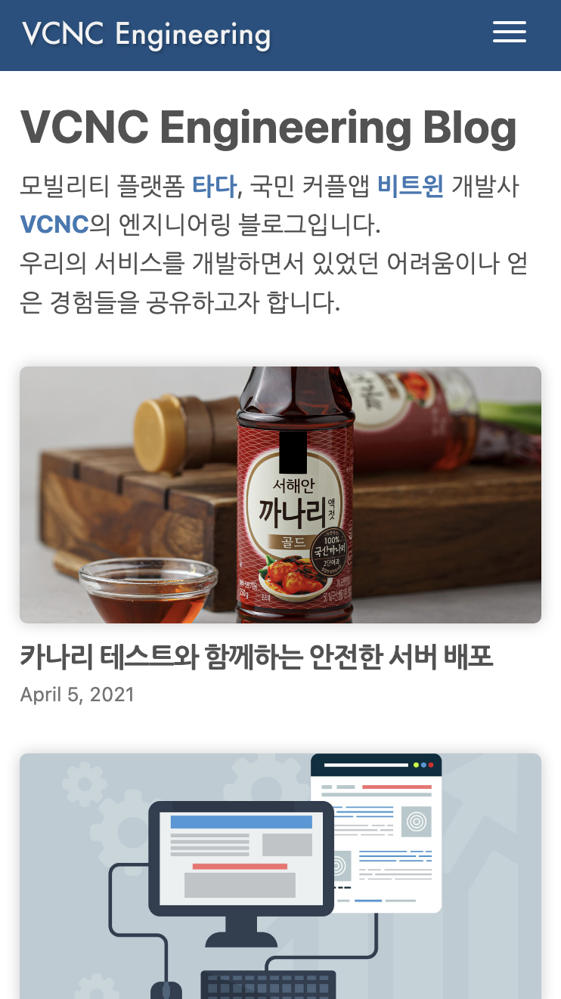
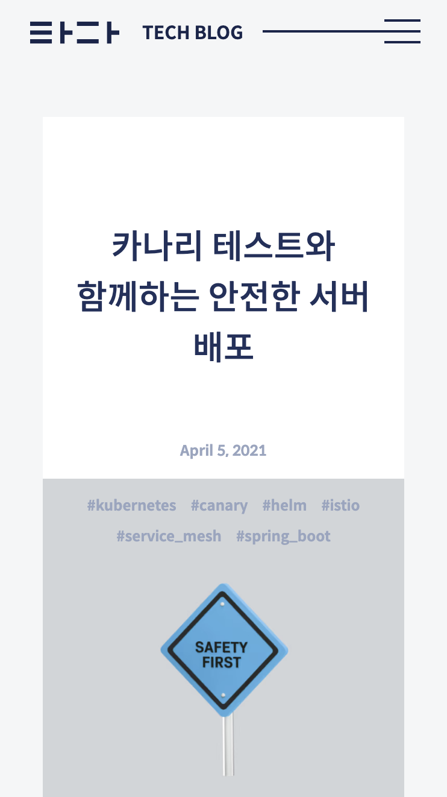

타다 개발팀은 10년간 서비스를 운영하면서 맞닥뜨린 기술적인 이슈, 개발 문화 등을 블로그를 통해서 공유하였습니다. 저희는 기술 블로그를 통해 업계 동료들에게 받은 도움에 대해 보답하고자 했고, 저희의 다양한 경험을 공유함으로써 다른 분들의 의사결정에 도움이 되기를 바랐습니다. 그뿐만 아니라 여러 동료 개발자분들의 피드백을 통해 저희는 올바른 선택을 하고 한층 더 성장할 수 있었습니다. 이처럼 기술 블로그는 저희가 업계의 다른 분들과 직접적으로 소통할 수 있는 가장 효과적인 방법의 하나입니다.

 

또한 기술 블로그는 지원자의 입장에서 회사의 기술적인 고민과 정보, 그리고 조직 문화를 알 수 있는 공간이 되기도 합니다. 실제로 타다팀에 지원하신 대다수 지원자분은 기술 블로그를 통해 합류를 결심하셨다고 합니다. '최고의 복지는 최고의 동료들' 이라고 생각하는 타다팀에게 좋은 동료를 모시기 위해 기술 블로그는 너무나 중요한 채널입니다.

## TF 의 시작

지난 1년간 타다팀(VCNC) 에는 많은 변화가 있었습니다. VCNC 가 운영하던 비트윈이라는 서비스가 다른 회사에 인수되어 저희는 온전히 타다라는 서비스에 집중할 수 있게 되었습니다. 그리고 타다팀은 전략적 투자를 통해 토스와 함께하게 되어, 당장의 생존이 아닌 시장 문제의 본질에 대해 집중하고 이를 기술적으로 해결하는 데 관심을 기울일 수 있게 되었습니다. HR 팀 주도로 회사의 이러한 변화를 알리기 위한 여러 액션이 시작되었습니다. 그리고 개발자 채용에 가장 큰 역할을 하는 기술 블로그의 오래된 정보 수정을 요청하셨습니다.

 

기존 타다 기술 블로그는 포스팅을 제외한 운영 측면에서 사실상 방치되었습니다. 좋은 글을 작성하기 위한 타다팀의 노력에 비해 이를 표현하는 창구가 다소 아쉬웠고, 이에 공감하는 개발자분들이 여럿 있었습니다. 저희는 회사의 전반적인 채용 브랜딩이 바뀌는 시기에 맞춰 단순 요청사항 반영에 머무는 것이 아니라 기술 블로그 자체를 조금 더 변화시키기로 하였고, 근무 외 시간을 이용해 개발팀을 중심으로 새로운 기술 블로그 TF 를 결성하였습니다.

## 기술 블로그 목표

TF 의 시작은 우리가 만들고 싶은 기술 블로그를 다시 정의하는 것이었습니다. 우리 블로그의 목적을 확실히 하고, 이를 잘 표현할 수 있는 방법을 찾아나갔습니다. 타다팀이 기술 블로그를 운영하는 이유는 [처음]과 달라지지 않았습니다. 즐겁게 가꾸어 나가고 있는 저희의 개발 문화를 소개하고, 기술적 경험을 공유하여 업계 전반의 생태계가 발전할 수 있게 도우며, 서비스 투명성을 통해 사용자들이 타다를 더욱 믿을 수 있고, 뛰어난 동료 개발자분들의 비판적인 피드백을 받고 싶습니다.

 

이를 위해 저희는 단순 기술에 대한 설명글이 아닌 실제 저희의 경험이 담긴 글들을 적고 있습니다. 특정 기술에 대한 주제라 하더라도 그것이 회사 업무에 적용해보았을 때 어떤 효과가 나타나는지를 적습니다. 그리고 따라 해볼 수 있는 구체적인 솔루션을 제시하거나 저희의 실패에 대한 회고를 충분히 공유하려고 합니다. 즉, 타다 기술 블로그는 실제 타다팀이 마주하는 문제, 그리고 그 해결 과정을 가능한 많은 분께 보여주는 것이 목표입니다.

## 개선 과정

이처럼 저희의 경험을 전달하는 것이 핵심이기 때문에 새로운 블로그 역시 단순하게 만들고 싶었습니다. `Press`, `Team` 등과 같이, 독자에게 필요한 것이 아니라 저희가 이야기하고 싶은 내용들은 모두 제거하였고, `Header`, `Footer` 에 중복으로 보이는 것들을 모두 정리하여 콘텐츠 자체에 집중하도록 구성하였습니다. SEO 나 SNS 바이럴을 통해 독자를 유입시키는 것이 현재 우리 블로그가 추구하는 방향에서 가장 이상적이라 생각했기 때문에 서치 등 복잡한 기능들을 배제하였습니다. 또한, 화면 구성에 있어서 단순함을 추구하되, [타다]라는 하나의 브랜드 웹 테마를 유지하려고 노력했습니다.

 

대신, 알고 싶은 콘텐츠를 정확하고 빠르게 인지할 방법들에 대해 고민하였습니다. 기존 블로그 형태에서는 최근글에만 있는 통일성 없는 이미지와 함께 제목을 통해서만 글의 내용을 유추할 수 있었습니다. 그리고 제목의 길이는 제한적이기 때문에 글이 다루는 내용들에 대해서는 미리 알기 어려웠습니다. 더군다나 블로그 글이 늘어남에 따라 원하는 글을 찾는 것은 점점 더 어려워졌습니다. 이러한 불편함을 해소하기 위해, 각 게시물에 적합한 [대표 이미지를 제작]하고 태그 추가하여 해당 글이 다루는 내용을 유추할 수 있도록 하였습니다. 추후, 게시글 카테고리에 따라 글을 모아서 볼 수 있도록 필터링 및 검색 기능을 추가할 계획입니다.

  

    
  

  

    
  

<figcaption>기술 블로그 전후 비교</figcaption>

 

기술 블로그는 인재 채용에 매우 중요한 역할을 합니다. 하지만, 기존 블로그에는 현재 타다팀의 정체성이 잘 드러나지 않는 톤 앤 매너를 가지고 있었습니다. 좋은 인재 채용과 내부 구성원들을 위한 `External & Internal 브랜딩 개선`을 목표로 세부 내용들을 정리해 나갔습니다.

## 기술적 고민

### 기존 블로그의 기술적 구성

기존 타다 기술 블로그는 [Jekyll]로 작성되었습니다. Jekyll을 기반으로 한 블로그에는 몇 가지 장점이 있습니다.

- 마크다운 문법을 사용한 게시물 작성
- [존재하는 테마]로부터 간단한 커스터마이징
- Github Pages 기능을 통한 간단한 배포

편리하고 익숙한 게시물 작성방법, 적은 빈도의 사이트 개편, 그리고 디자인 리소스를 들이지 않아도 되는 점에서 적절한 기술 선택이었습니다. 하지만, 반대로 Jekyll로 만든 블로그의 몇 가지 특징 때문에 위에서 언급한 타다팀이 나아가고자 하는 방향에 제한되는 부분들이 존재했습니다.

- **Ruby 기반**
  - 언어에 대한 지식 요구
  - 어려운 유지보수
  - 사용하고자 하는 기능들에 대한 지원 부족 (플러그인)
- **템플릿 기반 커스터마이징**
  - 타다 홈페이지의 공통된 테마를 적용하기에 제한

이러한 이유에서 Jekyll이 아닌 다른 방식을 찾게 되었고, 그 결과 Gatsby를 선택하게 되었습니다.

### 새로운 기술 선택

[Gatsby]는 React 기반의 정적 페이지 생성을 도와주는 프레임워크입니다. 타다팀이 기술 블로그를 운영하고자 하는 목적과 방식에 맞게 Gatsby를 선택하게 되었고, 이유는 다음과 같습니다.

- 웹 프론트엔드 팀 기술 스택(`React`) 사용으로 편리한 유지보수
- 다양한 [Plugin]을 제공
- Gatsby Cloud를 통한 손쉬운 배포

 

Gatsby라는 새로운 기술 선택 이외에도 기존 내용의 마이그레이션을 위한 추가적인 고려사항이 있었습니다.

## 마치며

기술 블로그 개편은 단지 저희가 만족하기 위한 것이 아닙니다. 진심으로 저희의 고민이 세상에 도움을 줄 수 있다는 확신이 있고, 이를 더 많은 사람과 공유할 수 있기를 바랍니다. 타다는 이동에서 발생하는 수많은 문제를 기술로 해결하고 싶은 팀입니다. 기술적 난제들을 고민하면서 좋은 팀과 서비스를 함께 만들고 키워나갈 좋은 분들을 기다리고 있습니다. 앞으로도 저희의 여정에 많은 관심 부탁드립니다.

[처음]: /2013-04-15-hello-world
[타다]: https://tadatada.com/
[대표 이미지를 제작]: https://www.instagram.com/designedbytada/
[존재하는 테마]: http://jekyllthemes.org/
[jekyll]: https://jekyllrb.com/
[gatsby]: https://www.gatsbyjs.com/
[plugin]: https://www.gatsbyjs.com/plugins
