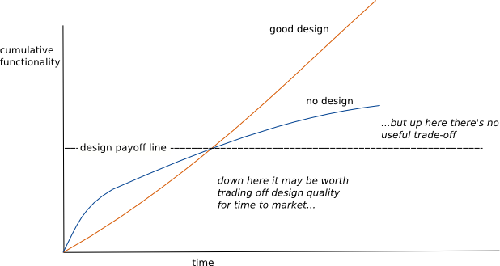

## Redux가 꼭 필요하게 된 이유

2017년 처음으로 React를 시작했을 때 기본으로 제공하는 [React.setState](https://ko.reactjs.org/docs/faq-state.html#what-does-setstate-do) 로 모든 상태관리를 했던 적이 있었습니다. [You Might Not Need Redux](https://medium.com/@dan_abramov/you-might-not-need-redux-be46360cf367)의 글에서 이야기하듯이 Redux가 꼭 필요해 지기 전까지 사용하지 않아도 된다는 내용처럼 언제인지 모르지만 그날이 오면 어쩌나 하는 걱정을 가지고 setState로 작업을 해나갔고 큰 어려움이 없었습니다.

하지만 얼마 지나지 않아 저에게 더 이상 `setState`만으로 개발을 하기 어려운 상황이 주어졌습니다.

대략적인 최초의 기획은 다음과 같았습니다.

- date picker 의 OK 버튼을 눌렀을 때 상단 달력 아이콘 왼쪽의 날짜가 업데이트된다.
- save all 체크박스를 활성화하고 수정 버튼을 누르면 start/end date 모두 업데이트한다.
- save start date 체크박스를 활성화하고 수정버튼을 누르면 start date를 업데이트한다.
- save end date 체크박스를 활성화하고 수정버튼을 누르면 end date를 업데이트 한다.
- save start date/save end date 체크박스를 활성화하고 수정버튼을 누르면 start/end date 모두 업데이트한다.

작업을 하다 보니 기획 변경이 되었고, 체크박스가 늘어났습니다. 그리고 아래와 같은 조건문을 계속 추가하게 되었습니다.

부모 페이지 컴포넌트의 상태가 추가 될수록 자식 컴포넌트의 조건문이 많아졌는데 백오피스의 특성상 하나의 부모 페이지에 수많은 모달이 있었고 상태 값도 많았기에 기획에서 하나의 조건만 변경되어도 수정하기 너무 힘든 코드가 되었습니다.

**React의 라이프사이클에 의존하여 setState로만 기획을 코드로 반영하기에 너무 힘든 상황에 이르게 된 것입니다.** 이 상황을 해결하기 위해선 부모 자식 관계가 아닌 global state 가 필요했고 그때 저에게 가장 익숙하고 React 커뮤니티에서 널리 쓰이고 있던 Redux를 회사 업무에 처음 도입하게 되었습니다. 그리고 얼마 지나지 않아 배포를 위해 QA를 진행하면서 Redux의 [디버깅 경험](https://coralogix.com/blog/this-is-what-your-developers-are-doing-75-of-the-time-and-this-is-the-cost-you-pay/)이 너무 좋다고 생각했습니다. [Redux Devtools](https://chrome.google.com/webstore/detail/redux-devtools/lmhkpmbekcpmknklioeibfkpmmfibljd?hl=ko)을 이용해 어디서 잘못되어 버그가 나는지 예전보다 쉽게 알 수 있어 편리했고, [한 곳](https://redux.js.org/understanding/thinking-in-redux/three-principles#single-source-of-truth)에서 상태를 관리하다 보니 상태변화의 순서도 통제하기가 쉬웠습니다. Redux에 보일러플레이트가 많아 코드 작성에 생각보다 많은 시간 썼는데 모두 보상받는 기분이 들었습니다.

## Redux의 관심사

### Redux로 프로젝트를 진행하다 보니 2가지의 상태가 생겼습니다.

- Redux에서 관리하는 상태: Global state
- Redux에서 관리하지 않는 상태: Local state

어떤 상태를 Redux로 관리하고 하지 말아야 하는지에 대한 고민이 커졌고 나름 원칙을 세웠습니다.

- 최대한 Local state로 두고 다른 곳에서도 필요하다면 그때 Redux에서 상태를 관리 할 수 있도록 하자.

다른 컴포넌트에서 사용하지도 않는 상태를 미리 전역 상태로 만들어두는 것은 캡슐화가 잘 안된 코드라는 생각이 있었습니다. 그리고 Redux에서 관리하려면 action type, action creator, reducer 등 작성해야 할 코드가 많아 귀찮음이 컸기 때문이었습니다. 또, 고민이었던 form의 상태관리에 대한 [여러 글](https://goshacmd.com/should-i-put-form-state-into-redux/)도 마음을 움직이게 했습니다. Redux에서 form을 관리하는 대표적인 라이브러리 [Redux Form](https://redux-form.com/8.3.0/)의 중단도 Redux의 전역상태를 보다는 Local State를 우선하게 하는데 영향을 주었습니다.

## Redux에서 관리하지 않기로 한 것들에 대한 관리

### Component Local State 와 Component 간 Shared State 관리

Redux에서 관리하지 않기로 한 **컴포넌트 내에만 존재하는 상태**가 많아지고 덩치가 커지다 보니 어떻게 하면 상태를 잘 분리하고 공유할 수 있는가에 대한 관리 고민이 시작됐습니다. Redux 이외의 상태관리 툴을 도입하지 않고 해결을 원했고 당시 React 커뮤니티에서 유행하던 패턴들을 사용해보았습니다.

#### 1. [HOC](https://ko.reactjs.org/docs/higher-order-components.html#gatsby-focus-wrapper)(Higher Order Component)

[Decorator Pattern](https://en.wikipedia.org/wiki/Decorator_pattern) 기반의 접근으로 [Higher-order function](https://ko.wikipedia.org/wiki/%EA%B3%A0%EC%B0%A8_%ED%95%A8%EC%88%98)이 그러하듯이 클로져를 이용하여 [각 인자의 단계를 나누고](https://ko.wikipedia.org/wiki/%EC%BB%A4%EB%A7%81) 미리 정해진 함수를 재활용하는 패턴입니다.
장점으로는 당시에 가장 유행하던 [Container-Presenter 패턴](https://medium.com/@dan_abramov/smart-and-dumb-components-7ca2f9a7c7d0)과 잘 어울렸습니다. 단점으로는 불필요하게 wrapping에 사용하는 Component를 생성하고, 중첩된 Component가 복잡해지기 쉽고 복잡해진 만큼 코드 관리가 어려웠습니다.

#### 2. [Render Props](https://ko.Reactjs.org/docs/render-props.html)

[Delegation Pattern](https://en.wikipedia.org/wiki/Delegation_pattern) 기반의 접근으로 자체적으로 렌더링 로직을 구현하는 대신, React 엘리먼트 요소를 반환하고 이를 호출하는 함수를 사용하는 패턴입니다. HOC 패턴에서 단점으로 생각한 불필요하게 Component를 생성 할 필요가 없어져서 좋았습니다. 또한 위 예제 코드에서 처럼 HOC보다 한 단계 Lazy하게 컴포넌트를 조합할 수 있어 좀 더 코드를 재활용 할 수 있었습니다. 하지만 해당 패턴 역시 상태 혹은 로직의 재활용이 생각보다 쉽지 않았습니다. 중첩구조가 복잡해 지면 render props에 대해 추적하는 것도 어려웠습니다.

#### 3. [Hook](https://ko.reactjs.org/docs/hooks-intro.html)

Hook의 장점이라고 한다면 소개페이지에서 여러 가지를 말하지만 저에게 가장 크게 와닿는 것은 **계층의 변화 없이 상태 관련 로직을 재사용할 수 있도록 도와주는 것**이었습니다. 이것은 HOC와 Render Props가 중첩 Component에서 생기는 문제를 해결해 주었습니다. 또한 javascript의 함수의 syntax를 가지고 로직을 나누고 조합하는데 이점은 코드 재활용의 문제도 많이 개선해 주었습니다. 특히 [hook이 로직의 조합](https://youtu.be/nUzLlHFVXx0)에 유리하여 관심사의 분리와 조합에도 이점이 있었습니다. 그래서 여러 가지 시행착오를 거쳤지만 Component 간 상태 혹은 로직의 공유는 [context](https://ko.reactjs.org/docs/context.html) + hook으로 하기로 결정했습니다.

## 상태 관리에 대한 규약이 부족해서 생기는 문제

Hook을 이곳 저곳에서 사용하다 보니, Redux와 Context의 경계가 모호 해졌습니다.

명확한 기준을 생각해보니 page단위가 적당하다고 판단했습니다. page는 url path와 맵핑되는 것이라고 정의하고, page내의 관심사는 hook으로 page 간 혹은 page를 넘어서는 관심사는 Redux로 하기로 정했습니다. 그러다 보니 [DI](https://en.wikipedia.org/wiki/Dependency_injection)의 Container와 같은 PageContainer를 만들게 되었습니다.

PageContainer를 만들어서 사용하다 보니 어려움이 몇가지 생겼습니다. 첫째로 [Angular에서 제공하는 DI](https://angular.io/guide/dependency-injection)처럼 프레임워크에서 제공하는 기능이 아니어서 견고함이 떨어졌습니다. 둘째로 공식적인 사용법이 아니다보니 팀 내 전파 및 사용설득에 어려움이 있었습니다. 그래서 PageContainer를 더 이상 사용하면 안되겠다는 생각을 시작했습니다.
Component Shared State 관리의 후보로 Redux도 있었지만 이때는 Redux가 싫었습니다. 보일러 플레이트도 많고 상태변화 하나 하는데 써야하는 코드도 많았기 때문이었습니다. Redux는 여러 명이 협업하는 환경에서도 좋다는 말이 있었고, 스스로 대규모 팀이 아닌데 Redux를 써야하나 라는 고민이 들었습니다. [Kent](https://twitter.com/kentcdodds)를 필두로 하는 여러 곳에서 Redux Is Dead류의 글도 쏟아져 나왔고, Redux를 하는 것이 잘못된 길인 것 같았습니다.

그러던 때에 VCNC에 입사하여 프로젝트를 진행했고 [Apollo](https://www.apollographql.com/)로 전역 상태관리를 할 기회가 있었습니다. 시작은 Redux + Apollo로 상태를 관리했는데 둘 사이에 의존성이 생기면서 하나의 상태관리 툴만 선택해야 했습니다. Graphql을 사용하고 있던 상황이라 Apollo를 선택했습니다. 프로젝트 진행중 **[Reactive variables](https://www.apollographql.com/docs/react/local-state/reactive-variables/)** 에서 [큰 어려움](https://github.com/apollographql/apollo-client/commit/412bb4d5b84dd9d011b3fbd93138ee4b44815f7c)을 겪었습니다. 전역을 대상으로 상태를 관리하는 곳에 문제가 있었고 Redux와는 다르게 언제 상태를 변화 시켰는지 알기 너무 어려워 버그가 있는지도 몰랐고 수정에도 어려움이 있었습니다. 공유 상태에 대한 접근 및 변경이 쉬운 것은 작성 시에는 편리했지만 유지보수에 너무 큰 결점으로 다가왔습니다. 그리고 [Component Shared State에서도 Redux](https://redux.js.org/faq/general#when-should-i-use-redux)를 써야겠다는 결심을 했습니다.

## 다시 Redux로

개발에서의 생산성이란 무엇일까요?

저는 Redux는 생산성이 없다고 생각하였는데,
생산성이 **소프트웨어가 복잡해져도 기능을 추가하는데 어려움이 없어야하고 오히려 더 빨라질 수도 있는 것**이라면 Redux는 React를 하면서 경험한 최고의 생산성을 가지고 있었습니다.
상태의 복잡함을 풀어내는데 탁월하고, [Redux Devtools](https://chrome.google.com/webstore/detail/redux-devtools/lmhkpmbekcpmknklioeibfkpmmfibljd?hl=ko)를 통한 디버깅지원도 여타 툴보다 뛰어나다고 생각하기 때문입니다.
오랫동안 생산성이 편리함이라고 생각하여 사용하던 Context를 뒤로하고, 다시 Redux로 많은 것을 해보아야겠습니다.

## 참고 자료

- [React setState](https://ko.reactjs.org/docs/faq-state.html#what-does-setstate-do)
- [This is what your developers are doing 75% of the time, and this is the cost you pay](https://coralogix.com/blog/this-is-what-your-developers-are-doing-75-of-the-time-and-this-is-the-cost-you-pay)
- [Should you store your form state in Redux?](https://goshacmd.com/should-i-put-form-state-into-redux)
- [Presentational and Container Components](https://medium.com/@dan_abramov/smart-and-dumb-components-7ca2f9a7c7d0)
- [고차 컴포넌트](https://ko.reactjs.org/docs/higher-order-components.html#gatsby-focus-wrapper)
- [고차 함수](https://ko.wikipedia.org/wiki/%EA%B3%A0%EC%B0%A8_%ED%95%A8%EC%88%98)
- [커링](https://ko.wikipedia.org/wiki/%EC%BB%A4%EB%A7%81)
- [Render Props](https://ko.reactjs.org/docs/render-props.html)
- [Michael Jackson - Never Write Another HoC](https://www.youtube.com/watch?v=BcVAq3YFiuc)
- [unstated-next](https://github.com/jamiebuilds/unstated-next)
- [react Context](https://ko.reactjs.org/docs/context.html)
- [Hook의 개요](https://ko.reactjs.org/docs/hooks-intro.html)
- [Michael Jackson - Composing Behavior in React or Why React Hooks are Awesome](https://youtu.be/nUzLlHFVXx0)
- [Dependency injection](https://en.wikipedia.org/wiki/Dependency_injection)
- [Dependency injection in Angular](https://angular.io/guide/dependency-injection)
- [Apollo Reactive variables](https://www.apollographql.com/docs/react/local-state/reactive-variables/)
- [Apollo Reactive variables issue](https://github.com/apollographql/apollo-client/commit/412bb4d5b84dd9d011b3fbd93138ee4b44815f7c)
- [Redux Toolkit](https://redux-toolkit.js.org/)
- [When should I use Redux](https://blog.isquaredsoftware.com/presentations/2018-03-redux-fundamentals/#/31)
- [Why React Context is Not a "State Management" Tool](https://blog.isquaredsoftware.com/2021/01/context-redux-differences)
- [DesignStaminaHypothesis](https://martinfowler.com/bliki/DesignStaminaHypothesis.html)
- [마틴파울러, 소프트웨어 아키텍처의 중요성](https://youtu.be/4E1BHTvhB7Y?t=698)
