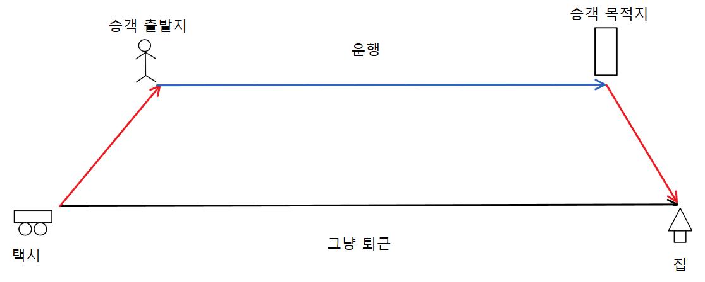
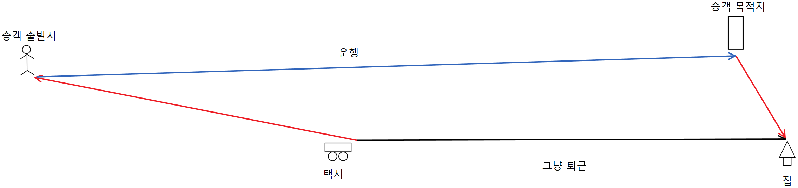
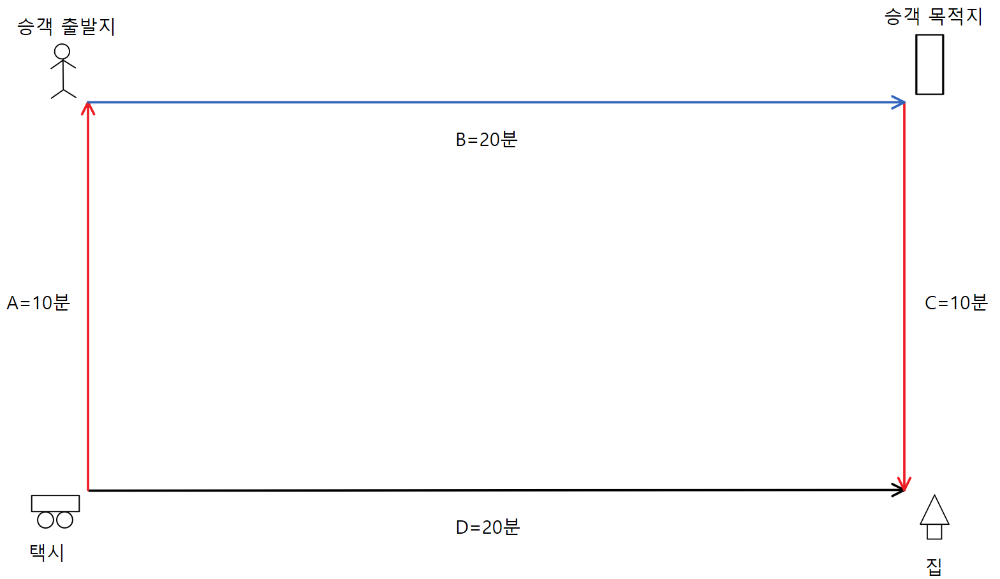
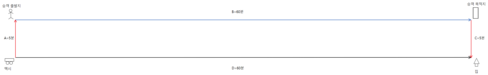
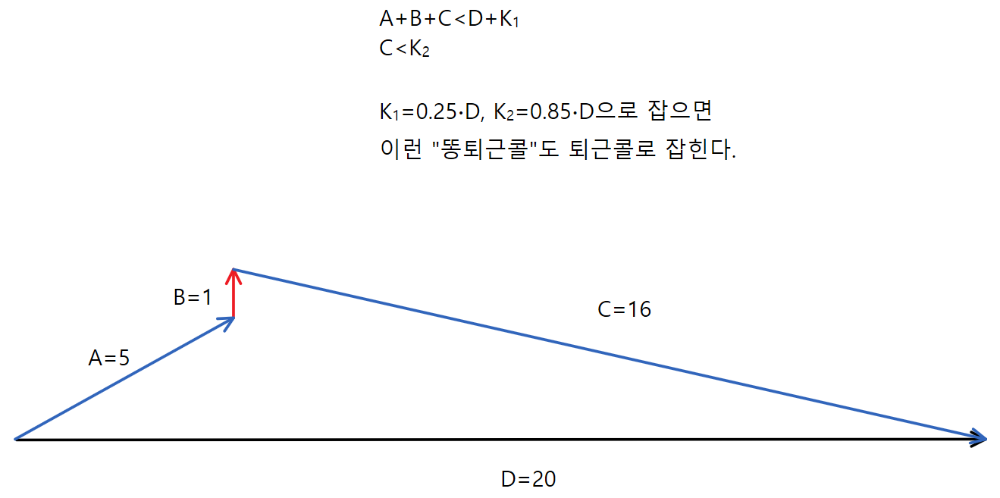

퇴근콜을 함께 정의한 Sini, Cheese, Nate께 감사드립니다.

## 퇴근콜의 의미

내가 택시를 타면서 기사에게 자주 들은 말이 있다.

"승객 도착지가 집이랑 반대방향이라 퇴근할 때 시간이 오래 걸린다."

하루종일 열심히 운전하신 기사분들이 빨리 집에 가게끔 도와주고 싶었다.

 

## 퇴근콜의 첫 정의

처음에는, 퇴근콜을 (승객 도착지)가 (집)이랑 가까운 운행으로 정의했다.

그러면 드라이버는 승객 하차 이후에 바로 집에 도착하니 기분이 좋을 거다.

| 일반콜                            |
| --------------------------------- |
|  |

| 퇴근콜                            |
| --------------------------------- |
|  |

 

## 퇴근콜의 재정의

위 정의를 토대로 모든 디자인을 개발한 상태에서, Nate와 Sini가 퇴근콜 정의의 허점을 지적했다:

(승객 도착지)가 (집)이랑 가깝기만 하다고 "퇴근콜"이라고 부를 수 있는가?

예를 들어서, (승객 목적지->집)이 가까워도 (택시->승객 출발지)가 훨씬 멀면 결국 드라이버는 퇴근하는데 오래 걸린다.

그럼으로 퇴근콜이라고 부를 수 없다.

| 나쁜 퇴근콜                       |
| --------------------------------- |
|  |

즉, ETA(택시→승객 출발지)가 ETA(승객 목적지→집)와 같은 중요도를 가진다.

예)

ETA(택시→승객 출발지)=20분, ETA(승객 목적지→집)=5분 콜과

ETA(택시→승객 출발지)=5분, ETA(승객 목적지→집)=20분 콜은

똑같은 퇴근콜 quality를 가진다.

 

## 퇴근콜의 공식화

공식화를 위해 변수들을 다음과 같이 정의했다:

A = ETA(택시→승객 출발지)

B = ETA(승객 출발지→승객 목적지)

C = ETA(승객 목적지→집)

D = ETA(택시→집)

 

위에서 재정의한 퇴근콜을 다음과 같이 공식화할 수 있다:

A + B + C < D + K

해석: 그냥 퇴근(D)과 퇴근콜후 퇴근(A + B + C)의 시간 차이(K)는 어디까지 허용되는가?

 

예를들어서 K = 10분으로 둔다면:

| 퇴근콜 (O)                        |
| --------------------------------- |
|  |

 

## 상수 vs 비율

위 예시처럼, 처음에는 K를 적당한 상수로 정하면 될까 생각했다.

근데 상수로 정할때도 문제가 생겼다.

예를들어서 K=20분으로 하자.

그러면 "그냥 퇴근"시간이 20분이 걸리는 경우에는 "퇴근콜후 퇴근"시간이 최대 40분이 되니 최대 2배나 늘어나니 적절하지 못하다.

| 적절하지 않은 퇴근콜              |
| --------------------------------- |
|  |

그렇다고 K를 10분으로 줄여도 문제다.

그러면 "그냥 퇴근"시간이 1시간 걸리는 경우에는 "퇴근콜후 퇴근"시간이 최대 1시간10분이 되니 이를 만족시키는 퇴근콜은 존재하지 않을거다..

| 존재하지 않는 퇴근콜               |
| ---------------------------------- |
|  |

시간 차이를 상수로 정하면 어떤 값을 정하든 퇴근 시간에 따라 안 맞는 값이 나온다.

그럼으로 퇴근 시간의 비율로 정해야 한다고 느꼈다.

 

## B vs D 논쟁

그렇다면 이 거리의 비율을 B(운행)를 기준으로 할까, D(그냥 퇴근)를 기준으로 할까?

처음에는 D를 기준으로 비율을 정하는걸 생각했다.

그 이유는 D기준이 직관적이고 설명하기 편하기 때문이다.

"퇴근콜은 그냥 집에 가는것보다 20%만 더 걸린다" 한문장으로 퇴근콜을 설명할 수 있다.

반면 B기준은 "퇴근콜은 그냥 집에 가는것보다 운행시간의 20% 더 걸린다"니 조금 복잡해진다.

 

그러나 D기준으로 하는것도 치명적인 문제가 있었다.

집 반대방향으로 가는 콜도 퇴근콜로 인식한다는 것이였다..

| 역행하는 퇴근콜                   |
| --------------------------------- |
|  |

비율을 어떤값으로 잡든, base가 D면 언제나 역행도 퇴근콜로 잡는다.

그렇다면 역행을 막기 위해서 C<D*K2 라는 2번째 조건을 추가하면 어떨까?

| 안 잡히는 좋은 퇴근콜             |
| --------------------------------- |
|  |

| 잡히는 나쁜 퇴근콜                |
| --------------------------------- |
|  |

K2를 낮게 잡으면 좋은 퇴근콜을 못 잡게 되고,

K2를 높게 잡으면 나쁜 퇴근콜을 잡게 된다.

(그렇다고 K2를 중간으로 잡으면 좋은 퇴근콜과 나쁜 퇴근콜 둘 다 잡게 된다.)

 

반면 B기준으로 하면 위 문제들이 모두 없다.

| 잡히는 좋은 퇴근콜                |
| --------------------------------- |
|  |

| 안 잡히는 나쁜 퇴근콜             |
| --------------------------------- |
|  |

여기서 귀납적으로 내린 결론은:

"좋은" 퇴근콜은 단순히 빨리 집에 가는게 아니다.

얼마나 오랫동안 운행을 하는지도 중요하다.

 

## 귀납적 추론의 한계

이렇게 귀납적으로 퇴근콜을 명확화할수록 걱정이 늘었다.

이렇게 예외상황들이 많이 나오면, B비율 정의 또한 예외상황이 안나올리라는 보장이 없기 때문이다.

어떻게 해야 예외상황을 막을 수 있을까?

 

	To be continued: 퇴근콜 공식 2부: 연역적 추론

