퇴근콜을 함께 정의한 Sini, Cheese, Nate께 감사드립니다.

## 퇴근콜의 의미

제가 택시를 타면서 기사분들께 자주 들은 말이 있습니다.

"승객 도착지가 집이랑 반대방향이라 퇴근할 때 시간이 오래 걸린다."

하루종일 열심히 운전하신 기사분들이 빨리 집에 가게끔 도와주고 싶었습니다.

 

## 퇴근콜의 정의

저희는 퇴근콜에서 드라이버의 니즈를 정확히 몰랐습니다.

그래서 저희는 일단 드라이버 입장에서 어떤 퇴근콜을 원할지 콜 예시들을 보면서 귀납적으로 정의했습니다.

 

처음에는, 퇴근콜을 (승객 도착지)가 (집)이랑 가까운 운행으로 정의했습니다.

그러면 드라이버는 퇴근콜 이후에 집에 빨리 도착할 수 있습니다.

| 일반콜                            |
| --------------------------------- |
| 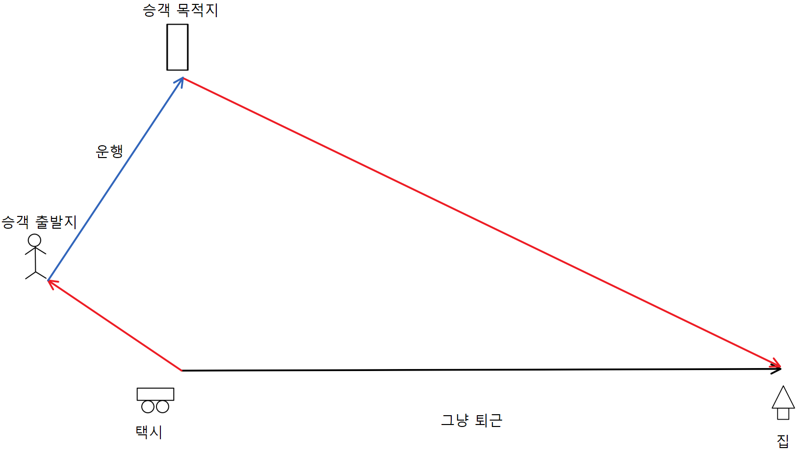 |

| 퇴근콜                             |
| ---------------------------------- |
| 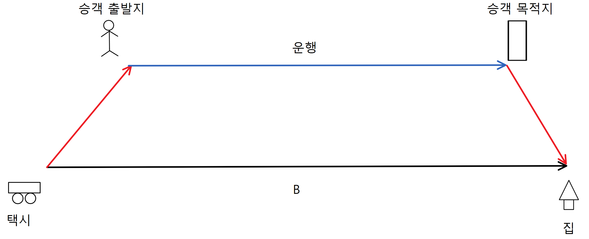 |

 

## 퇴근콜의 재정의

위 정의를 토대로 모든 디자인을 개발한 상태에서, Nate와 Sini가 퇴근콜 정의의 허점을 지적했습니다:

(승객 도착지)가 (집)이랑 가깝기만 하다고 "퇴근콜"이라고 부를 수 있습니까?

예를 들어서, (승객 목적지->집)이 가까워도 (택시->승객 출발지)가 훨씬 멀면 결국 드라이버는 퇴근하는데 오래 걸립니다.

그런 콜은 퇴근콜이라고 부를 수 없다고 봤습니다.

| 퇴근콜 ?                           |
| ---------------------------------- |
| 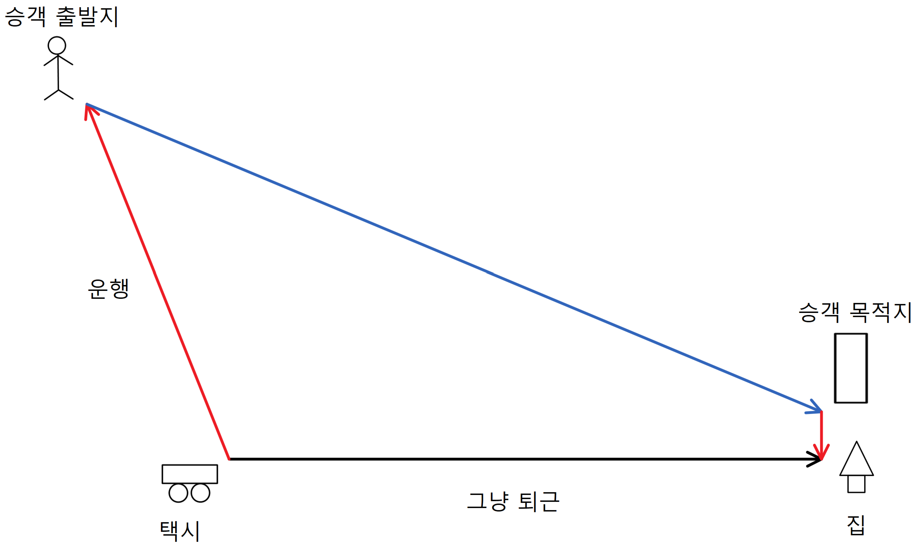 |

즉, ETA(택시→승객 출발지)가 ETA(승객 목적지→집)와 같은 중요도를 가진다는 겁니다.

*ETA: Estimated Time of Arrival

 

예)

ETA(택시→승객 출발지)=20분, ETA(승객 목적지→집)=5분 콜과

ETA(택시→승객 출발지)=5분, ETA(승객 목적지→집)=20분 콜은

똑같은 퇴근콜 quality를 가지게 됩니다.

 

## 퇴근콜의 공식화

공식화를 위해 변수들을 다음과 같이 정의했습니다:

A = ETA(택시→승객 출발지)

B = ETA(승객 출발지→승객 목적지)

C = ETA(승객 목적지→집)

D = ETA(택시→집)

 

위에서 재정의한 퇴근콜을 다음과 같이 공식화할 수 있습니다:

A + B + C < D + K

해석: 그냥 퇴근(D)과 퇴근콜후 퇴근(A + B + C)의 시간 차이(K)는 어디까지 허용되는가?

 

예를들어서 K = 10분으로 둔다면:

| 퇴근콜 (O)                        |
| --------------------------------- |
| 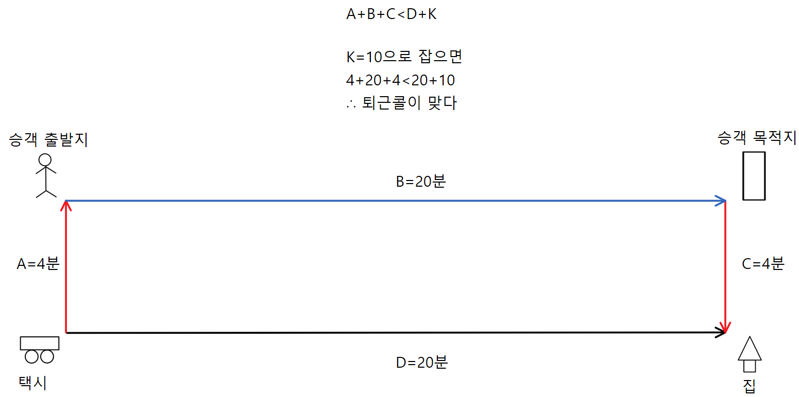 |

 

## 상수 vs 비율

위 예시처럼, 처음에는 K를 적당한 상수로 정하면 될까 생각했습니다.

근데 상수로 정할때도 문제가 생겼습니다.

 

예를들어서 K=20분으로 하면,

"그냥 퇴근"시간이 20분이 걸리는 경우에는 "퇴근콜후 퇴근"시간이 최대 40분이 됩니다.

그러면 그냥 퇴근하는것보다 퇴근콜이 2배로 더 걸리니 직감적으로 퇴근콜이 아니라고 느꼈습니다.

| 적절하지 않은 퇴근콜               |
| ---------------------------------- |
| 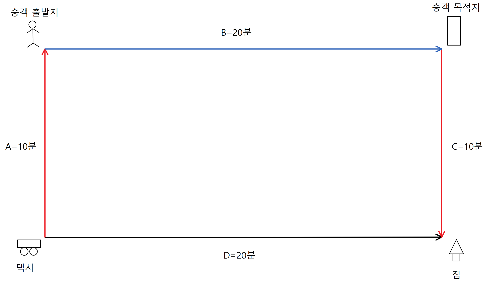 |

그렇다고 K를 10분으로 줄여도 문제라고 느꼈습니다.

그러면 "그냥 퇴근"시간이 1시간 걸리는 경우에는, "그냥 퇴근"경로와 "퇴근콜후 퇴근 경로"가 거의 일치해야 하니, 확률상 거의 존재하지 않을것이라고 예상했습니다.

| 존재하지 않는 퇴근콜               |
| ---------------------------------- |
| 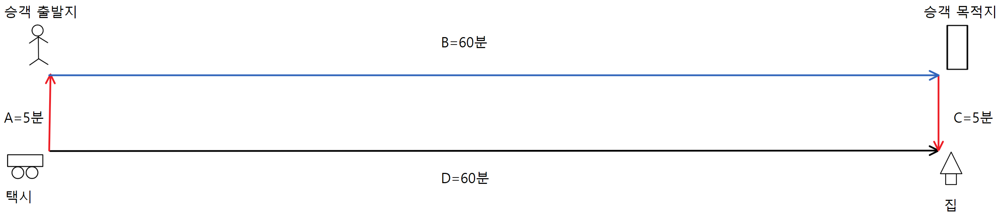 |

K를 상수로 정하면 어떤 값을 정하든 퇴근 시간에 따라 안 맞는 값이 나온다는걸 깨달았습니다.

그럼으로 K는 퇴근 시간에 dependency가 있어야 한다는걸 알았습니다.

 

## B vs D 논쟁

K를 B(운행)비율로 계산할지, D(그냥 퇴근)비율로 계산할지 고민했습니다.

처음에는 D비율로 계산하는걸 생각했습니다.

그 이유는 D비율이 직관적이고 설명하기 편하기 때문입니다.

"퇴근콜은 그냥 집에 가는것보다 20%만 더 걸린다" 한문장으로 퇴근콜을 설명할 수 있습니다.

반면 B비율은 "퇴근콜은 그냥 집에 가는것보다 운행시간의 20% 더 걸린다"니 조금 복잡해집니다.

 

그러나 D비율로 하는것도 치명적인 문제가 있었습니다.

집 반대방향으로 가는 콜도 퇴근콜로 인식한다는 것입니다..

| 역행하는 퇴근콜                   |
| --------------------------------- |
| 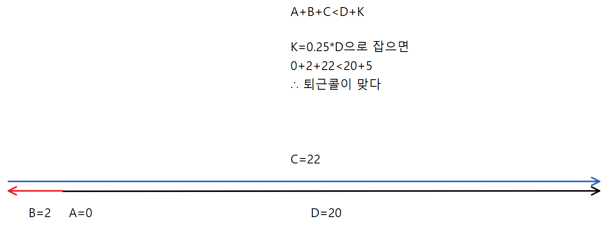 |

비율을 어떤값으로 잡든, base가 D면 언제나 역행도 퇴근콜로 잡습니다.

역행을 막기 위해서 C < D * K2 라는 2번째 조건을 추가해봤습니다.

| 안 잡히는 좋은 퇴근콜             |
| --------------------------------- |
| 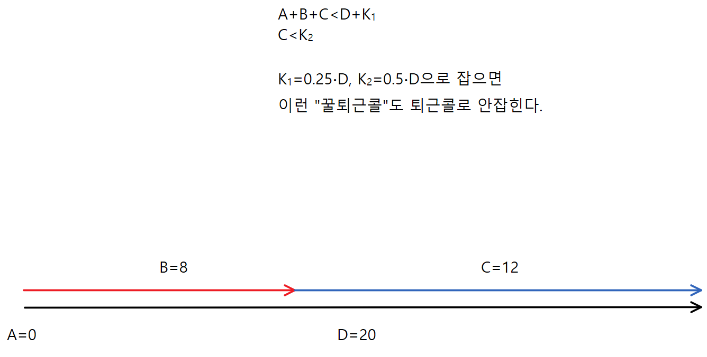 |

| 잡히는 나쁜 퇴근콜                 |
| ---------------------------------- |
| 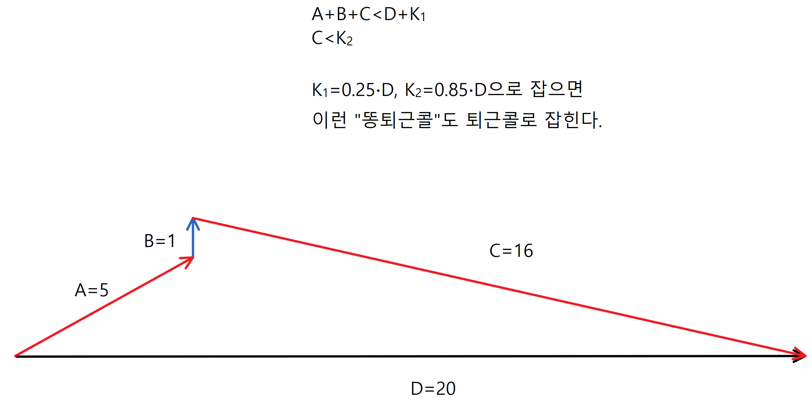 |

K2를 낮게 잡으면 좋은 퇴근콜을 못 잡고,

K2를 높게 잡으면 나쁜 퇴근콜을 잡습니다.

그렇다고 K2를 중간으로 잡으면 좋은 퇴근콜과 나쁜 퇴근콜 둘 다 잡게 됩니다.

 

반면 B비율로 하면 위 문제들이 모두 없습니다.

| 잡히는 좋은 퇴근콜                |
| --------------------------------- |
| 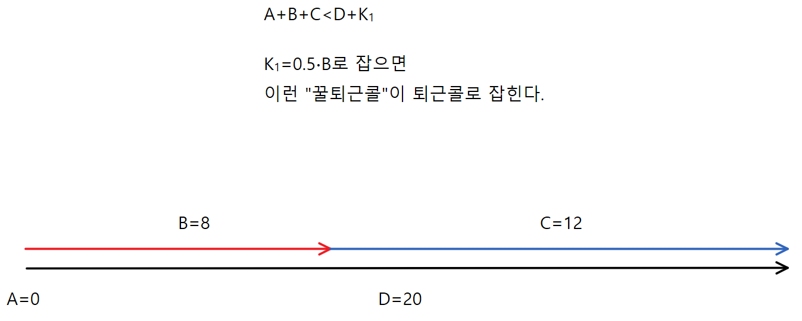 |

| 안 잡히는 나쁜 퇴근콜             |
| --------------------------------- |
| 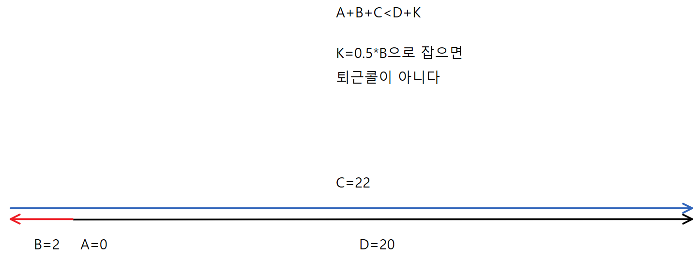 |

그렇게 저희는 퇴근콜을 B비율로 계산하기로 정했습니다.

 

## 귀납적 정의의 한계

지금까지 저희는 퇴근콜의 기하학적 예시들을 보고 귀납적으로 정의를 해왔습니다.

그러나 귀납적으로 퇴근콜의 정의를 할수록 걱정이 늘었습니다.

이렇게 예외상황들이 많이 나오면, B비율 정의 또한 예외상황이 안나올리라는 보장이 없기 때문입니다.

 

	To be continued: 퇴근콜 공식 2부: 연역적 정의

