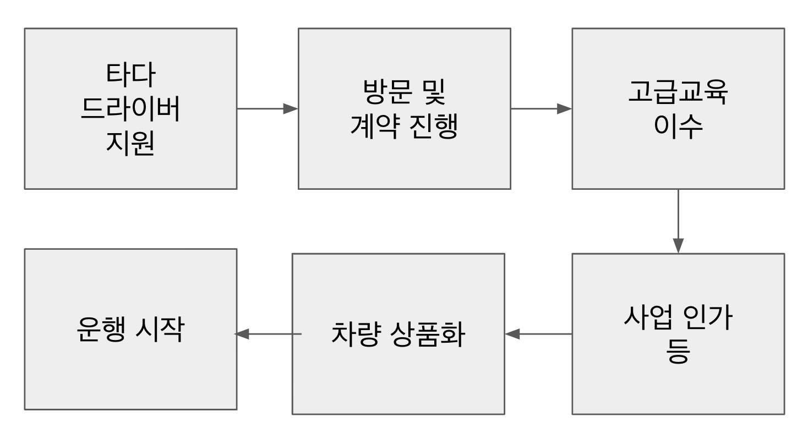
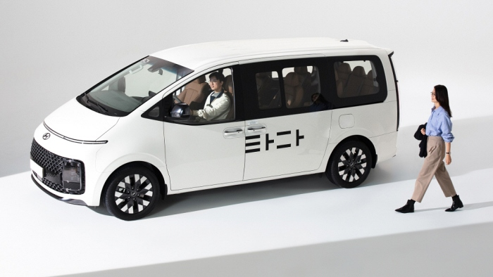
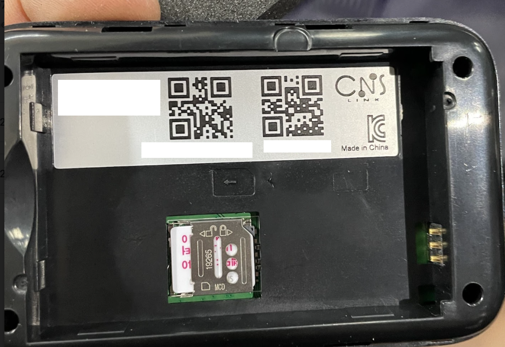
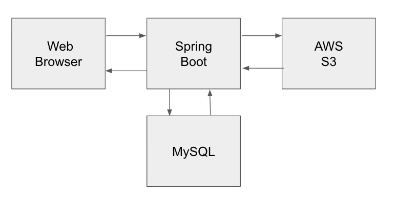
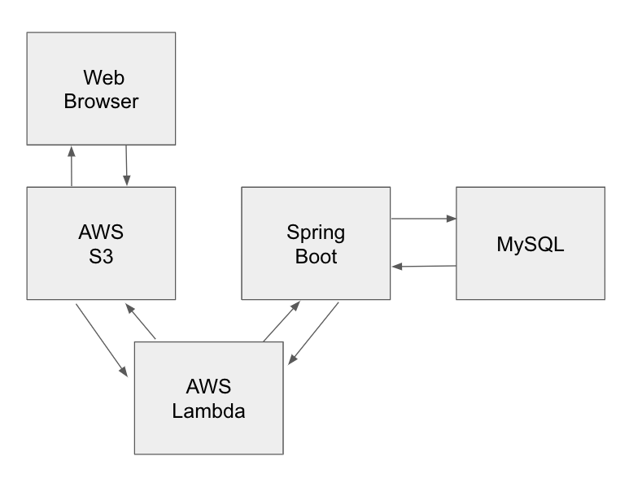

  &nbsp;타다는 2021년 11월 NEXT 라인업을 출시한 이후 고객들에게 더 빠른 배차 경험을 제공하기 위해 타다 드라이버님들을 적극 모집하고 있습니다. 타다 NEXT는 고급 택시로서, 일반 중형 택시에 비해 온보딩에 있어 보다 복잡한 절차들이 필요합니다. 저희 타다 인터널 프로덕트 팀에서는 빠르게 더 많은 기사님들을 파트너로 모시기 위해서 Driver Relationship System(이하 DRS)을 만들게 되었습니다. 이 글에서는 인터널 프로덕트 팀에서 DRS를 만들면서 AWS Lambda를 적극 활용한 사례를 공유하고자 합니다.


## 발단

타다 파트너가 되기 위해서 온보딩을 하는 단계는 아래와 그림과 같습니다.


<figcaption>타다 드라이버 온보딩 과정</figcaption>

[타다 드라이버 지원 페이지](https://apply.tadatada.com)에서 지원을 하게 되면 타다에 방문하여 계약을 하게 됩니다. 그 이후 고급 면허를 따기 위해서 고급 교육을 이수하고 구청에서 사업 인가를 위해 인가 신청을 합니다. 최종적으로 타다 브랜드에 맞게 상품화를 마치면 운행을 시작하게 됩니다. 이러한 과정에서 생성되는 계약서, 교육 이수 결과, 상품화 결과 및 사진 등을 DRS를 통해 관리하는 것이 요구사항이었습니다.

<div style="margin-top: 10px; display: flex; justify-content: center; width: 100%">
  <div style="max-width: 500px; width: 100%;">
    
  </div>
</div>
<figcaption>타다 넥스트 상품화</figcaption>

<br/>

위 과정의 상세 요구사항을 분석하다가 다른 요구사항들은 모두 설계를 했는데 2가지 요구사항에서 어려움을 맞게 되었습니다.

- **드라이버님의 제출 서류들을 한 번에 스캔하면 PDF로 저장하고 이를 종류별로 파일 분리해서 따로 저장을 해야 한다.**
- **차량 상품화 담당자가 와이파이를 차량에 설치하는데, 설치 이후 와이파이에 부착된 QR 코드 사진을 찍어서 DRS에 업로드하면, DRS에서 해당 QR 코드를 자동으로 읽어 와이파이 Serial Number를 추출해 차량 코드에 매핑하여 재고를 관리한다.**


<figcaption>와이파이 QR코드 사진</figcaption>

 위에서 언급한 두 요구사항은 기존에 Google Drive, [Colab](https://colab.research.google.com/)을 이용하여 해결하고 있었습니다. Google Drive에서 드라이버가 업로드한 PDF 문서와 와이파이 이미지를 python으로 작성된 프로그램을 통해 해결하고 있었습니다. 위 두 가지 기능을 두고 팀원들끼리 어떤 방법으로 구현할지 고민을 했습니다.

<br/>

원래 저희 기술 스택 (Next.js, Spring Boot)을 활용하려면 파일을 Web Browser에서 Spring Boot Sever로 전송하고 해당 파일을 읽어서 Java libray를 이용해서 PDF 분리 또는 QR 코드 인식을 진행하고 결과를 DB에 업데이트하는 방식으로 진행해야 했습니다.


<figcaption>변경해야하는 구조</figcaption>

위 방법에는 3가지 문제점이 있었습니다.

- **기존 web에서 이미지 업로드는 서버를 거치지 않고 바로 S3로 업로드를 했었는데 불필요하고, 부하가 큰 통신 과정이 추가되어야 했습니다.**
- **PDF를 카테고리 별로 분리하고 사진에서 QR코드를 읽어들이는 기능은 자원을 많이 소모하기 때문에 분리된 환경에서 다뤄야 한다고 생각했습니다.**
- **기존에 Colab에서 구현된 코드는 python이였고 이를 Java로 전환하는 데는 새로 코드를 짜야 했습니다.**

Colab보다는 S3와 동일하게 AWS로 통일하는 게 좋다고 판단했고, 그러다 AWS에서 제공하는 [Lambda Thumbnail](https://docs.aws.amazon.com/lambda/latest/dg/with-s3-tutorial.html) 예제 코드에 착안해서 Lambda 및 S3 Trigger를 통해서 python으로 개발하자는 아이디어가 나왔고 만장일치로 진행하게 되었습니다.


<figcaption>새로 고안한 구조</figcaption>

## 전개

처음 pdf 파일 분리하는 코드는 간단했습니다. [Lambda Thumbnail](https://docs.aws.amazon.com/lambda/latest/dg/with-s3-tutorial.html) 예제 코드와 다를 게 없이 Lambda Console Editor를 이용해 S3에 PDF가 특정 PostFix로 업로드되면 해당 파일을 읽어 드립니다. 그리고 추가한 [PDF Library](https://pypi.org/project/PyPDF2/)를 Lambda에서 외부 라이브러리를 추가하기 위해서 사용하는 [Lib Layer](https://docs.aws.amazon.com/lambda/latest/dg/configuration-layers.html)에 Import 해 PDF를 순서에 맞게 분할을 해서 다시 S3에 업로드하면 되었습니다.

<br/>

아래와 같이 파일 분리 시 splitStart부터 splitEnd까지의 페이지를 분할하고 writePageName 이름으로 저장하는 Function을 만들었습니다.
<br/>

```python
def split_upload_file(writePageName, splitStart, splitEnd):
    pdf = PdfFileReader(download_path)
    pdfWriter = PdfFileWriter()
    for page in range(splitStart, splitEnd):
      pdfWriter.addPage(pdf.getPage(page))

    with open(upload_path, 'wb') as f:
        pdfWriter.write(f)
        f.close()

    upload_path = '/tmp/{0}_{1}.pdf'.format(_s3_file_name, writePageName)
    upload_key_name = '{0}{1}_{2}.pdf'.format(s3_file_dir, _s3_file_base_name, writePageName)
    s3_client.upload_file(upload_path, _bucket, upload_key_name)
```
<br/>
순조롭게 분리가 되었고 사용하는데 문제가 없었습니다.

## 위기

QR코드 인식을 위해서 [pyzbar](https://pypi.org/project/pyzbar/)를 Lib Layer로 추가하려고 했는데 문제가 생겼습니다. Shared Library인 [zbar](http://zbar.sourceforge.net/)를 설치를 해야 했는데 Shared Library는 Layer로 추가해도 pyzbar에서 읽기가 불가능했고 Docker 이미지를 만들어야 했습니다. (Lambda에서 Sharing Layer 추가 [가이드 문서](https://aws.amazon.com/premiumsupport/knowledge-center/lambda-linux-binary-package/?nc1=h_ls) ) 그래서 이미지를 이용해서 Lambda를 만들기로 하였고 다시 DockerFile부터 만들기 시작했습니다.

```DockerFile

FROM public.ecr.aws/lambda/python:3.8

ENV ZBAR_PATH=/var/task/usr/lib/libzbar.so.0.3.0

COPY app.py ${LAMBDA_TASK_ROOT}

COPY lib usr/lib

COPY requirements.txt  .

RUN pip3 install -r requirements.txt --target "${LAMBDA_TASK_ROOT}"

RUN yum install git -y
RUN git clone https://github.com/nickovs/pyzbar.git

CMD [ "app.handler" ]

```

<br/>

- 우선 Lambda의 python 이미지를 활용하여
- amazonlinux를 이용해서 미리 만든 [zbar lib](https://gist.github.com/nickovs/f097c577df90bdeb98ea0127c60e3462)를 COPY 하여 라이브러리로 사용했습니다. 
- Lib를 COPY 하고 나니 PIP를 이용해서 pyzbar를 이용해서 intall 하는데 성공할 수 있었습니다. 
- 여기서 ZBAR_PATH를 바로 못 찾는 경우가 있어 ZBAR_PATH를 강제로 지정할 수 있도록 pyzbar 코드에서 Shared Library 찾는 코드를 일부 수정하여 활용하였습니다. ([pyzbar](https://github.com/nickovs/pyzbar) 코드 참고)


## 결말

이와 같은 단순한 구조로 인해 빠르게 오픈할 수 있었던 DRS는 7월 중순부터 매일 들어오는 드라이버 분들의 계약을 진행하고 있습니다. 물론 안정적이고, 원활하게 PDF 분리 및 QR-Code Scan을 사용하고 있습니다.

<br/>

앞으로 발전시켜 볼 내용

- **QR 코드 스캔이 에러 났을 때 Slack으로 알람 주는 내용을 추가해 볼 예정입니다. (QR 코드 사진 자체가 퀄리티가 떨어지면 에러가 나는 경우가 종종 있습니다.)**
- **지금은 스캔 된 PDF 문서에 내용을 직접 타이핑해서 DRS에 입력하고 있는데, OCR 기술로 읽는 Lambda Function을 만들어볼 예정입니다.**
<br/>

저희 인터널 프로덕트 팀에서는 이 글에서 해결해 나간 상황처럼 다양한 문제를 기술 스택의 한계를 가지지 않고 슬기롭게 해결해 나갈 개발자를 찾고 있습니다. :)
