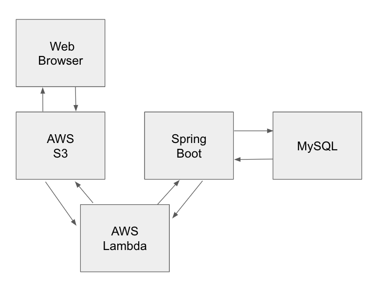

  &nbsp;타다는 2021년 11월 NEXT 라인업을 출시한 이후 고객들에게 더 빠른 배차 경험을 제공하기 위해 타다 드라이버님들을 적극 모집하고 있습니다. 타다 NEXT는 고급 택시로서, 일반 중형 택시에 비해 타다 파트너로서 운행하기 위해 보다 복잡한 절차들이 필요합니다. 저희 타다 인터널 프로덕트팀에서는 빠르게 더 많은 기사님들을 파트너로 모시기 위해서 Driver RelationShip System(이하 DRS)을 만들게 되었습니다. 이 글에서는 인터널 프로덕트 팀에서 DRS를 만들면서 AWS Lambda를 적극 활용한 사례를 공유하고자 합니다.


## 발단

&nbsp;DRS를 만들다가 다른 요구사항들은 모두 설계를 했는데 2가지 요구사항에서 어려움을 맞게 되었습니다.

- **드라이버님의 제출 서류들을 한 번에 스캔하면 PDF로 저장하고 이를 종류별로 분리해서 따로 저장을 해야 한다.**
- **차량에 와이파이 단말기를 달고 부착 사진을 업로드하면 사진의 QR 코드를 읽어서 차량에 코드를 등록해야한다.**

&nbsp;위 두 가지 기능은 기존에 Google Spread Sheet에서 Colab을 이용하여 Google Drive에서 이미지 및 파일을 읽어드리고 python으로 작성된 프로그램을 통해 각각 요구사항을 해결하고 있었습니다. 위 두 가지 기능을 두고 팀원들끼리 어떤 방법으로 구현할지 고민을 했습니다. 원래 저희 기술 스택 (Next.js, Spring Boot) 만으로 구현을 하려면 파일을 Web Browser에서 Spring Boot Sever로 전송하고 해당 파일을 읽어서 Java libray를 이용해서 PDF 분리 또는 QR 코드 인식을 진행하고 결과를 DB에 업데이트하는 방식으로 진행해야 했습니다.

<div style="margin-top: 10px; display: flex; justify-content: center; width: 100%">
  <div style="max-width: 500px; width: 100%;">
    
  </div>
</div>

&nbsp;위 방법에는 2가지 문제점이 있었습니다.

- **기존 web에서 이미지 업로드는 서버를 거치지 않고 바로 S3로 업로드를 했었는데 불필요하고, 부하가 큰 통신 과정이 추가되어야 했습니다.**
- **기존에 Colab에서 구현된 코드는 python이였고 이를 Java로 전환하는데는 새로 코드를 짜야 했습니다.**

&nbsp;그러다 AWS에서 제공하는 [Lambda Thumbnail](https://docs.aws.amazon.com/lambda/latest/dg/with-s3-tutorial.html) 예제 코드에 착안해서 Lambda 및 S3 Trigger를 통해서 python으로 개발하자는 아이디어가 나왔고 만장일치로 진행하게 되었습니다.

<div style="margin-top: 10px; display: flex; justify-content: center; width: 100%">
  <div style="max-width: 500px; width: 100%;">
    
  </div>
</div>

## 전개

&nbsp;처음 pdf 파일 분리하는 코드는 간단했습니다.  [Lambda Thumbnail](https://docs.aws.amazon.com/lambda/latest/dg/with-s3-tutorial.html) 예제코드와 다를게 없이 Lambda Console Editor를 이용해 S3에 PDF가 특정 PostFix로 업로드 되면 해당 파일을 읽고 추가한 PDF Lib Layer를 Import해 PDF를 순서에 맞게 분할을해서 다시 S3에 업로드 하면 되었습니다.

<br/>

&nbsp;아래와 같이 파일 분리 시 splitStart 부터 splitStart 까지의 페이지를 분할 하고 writePageName 이름으로 저장하는 Function을 만들었습니다.
<br/>

```python

def split_upload_file(writePageName, splitStart, splitStart):
    pdf = PdfFileReader(download_path)
    pdfWriter = PdfFileWriter()
    for page in range(splitStart, splitEnd):
      pdfWriter.addPage(pdf.getPage(page))

    with open(upload_path, 'wb') as f:
        pdfWriter.write(f)
        f.close()

    upload_path = '/tmp/{0}_{1}.pdf'.format(_s3_file_name, writePageName)
    upload_key_name = '{0}{1}_{2}.pdf'.format(s3_file_dir, _s3_file_base_name, writePageName)
    s3_client.upload_file(upload_path, _bucket, upload_key_name)

```
<br/>
&nbsp;순조롭게 분리가 되었고 사용하는데 문제가 없었습니다.

## 위기

&nbsp;QR코드 인식을 위해서 [pyzbar](https://pypi.org/project/pyzbar/) 를 Layer로 추가하려고 했는데 문제가 생겼습니다. Shared Library인 [zbar](http://zbar.sourceforge.net/) 를 설치를 해야 했는데 Shared Library는 Layer로 추가해도 pyzbar에서 읽기가 불가능했고 Docker 이미지를 만들어야 했습니다. 그래서 이미지를 이용해서 Lambda를 만들기로 하였고 다시 DockerFile부터 만들기 시작 했습니다.

```DockerFile

FROM public.ecr.aws/lambda/python:3.8

ENV ZBAR_PATH=/var/task/usr/lib/libzbar.so.0.3.0 

COPY app.py ${LAMBDA_TASK_ROOT} 

COPY lib usr/lib 

COPY requirements.txt  . 

RUN  pip3 install -r requirements.txt --target "${LAMBDA_TASK_ROOT}" 

CMD [ "app.handler" ]

```

<br/>

&nbsp;AWS Amazon Docker 이미지를 이용했고 미리 amazonlinux를 이용해서 zbar lib를 만들었고 이를 COPY 하여 라이브러리로 사용했습니다. Lib를 COPY 하고 나니 PIP를 이용해서 pyzbar를 이용해서 intall 하는데 성공할 수 있었습니다. 여기서 ZBAR_PATH를 바로 못 찾는 경우가 있어 ZBAR_PATH를 강제로 지정할 수 있도록 pyzbar 코드에서 Shared Library 찾는 코드를 일부 수정하여 활용하였습니다. [링크](https://github.com/nickovs/pyzbar) 코드 참고


## 결말

&nbsp;DRS는 7월 중순 OPEN 하여 매일 들어오는 드라이버 분들의 계약을 진행하고 있고 역시 PDF 분리 및 QR-Code Scan을 원활하게 사용하고 있습니다.


&nbsp;앞으로 좀 더 발전시켜보면 좋을 것들은

- **QR 코드 스캔이 에러 났을 때 Slack으로 알람 주는 내용을 추가해 볼 예정입니다. (QR 코드 사진 자체가 퀄리티가 떨어지면 에러가 나는 경우가 종종 있습니다.)**
- **지금은 스캔 된 PDF 문서에 내용을 직접 타이핑해서 DRS에 입력하고 있는데 가 OCR 기술로 읽는 Lambda Function를 만들어볼 예정입니다.**

<br/>

&nbsp;기술 블로그 개편은 단지 저희가 만족하기 위한 것이 아닙니다. 진심으로 저희의 고민이 세상에 도움을 줄 수 있다는 확신이 있고, 이를 더 많은 사람과 공유할 수 있기를 바랍니다. 타다는 이동에서 발생하는 수많은 문제를 기술로 해결하고 싶은 팀입니다. 기술적 난제들을 고민하면서 좋은 팀과 서비스를 함께 만들고 키워나갈 좋은 분들을 기다리고 있습니다. 앞으로도 저희의 여정에 많은 관심 부탁드립니다.

[처음]: /2013-04-15-hello-world
[타다]: https://tadatada.com/
[대표 이미지를 제작]: https://www.instagram.com/designedbytada/
[존재하는 테마]: http://jekyllthemes.org/
[jekyll]: https://jekyllrb.com/
[gatsby]: https://www.gatsbyjs.com/
[plugin]: https://www.gatsbyjs.com/plugins
[disqus]: https://disqus.com/
[utterances]: https://utteranc.es/
[rss]: https://ko.wikipedia.org/wiki/RSS
