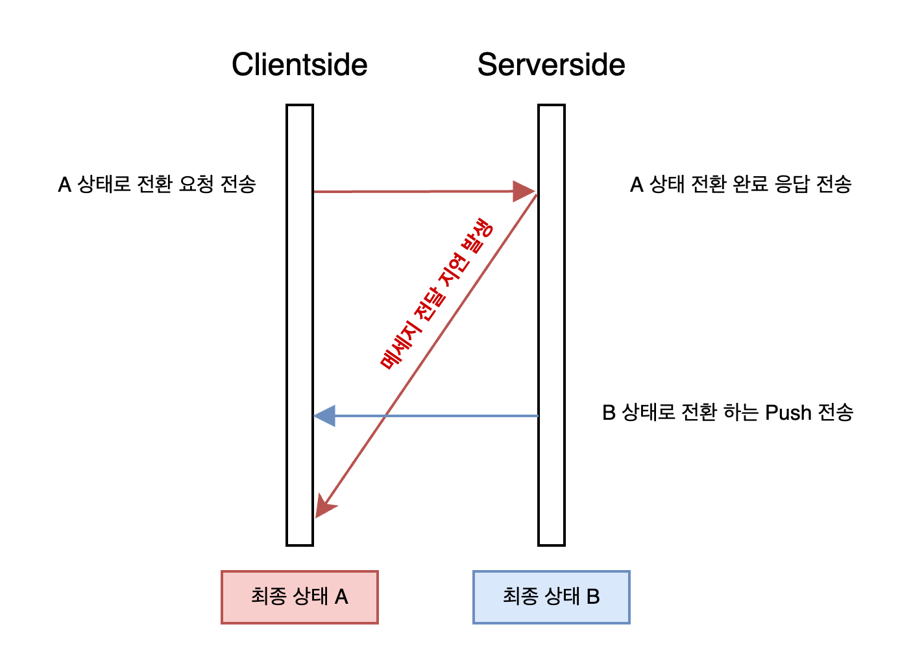

안녕하세요, 타다 드라이버 앱의 안정성 및 생산성을 개선하기 위해 현재 팀 내에 존재하는 문제 상황들을 분석하고 상태관리의 개선을 통해 이를 해결한 과정을 공유해 보려고 합니다.


타다 드라이버 앱은 타다 운행 기사님들이 사용하는 앱으로 승객이 요청한 택시 배차, 택시 예약 등을 매칭하고 운행하는 기능을 제공합니다.
라이드 헤일링이라는 실시간 비즈니스의 특성상 앱의 신뢰도도 민감하며, 타다 팀의 제품 개선 니즈에 맞추어 빠른 피쳐 생산성을 필요로 하는 앱이기도 합니다.

타다 드라이버 앱 코드베이스에는 위 앱의 신뢰도 / 생산성의 측면에서 몇 가지 문제상황이 있었습니다.

---

## 팀 내에 존재하는 문제상황

### 1. 깊고 복잡한 상태 에 얽힌 도메인 로직

타다 드라이버 앱은 일반적인 앱들에 비해 깊고 복잡한 상태를 가지고 있습니다.

- 기본적인 앱 로그인 / 로그아웃 상태
- 로그인 상태라면 현재 택시를 운행중인지
- 운행 중이라면 고객을 태운 상황인지
- 운행과 별도로 존재하는 다음에 수행할 예약 운행이 있는지 등등...

이와 같이 택시 운행의 상태가 앱의 상태로 대변되는 도메인 특성상 깊고 복잡한 상태를 가지고있습니다. 이런 상태를 잘 관리할 수 있도록 [RIBs] 라는 아키텍쳐를 선택한 것 또한 위의 상황을 잘 보여주고 있습니다.


> 현재 타다 드라이버 앱 내의 State Tree 를 유추할 수 있는 RIB Tree

복잡한 상태를 가진 만큼 그 상태 변경 로직은 다양한 도메인 맥락을 고려해야 합니다.

- 서버와 클라이언트 간의 상태를 싱크맞출 때 사용자의 인지 여부에 따라 특정 경우 서버값으로 업데이트 하지 않는다 (X 상황에서는 Y 의 업데이트를 지연한다)
- 상태를 Clear 시킬 때 만약 Clear 된 값을 대체할 다른 값이 상태 내부에 존재할 경우 그 값으로 대체시킨다

와 같은 도메인 맥락이 충분하지 않은 상태에서 상태 변경 코드를 작성하면 버그를 만들어 낼 가능성이 높습니다.

```kotlin
// 실제 코드를 단순화한 코드라 오류가 있을수 있습니다.
fun updateStateAfterRideDropOff(/* ... */) {
  // 취소된 상태나 하차완료 상태의 경우 서버 상태와 상이할 가능성이 있으니 상태 보정을 진행한다.
  if (currentRide.status.isIn(RideStatus.CANCELED, RideStatus.DROPPED_OFF)) {
      // 미리배차된 라이드가 존재할시, 미리배차된 라이드로 전환되어야 하므로
      // 현재 하차완료된 라이드에 해당되는 UI 를 잠시라도 보여주지 않기 위해 currentRide 의 업데이트는 하지 않는다.
      if (forwardRide != null) {
          dataStore.forwardRide.value = forwardRide
          return
      } else if (alreadyDeniedPendingRide) {
          // 수락을 기다리는 상태의 Ride 가 api 상에서 들어오더라도
          // 이미 수락을 거절한 상태라면, currentRide 업데이트를 하지 않는다.
          if (ride.status == RideStatus.PENDING) {
              dataStore.currentRide.clear()
              return
          }
      }
  }
  dataStore.currentRide.value = ride
}
```

> 상태 업데이트에서 발생하는 도메인 맥락은 위 예시 코드 & 주석을 통해서 간접 체험할 수 있습니다.

### 2. 상태 변경에서 반복적으로 나타나는 코드가 존재한다.

타다 드라이버 앱은 서버와의 통신에 HTTP, [gRPC] 를 함께 사용하고 있습니다. 이중화된 상태 변경 요인으로 인해 네트워크 상황에 따라 논리적인 상태 변경 순서와 네트워크를 통해 전달된 상태 변경 순서가 상이해 지며 발생하는 버그들이 있었고 이를 위한 `상태 업데이트용 순서 보정 코드` 를 작성한다던지



분리되지 않고 한번에 발생해야 하는 상태 업데이트가 개별로 발생하며 event emit 이 불필요하게 여러번 발생하는 등의 `두 상태 업데이트간의 간섭으로 생기는 미묘한 동시성 버그 해결을 위한 코드` 등


> A -> A" 변화와, B -> B" 변화를 동시에 발생시켜야 하지만, 개별 state 로 존재하여 2번의 업데이트가 발생하는 상황

상태관리에서 나타나는 bug 를 막기위한 **비슷한 맥락의 코드가 중복적으로 발생하는 (또는 놓쳐지는...) 문제** 가 존재하였습니다.

### 3. 버그 픽스 / 디버깅 시 특정 상태를 손쉽게 확인 및 재현하고싶다.

CS로 인입되는 버그 상황 중 일부는 앱 상태관리와 관련된 버그였습니다. 예를 들어 `"갑자기 택시 콜의 수락이 안 되어서 배차가 거절 당했다!"` 라는 CS가 존재했습니다.

단순 코드만 보고는 문제 상황을 유추하기가 어려웠고, 결국 앱 내 상태가 어떻게 변경되었는지 순서를 릴리즈에 로깅을 찍으면서 해당 문제가 발생한 상태를 알아내고 수정한 기억이 납니다. (앞서 말씀드린 상태 관리에서 발생하는 동시성 이슈가 원인이었습니다 :sad:)

비슷한 상황은 개발 도중에도 발생합니다. 특정 상태에 대응하는 UI 개발을 진행할 때 해당 상태를 만드는 것 자체가 쉽지 않은 경우가 존재합니다. 예를 들어, _실시간 택시 운행 완료 후 인접한 택시 예약이 존재할 때 노출되는 UI_ 를 바꾸고 싶다면

- 승객 앱으로 택시 예약을 생성하고
- 택시 기사 앱으로 택시 예약을 수락한 다음, 예약에 인접한 시간 까지 대기
- 또 다른 승객 앱으로 실시간 택시를 호출하여 택시 기사 앱으로 수락한 다음 운행을 완료

하는 복잡한 상태를 매번 긴 시간을 들여서 만들어야 하는 문제가 존재했습니다.

> 물론 http 응답을 mocking 하거나, UI 코드 레벨에서 임시적인 mock state 를 사용하는 방법도 있습니다.
> 하지만 _실제 Flow 에 대한 순차적 mocking_ 을 구성하는게 귀찮고, _빈번하게 사용되는 mock state 에 대한 재사용성_ 을 챙기기 힘들어 썩 마음에 드는 방식은 아니었습니다.

---

## 문제가 많다... 어떻게 해결할 수 있을까?

위 문제들은 현재 코드 생산성에 병목이 되고 있는 문제이면서, 또한 **상태관리** 라는 공통 분모를 가지고 있는 문제였습니다.
이를 각각을 쪼개어 지엽적인 해결을 하기보다, 근본적으로 Android 개발팀의 니즈를 반영하는 상태관리 레이어를 개발하여 위 문제들을 수정하려고 했습니다.

- 상태 변화에 대한 테스트를 작성하여 변경에 대한 안정성을 만들면, 복잡한 상태로 인한 버그가 줄어들 것이다.
- 상태 관리에서 반복적으로 나타나는 패턴을 [Plugin](미들웨어)화 하여 반복을 줄이고 관점 지향의 개발을 할 수 있도록 하면, 중복 코드 / 중복 버그를 줄일 수 있을 것이다.
- 상태 변화에 대한 모니터링 (디버깅) 을 쉽게할 수 있는 방법을 만들면 개발 도중 / CS 대응의 효율성을 높일 수 있을 것이다.

위와 같은 가설을 확인할 수 있는 방향으로 리팩토링을 계획하였고, 그 로드맵은 아래와 같았습니다.

1. 앱 내의 상태를 관리하는 책임을 독립된 모듈로 분리하자.
2. 상태관리가 안정적이고, 확장에 유리한 모듈로 개선하자.
3. 확장성 및 안정성이 올라온 상태 관리 모듈에 대해 테스팅, 플러그인 등 현존하는 문제를 해결할 수 있는 코드를 작성하자.

앞으로의 글은 위 개선 과정을 설명하면서 진행하려고 합니다.

---

## 1. 앱 내의 상태를 관리하는 책임을 독립된 모듈로 분리하자.


> (구) 상태관리 코드가 분산되어 있는 형태

타다 드라이버 코드베이스에서는 기존 위와 같은 상태를 업데이트하는 코드들이 특정 추상화 계층에 몰려있지 않고, 내부적으로 RIBs Interactor 라고 부르는 소위 말하는 ViewModel 과 유사한 Application 레이어에 분산되어 있었습니다.

별도의 계층을 두지 않는 만큼 계층의 주입이나 분리를 위한 부차적인 boilerplate 코드를 생산하지 않기에 **당장의 피쳐 개발을 위한 빠른 생산성에 유리** 하였지만, 대신

- 분산되어 있는 코드는 관리 측면에서 어려움
- 상태관리의 개선을 위한 관점 지향 컴포넌트 (Plugin) 추가 어려움
- 유닛 테스트 작성 힘듦

와 같은 이번 리팩토링으로 이루고자 하는 장기적인 생산성 항샹에는 적합하지 않은 구조였습니다.

따라서 이를 상태에 대한 변화를 만드는 코드를 모두 한 곳으로 응집시켰고, 이 기계적인 작업의 결과는 매우 커다랗고 수많은 메서드를 가지고 있는 거대한 모듈이 되었습니다.
이제 우리가 해야할 일은 퍼져있던 로직이 한데 모인 거대한 모듈을 **내부적인 책임 분리나 확장에 용이한 모듈로 만드는 일** 이었습니다.

## 2. 안정적이고 확장에 유리한 모듈로 개선하자

책임의 분리 및 확장에 용이한 모듈을 고민하던 차에 [Redux] 를 접하게 되었습니다.

[Redux] 는 상태관리를 담당하는 javascript 생태계의 라이브러리로 단방향 데이터 흐름으로 상태를 변경 & 구독하며, Action 처리에 대한 Middleware 를 제공하는 라이브러리이며 프로그래밍 스타일이라고 요약할 수 있습니다. (대략적인 개념은 안드로이드, iOS 생태계의 MVI Architecture 와 유사하다고 볼 수 있습니다.)

개인적인 흥미로 타다 WebFrontend 팀에서 Redux 를 사용한 프로젝트를 진행하며 Redux 의 /단을 체감할 수 있었고 이 중에는 타다 드라이버 앱의 상태관리에서 발생하는 문제점을 해결하는데 효과적이라고 느껴지는 부분들이 많았습니다.

> WebFrontend 팀의 더 자세한 redux 사용기는 [여기](https://blog-tech.tadatada.com/2022-08-08-redux-again) 에서 확인하실 수 있습니다.

- State Mutation(Action), State Subscription 등 Redux 의 단방향 데이터 흐름 개념은 기존 부터 MVVM + RxJava 로 익숙한 사용성이다. 
- Action 과 State 에 대한 Middleware 의 도입을 통해 관점 중심의 개발을 할 수 있다.
- 중앙집중화된 상태관리를 제공하여 이와 궁합이 잘 맞는 커다란 State Tree 를 가지는 프로덕트 요구사항에서 Fit 이 잘 맞는다.

위와 같은 장점을 고려하며 (특히나 Middleware 컴포넌트의 존재) Redux 로 우리의 니즈를 해결하는데 큰 도움이 될 수 있을 것이라 판단하였고 Redux 를 모티브로 상태관리를 담당하는 이하 `StateMachine` 을 만들기 시작하였습니다.

> 최초에는 [finite-state machine] 의 형태로 좀 더 상태간의 관계를 잘 모델링하는 상태관리를 고려하고 있었기에 StateMachine 이라는 이름이 붙게 되었습니다.
> 하지만, 당장은 [finite-state machine] 스러운 모듈을 통한 이점보다는 빠른 구현체를 만드는데 중점을 두어 현재와 같은 Redux style 의 StateMachine 이 탄생하게 되었습니다.

```kotlin
interface StateMachine {
  val state: DataStream<State>
  fun dispatch(action: Action)
}

interface Reducer {
  fun reduce(prevState: State, action: Action): State
}

interface Middleware {
  fun intercept(next: (Action) -> State): (Action) -> State
}
```

Redux 의 간단한 매커니즘을 카피하여 유사한 인터페이스를 구축하고 실제 내용물을 구현하기 시작했습니다.

```kotlin
// 실제 구현된 StateMachineImpl 의 동시성 처리 등의 디테일을 생략하고
// 이해를 돕기 위해 만든 간단한 구현체 입니다.
class MinimalStateMachineImpl {
  private val _state = MutableDataStream()
  override val state = _state.toDataStream()

  private val combinedReducer: Reducer // 주입 생략
  private val middlewares: List<Middleware> // 주입 생략

  override dispatch(action: Action) {
    val prevState = _state.value
    val nextStateGenerator = middlewares.fold(
      { action -> combinedReducer.reduce(prevState, action) }
    ) { next, middleware ->
     middleware.create(next)
    }
    _state.update(nextStateGenerator(action))
  }
}

val stateMachine = MinimalStateMachineImpl()

// 상태의 mutation
stateMachine.dispatch(Action.ReceiveRide())
stateMachine.dispatch(Action.PickUp())
stateMachine.dispatch(Action.Arrive())
stateMachine.dispatch(Action.ClearRide())

// 상태를 구독하는 방식
stateMachine.state.observe { state ->
  // mutate ui on state changed!
}
```

- StateMachine 은 `State` 에 대한 Mutation 을 `Action` 이라는 데이터를 dispatch 하여 진행하고
- Mutation 을 발생 시키는 과정에서는 `Middleware` 라는 중간자가 존재하여 과정에 개입할 수 있으며
- 최종적으로 `State` 의 Mutation 을 시키는 도메인 로직은 `Reducer` 가 책임을 가져가게 됩니다.

```kotlin
class RideReducer: Reducer {
  fun reduce(action: Action): State {
    return when (action) {
      is Action.ReceiveRide -> /* get next state */
      else -> /* get next state */
    }
  }
}
```

또한 분리 과정에서 위와 같은 형태로 Reducer 를 쪼개어 가면서 거대한 모듈을 책임에 따라 (실시간 운행을 위한 상태, 예약 운행을 위한 상태 등) 분리하였습니다.

## 3. StateMachine 을 통해 해결하는 문제


이제 제작한 StateMachine 을 통해 기존 존재하던 문제를 해결한 사례를 공유드리려 합니다.
### 상태 관리 모듈 분리

모듈의 분리로 인해 취약했던 상태 관리 책임이 한 곳으로 집중되었으니, 가벼운 피쳐 개발을 진행하면서 커다란 버그를 만들게 되는 일이 비교적 줄어들었습니다.
코드내의 domain / application 레이어의 분리를 통해 얻을 수 있는 장점과 단점들이 발생했다고 보면 될 것 같습니다. 장점중 큰 비중을 차지하는 Testability 는 아래에서 이어서 설명하도록 하겠습니다.

### Middleware 를 통해 쉽게 확장가능한 요구사항 해결

상태관리 모듈을 개선하면서 중요하게 고려한 점 중 하나는 Middleware, Plugin 등으로 불리는 관점 중심의 개발이 가능해 지는지 여부였습니다.
실제 Redux 스타일의 Middleware 를 도입하면서 관점 중심의 개발이 가능해 졌고, 이 것이 앞선 팀 내 문제에서 어떤 문제들을 해결하였는지 소개드리려고 합니다.

#### `LoggerMiddleware`

앞서 언급된 요구사항은 _디버깅/CS 인입 시에 관련 Action 과 State 변화의 로그를 보고 빠르게 상황을 파악하고 싶다_ 였습니다.
따라서 상태 변화가 발생할 때 마다 그 변화를 Logging 하여 실시간으로 Log 를 보거나, 파일시스템에 저장하고 CS 인입에 전달 받을 수 있는 구조를 만들어 문제를 해결하였습니다.

```kotlin
class MinimalLoggerMiddleware: Middleware {
    override fun create(next: (Action) -> State): (Action) -> State {
        return { action ->
            val nextState = next(action)
            Logger.d("Action : ${action.toJson(minifiedMoshi)}")
            Logger.d("State  : ${nextState.toJson(minifiedMoshi)}")
            nextState
        }
    }
}
```

#### `BlockActionWhileFetchingMiddleware`

앞서 제시된 문제 중 HTTP API 의 응답을 기다리는 중에 [gRPC] Push 가 꽂히는 등으로 매끄럽지 못한 사용성이 발생하는 문제는 `BlockActionWhileFetchingMiddleware` 의 추가로 해결하였습니다.
일반적인 HTTP API 호출의 시작/종료 시점에 락을 잡고 여는 액션을 추가하여 Update 를 호출 중 지연시키거나, 서버에서 내려오는 Action 들의 시간 & 위계를 고려하여 무시 / 또는 저장하는 행동을 하게 됩니다.

```kotlin
// Fetch Request & Response 간의 쌍을 맞추어 Lock / Unlock 하는
// 간소화를 위해 무조건 요청을 drop 하는 형태로 세부 구현을 제외한 구현체입니다.
class MinimalBlockActionWhileFetchingMiddleware : Middleware {

    private var isFetchingRequest = false

    override fun create(next: (Action) -> State): (Action) -> State {
        return { action ->
            when {
                action is Action.FetchingFinished -> {
                    isFetchingRequest = false
                    next(action)
                }
                isFetchingRequest.get() -> prevState
                action is Action.FetchingStarted -> {
                    isFetchingRequest = true
                    next(action)
                }
                else -> next(action)
            }
        }
    }
}
```

#### `Flipper Middleware`

또한 기존 의도한 기획은 아니지만, 디버깅 시에 단순한 State, Action 의 로깅이 아닌

- State 의 diff 를 비교하거나
- 순서대로 dispatch 된 Action 을 확인하거나
- 임의로 action 을 dispatch 할 수 있는

간단한 시각화 툴을 만들어 보고 싶었습니다 (마치 [Redux DevTools] 같은)


그 과정에서 모바일 플랫폼 디버깅 플랫폼인 [Flipper] 를 알게 되었고, 개인적인 흥미로 Flipper 를 위한 Plugin 을 제작하여 보았는데 생각보다 state 와 action 을 GUI 로 tracking 하고 디버깅하는 경험이 윤택해 져서 함께 소개드려봅니다.

> 위의 다양한 Middleware 외에도 데이터 영속성 관리를 위한 PersistanceMiddleware 등 다양한 Middleware 로 관점 지향의 개발을 진행할 수 있었습니다.

### 테스트 환경 조성을 위한 밑거름

복잡한 상태가 StateMachine 으로 모인 만큼, 이제 StateMachine 에 대한 Unit Test 환경을 구성하여 앱 내의 복잡한 상태에 대한 테스트를 진행할 수 있었습니다.

다양한 앱 내의 플로우를 돌리면서 `LoggerMiddleware` 를 통해 StateMachine Log (Action & State) 를 가져온 후, 이를 하나의 Test Case 로 변경하면
매 StateMachine 변경에 대해서 안정성을 보장하는 회귀 테스트를 손쉽게 만들 수 있었습니다.

```kotlin
@Test
fun `실시간_콜을_수락하고_운행을_완료한다`() {
    val (initialState, actions, expectedStates) = TestRecord.`실시간_콜_수락_후_운행완료`.parse()
    val stateMachine = StateMachineImpl(initialState)

    actions.zip(expectedStates).forEach { (action, expectedState) ->
        stateMachine.dispatch(action)
        val state = stateMachine.state.get()
        assertEquals(expectedState, state)
    }
}
```

또한 현재 시작하지 못했지만, 전체적인 앱의 UI 가 StateMachine 의 State 에 의존하고 있으므로, 이 State 만 모킹한다면 쉽게 앱의 UI 를 표현할 수 있기에 이를 기반으로 [UI Snapshot Test] 를 손쉽게 진행할 수 있을 것으로 기대하고 있습니다.

```kotlin
@Test
fun `호출예약_이전_대기중_화면이_기존과_동일하게_보여진다`() {
    val stateMachine = DriverStateMachineImpl(StateCatalogue.`호출예약_이전_대기중`)
    val appScreen = AppScreen(stateMachine)
    compareSnapshot(appScreen)
}
```

위와 같은 두 logic / UI Unit Test 를 통해서 제품에서 발생하는 신뢰도 이슈를 최소화 할 수 있을 것이라 기대하고 있습니다.

---
## 마무리

타다 드라이버 안드로이드 코드베이스에서 발생하는 다양한 문제상황을 해결하기 위한 근본적인 해결책을 앱 내 상태 관리 개선으로 판단하고, 상태 관리 레이어 분리 / 상태 관리 방식 개선 / 실제 개선된 상태관리 방식으로 해결한 문제를 공유드렸습니다.

문제 개선을 위해 많은 고민을 하였지만 아직

- test case 고도화
  - StateMachine Unit test 테스트 케이스 추가
  - 특정 State 일 때의 UI 스냅샷 테스트 진행
- StateMachine 내부적으로 State 관리 / 구독하는 방식의 고도화
  - 상호 배타적인 상태를 명확하게 표현하기 위해 sealed class 활용하여, state 를 명확하게 바라볼 수 있게 하기
  - State 내의 반복적인 데이터에 대한 구독을 Selector 로 추출하기

등 StateMachine 을 도입하고 나서도 생겨나는 다양한 니즈를 해결하기 위해 끊임없이 고민하고 있습니다.

타다 클라이언트 팀은 이번 글에서 설명한 StateMachine 에 대한 고민들 뿐 아닌 프로덕트 안정성/생산성 고도화를 위해 다양한 기술적 고민을 하고 있습니다. 논리적인 판단을 바탕으로 문제 해결을 위한 솔루션을 함께 고민하실 분을 찾고 있으니 많은 관심 부탁드립니다!

긴 글 읽어 주셔서 감사합니다 :)

[gRPC]: https://grpc.io/
[Redux]: https://ko.redux.js.org/introduction/getting-started/
[RIBs]: https://blog-tech.tadatada.com/2019-05-08-tada-client-development
[Plugin]: https://en.wikipedia.org/wiki/Plug-in_(computing)
[Redux DevTools]: https://chrome.google.com/webstore/detail/redux-devtools/lmhkpmbekcpmknklioeibfkpmmfibljd?hl=en
[Flipper]: https://fbflipper.com/
[UI Snapshot Test]: https://jestjs.io/docs/snapshot-testing
[finite-state machine]: https://en.wikipedia.org/wiki/Finite-state_machine