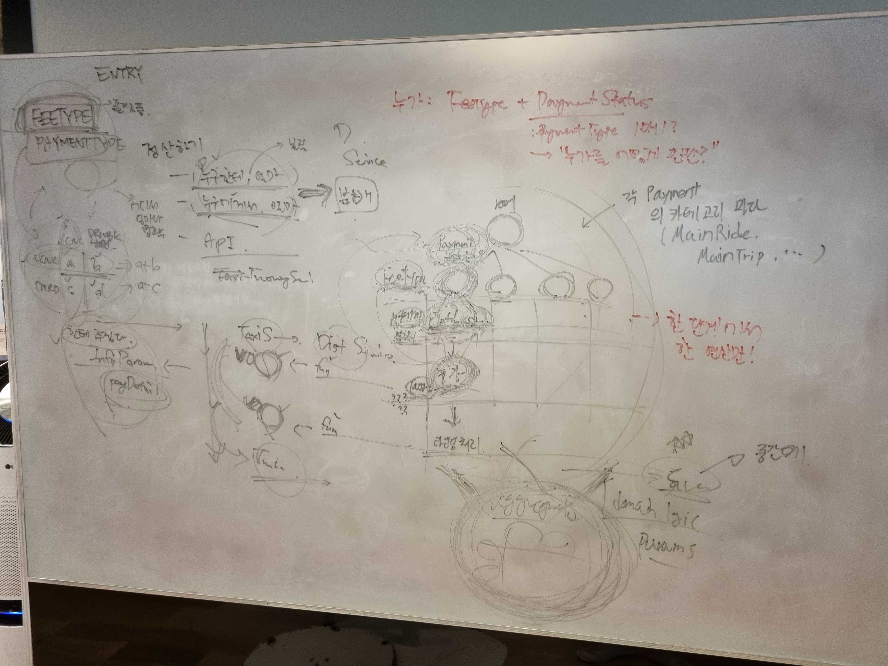
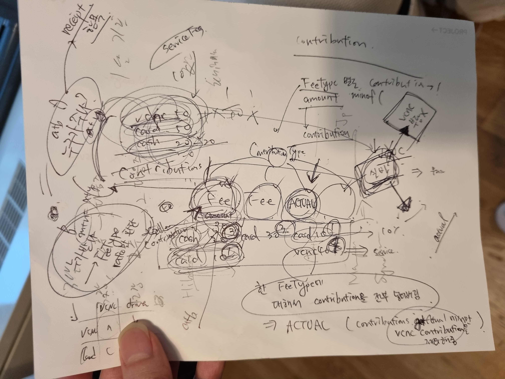
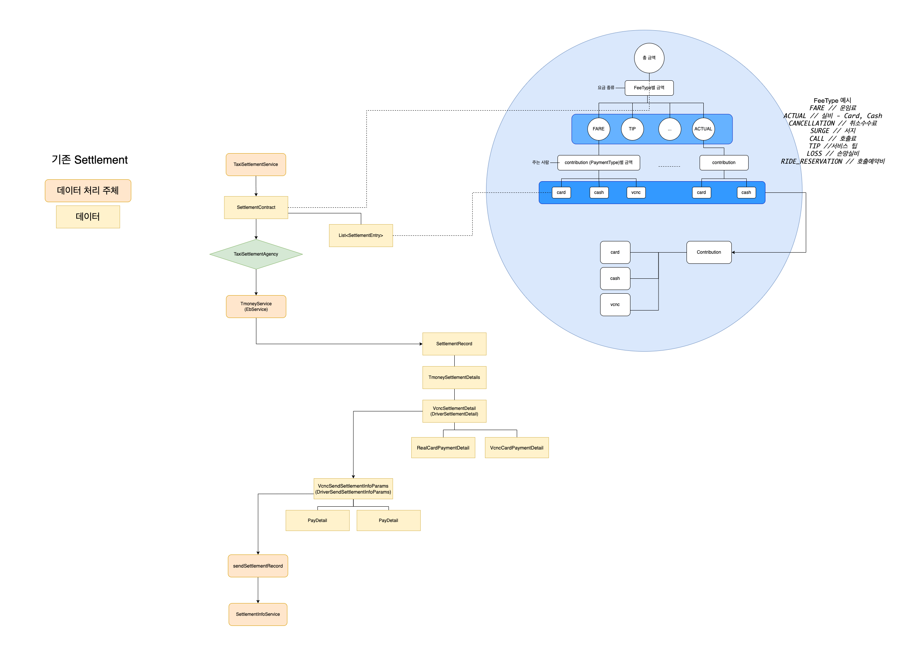
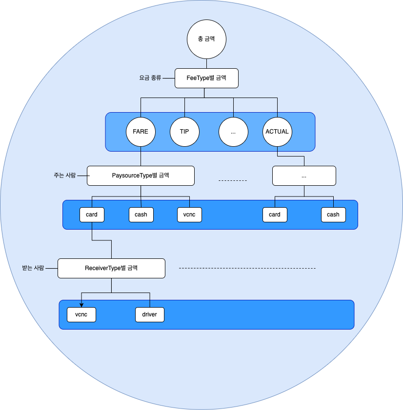
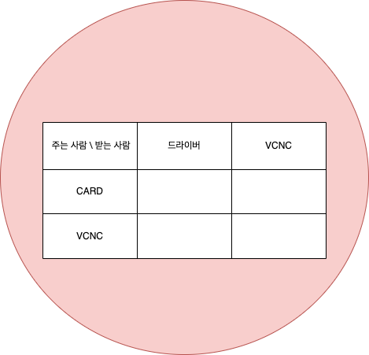
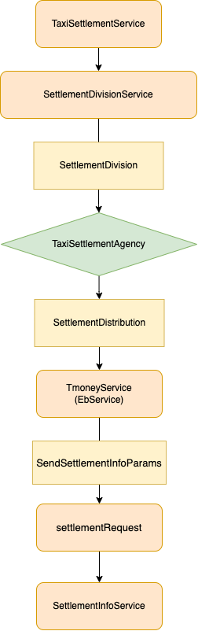

## 도메인 정리와 정산

### 도메인 정리를 시작하게 된 이유
리뷰 관련 코드를 고치려다가 운행 관련 코드까지 고쳐야하는 상황과 비슷하게, 한 도메인의 변경 사항이 다른 도메인까지 영향을 미치는 경험을 
독자분들도 하신 적이 있을 것 같습니다. <br/>
타다 서버팀은 최근 이러한 도메인 간의 강결합과 각 도메인 내부의 복잡성 때문에 겪는 생산성과 확장성 저하를 큰 문제라고 생각하고 있었습니다. <br/> 
비지니스가 확장함에 따라 더 큰 문제가 되기 이전에 도메인을 정리하고 다듬는 작업이 필요하다고 생각하였고, 
에릭 에반스의 도메인 주도 설계(이하 DDD) 스터디를 시작으로 프로젝트를 진행해 나아갔습니다.

### 도메인 주도 설계와 모델 주도 설계
먼저 타다팀에서의 진행 과정 이전에 도메인 주도 설계와 모델 주도 설계가 무엇인지 살펴보겠습니다.

> `도메인`이란 해당 비즈니스에서 다루는 분야라고 정의할 수 있습니다. 예를 들어, 타다에서는 라이드헤일링이라는 도메인을 다루고 있으며,
> 매칭, 운행, 결제 등의 서브 도메인으로 이루어져 있습니다. <br/>
> `도메인 주도 설계`는 데이터의 연관관계보다는 도메인을 기준으로 설계를 해 나아가는 방법입니다.
> 예를 들어, 운행과 리뷰 관련 데이터가 1:n의 관계를 이루고 있다면 직접적으로 연관관계를 맺는 것이 데이터 기준 설계에서는 맞을 수 있으나,
> 도메인 주도 설계에서는 서로 다른 큰 도메인이기 때문에 직접적인 연관관계를 맺는 것이 옳지 않을 수 있습니다. <br/>
> 이러한 도메인 주도 설계를 잘 구현하기 위한 방법이 `모델 주도 설계`(이하 MDD)입니다. `모델`이란 해당 도메인을 추상화한 것을 이야기하며 플로우차트나 다이어그램 등으로 표현할 수 있습니다.

보통 도메인의 복잡도가 코드 구현의 복잡도를 올리는 이유가 되기 때문에 도메인 주도 설계를 도입합니다.
도메인 복잡도를 기획자/설계자와 개발자가 긴밀하게 해결하기 위해서는 모델을 기준으로 기획/설계와 개발을 수정하고 발전시켜 나아가야 합니다.

### 왜 정산 도메인부터 시작했을까
DDD를 스터디하면서 여러 도메인 간의 강결합을 한 번에 해결하기에는 너무나도 큰 문제라고 생각했기 때문에, 
경계가 비교적 명확한 정산부터 정리해나아가고 있습니다.
정산은 결제된 금액을 드라이버와 VCNC에 분배하는 과정입니다. 

정산을 DDD와 MDD를 적용하는 첫 도메인으로 정한 이유는 크게 두 가지입니다.

첫째, `도메인 지식과 코드의 복잡성`이 매우 높아 `기능을 추가하는 데에 큰 어려움`이 있었습니다. 인터널 팀에서 정산을 자동화하고자 했으나, 
기능을 추가할 때 어떠한 문제가 생길지 가늠하기 어려웠습니다. <br />
둘째, `도메인 전문가가 명확`했지만, 개발자와의 `커뮤니케이션에 어려움`을 느끼고 있었습니다. 정산 담당자와 개발자가 사용하는 언어는 같았지만 그 의미가 달랐으며,
이해하고 있는 정산의 흐름 또한 달랐습니다.

이 글에서는 정산 도메인의 모델을 정의하고 도메인 전문가분들과 모델을 다듬는 과정, 그리고 모델을 바탕으로 구현한 코드까지 살펴볼 예정입니다.

## 기존 정산 도메인 파악하기
### 도메인 지식 및 구현 파악하기
새로운 모델을 정의하고 해당 모델을 기준으로 적합하게 구현하기 위해서는 도메인 지식과 기존 코드 파악을 매우 세밀하게 할 필요가 있었습니다. 
정산 도메인에 대한 지식과 구현이 주기적으로 관리되지 않고 있었기 때문에 관련된 모든 필드 하나하나를 파악하고 정산 관련 업무를 하셨던 다양한 직군의 구성원과 논의하기를 반복하여 흩어진 지식을 모았습니다. 

<div style="margin-top: 10px; display: flex; justify-content: center; width: 100%">
  <div style="max-width: 249px; width: 50%;">
    
  </div>
  <div style="margin-left: 4px; max-width: 249px; width: 50%;">
    
  </div>
</div>
<figcaption>기존 정산 코드와 도메인을 이해하기 위한 노력들</figcaption>

### 기존 모델 도출
도메인 지식을 모으고 정리하면서 정산의 핵심 기능을 완전히 파악할 수 있었고, 기존에 정의되어 있지 않던 모델을 기존 코드 구현에서 도출해낼 수 있었습니다.
기존 구현에 대한 모델을 도출한 이유는, 새로운 모델을 만들기 위해서 기존 모델에서의 문제점을 정확히 분석할 수 있도록 
`핵심`과 `흐름`을 한 눈에 파악할 수 있어야 했기 때문입니다.
<div style="margin-top: 10px; display: flex; justify-content: center; width: 100%">
  <div style="margin-left: 4px; max-width: 500px; width: 100%;">
    
  </div>
</div>
<figcaption>기존 정산 모델 도출</figcaption>

기존 구현의 가장 큰 문제는 객체의 역할이 명확하지 않다는 점이었습니다.

### 문제의 원인 - 타다 정산 도메인의 복잡성
문제를 더 자세히 살펴보기 전, 타다 정산 도메인에 대한 간략한 이해가 필요합니다.</br> 

1. 총 이용 금액은 운임료, 탄력요금, 호출예약비 등 `여러 항목`으로 **구성**됩니다. (요금 항목)
2. 이용 금액은 할인에 따라 `이용자`와 `VCNC`가 **부담**합니다. (누가 지불하는지)
3. 총 이용 금액 중 일부는 플랫폼 수수료로 `VCNC`에게 분배되고, 나머지는 `드라이버`에게 **분배**됩니다. (누구에게 분배하는지)
<br/>

여기서 요금을 분류하는 기준이 1.`요금 항목` 2.`누가` 3.`누구에게` 로 3가지인 것을 알 수 있습니다. 
정책에 따라 이 세 기준 중 어떤 기준을 사용하여 수수료 등을 계산할 것인지 달라지기 때문에, 구현에서의 복잡도를 매우 올리는 이유가 되고 있었습니다.  

하지만, 정산에서는 결론적으로 `누가 누구에게` 얼마를 지불해야 하는지가 핵심입니다.

### 문제점 - 책임의 잘못된 분리
모델 주도 설계를 구현함에 있어 객체 지향이 적합하다고 생각했고, 새로운 설계를 위해 기존 객체의 책임과 역할으로부터 문제점을 도출해내었습니다.
기존 모델의 구성요소 중 가장 중요한 객체인 SettlementEntry와 SettlementContract의 역할은 다음과 같습니다. <br/>
```text
SettlementEntry: 요금 항목과 "누가"를 기준으로 나눈 요금을 계산
SettlementContract: SettlementEntry를 통해 "누구에게"를 기준으로 나눈 요금을 계산
```
그렇다면 SettlementEntry과 SettlementContract의 역할을 나눌 필요가 있을까요?

정산의 핵심은 `누가, 누구에게` 얼마를 주는지 결정하고 분배하는 것입니다. 하지만, SettlementEntry는 요금 항목과 `누가`를 기준으로 나눈 금액이고,
SettlementContract에서는 `누구에게`를 기준으로 분배할 금액을 결정해줍니다. 우리가 궁극적으로 필요한 `누가 누구에게`의 책임이 **서로 다른 객체에 분리**되어 있는 셈입니다.

이렇다보니, SettlementEntry와 SettlementContract가 생성된 뒤에도 두 객체가 정산 프로세스 전체에 거쳐 사용되고 있으며, `누가 누구에게`의 책임을 담당하는
SettlementDetails라는 새로운 객체를 만들어 처리하고 있습니다.  
SettlementEntry와 SettlementContract는 연산의 중간 산물임에도 불구하고 너무 많은 곳에서 무분별하게 사용되고 있었습니다. 
이는 코드의 높은 결합도와 낮은 가독성을 만들어 더 큰 문제를 야기했습니다. 이 문제는 아래에서 코드를 통해 더 자세히 살펴볼 예정입니다.

결론적으로 `누가, 누구에게`를 기준으로 금액을 나누는 책임을 가진 **단일한** 객체를 만들 필요가 있다고 생각했습니다.

## 새 모델 정의하기
그래서 `누가 누구에게` 얼마를 내야하는지를 정하는 SettlementDistribution이라는 객체를 중심으로 정산 도메인 모델을 다시 설계 했습니다.
주요 구성요소는 SettlementDivision과 SettlementDistribution입니다.

### 모델 구성요소 - SettlementDivision, SettlementDistribution

<div style="margin-top: 10px; display: flex; justify-content: center; width: 100%">
  <div style="margin-left: 4px; max-width: 500px; width: 100%;">
    
  </div>
</div>
<figcaption>새 모델의 SettlementDivision</figcaption>

`SettlementDistribution`을 만들기 이전에 우리가 알고 있는 정보는 유저와 VCNC가 내야하는 총 요금, 각 요금 항목마다
플랫폼 수수료 비율 등의 정보입니다. 계산에 사용되는 값들이 종류마다 다르기 때문에 이 정보들로 바로 `SettlementDistribution`을 생성하기에는
구현의 복잡도가 매우 올라갈 것으로 예상되었습니다. 요금 항목, 누가, 누구에게의 세 기준으로 나눈 금액인 `SettlementDivision`을 계산하고,
다시 합치는 방식으로 `SettlementDistribution`을 도출하기로 했습니다.

<div style="margin-top: 10px; display: flex; justify-content: center; width: 100%">
  <div style="margin-left: 4px; max-width: 500px; width: 100%;">
    
  </div>
</div>
<figcaption>새 모델의 SettlementDistribution</figcaption>

`SettlementDistribution`은 핵심 데이터로서 `누가 누구`에게 얼마를 주어야하는지 정보를 가진 데이터입니다.
`SettlementDistribution`을 통해 누가 누구에게 얼마를 주어야하는지 정산 대행사에 요청할 객체를 만듭니다.

### 모델의 전체 흐름
새 모델의 전체적인 그림은 다음과 같습니다.

<div style="margin-top: 10px; display: flex; justify-content: center; width: 100%">
  <div style="margin-left: 4px; max-width: 249px; width: 35% ;">
    
  </div>
</div>
<figcaption>새 모델의 전체 흐름</figcaption>

흐름이 더 간결해지고 책임이 명확해진 것을 확인할 수 있습니다.

## 정산 전문가와 논의
타다 서버팀은 DDD의 핵심이 모델을 중심으로 도메인 전문가와 개발자가 긴밀하게 협업하는 것이라고 생각했습니다. 
그래서 서버팀만 알고 있는 모델을 만드는 것은 반쪽짜리 DDD라고 생각했고, 실제 정산 업무를 담당하시는 분들과 여러 번의 논의를 거치며 모델을 다듬어갔습니다.

논의가 진행됨에 따라 `division으로 금액 나누기 -> distriubtion 기준으로 합치기 -> 정산 요청하기`의 큰 흐름은 바뀌지 않았지만, 세부 구현에 있어 매우 많은
인사이트를 얻을 수 있었습니다.

논의 과정에서 파악한 문제 중 하나를 살펴보려고 합니다.

### 사용하지 않으나 구현을 복잡하게 하는 것

실제 정산 담당자들이 사용하지 않아 코드상에 필요 없는 개념들을 제거하여 코드의 복잡성을 더 줄일 수 있었습니다.

`PaymentType`은 enum 값으로, 요금 항목에 대한 돈을 누가 내는지 나타내고 있었습니다. 해당 enum에는 `CARD`, `CASH`, `VCNC`의 세 항목이 있었습니다.

이 enum에는 두 가지 문제가 있었습니다. 첫째, `이름이 모호`합니다. CASH는 유저가 내야하지만 내지 않아 VCNC의 예치금에서 빠져나가는 미수금을 가리키고 있었습니다. PaymentType.CASH라는 이름으로
이것을 유추하기는 불가능합니다. 둘째, 이 enum은 단순히 누가를 가리키는 것이 아니라, 청구된 대상과 실제 돈을 내는 대상을 합친 `복합적인 의미`를 갖고 있습니다. </br>

두 문제는 엮여있는 문제였으며, 특히 두번째가 더 큰 문제를 야기했습니다. 같은 enum을 다른 의미로 사용하는 코드가 뒤엉켜 몇 번을 읽어야 이해가 되는 코드를 만들어냈기 때문입니다.

두 의미를 한 enum이 가져야 했던 이유는 미수금 때문이었습니다. 하지만 실제 정산 업무에서는 해당 `paymentType`을 통해 미수금 여부를 판단하지 **않고** 있다는 것을 알게 되었고,
단순히 `누가`의 의미를 나타내는 `paySourceType`으로 `paymentType`을 대체하여 코드의 복잡도를 훨씬 줄일 수 있었습니다.

이 예시를 통해 기획/설계 - 모델 - 구현이 매우 밀접하게 연관되어 있고, 구현상의 복잡도를 기획과 설계 단계에서 해결할 수 있다는 것을 깨달았습니다.
이와 같이 정산 담당자분들과 몇 차례의 논의를 거쳐 모델을 수정하고 해당 모델을 기준으로 코드를 구현했습니다.

## 새 모델을 통한 구현
새 모델을 기준으로 정산 코드를 리팩토링하였고, 기존 구현과 새 구현을 비교해보려고 합니다.
아래는 실제 타다 정산 코드의 일부입니다.

### 새 정산 메인 함수 VS 기존 정산 메인 함수
**새 메인 함수**

```kotlin
fun settle(ride: Ride, ...) {
    val settlementAgency = TaxiSettlementAgency.get(ride)
    ...
    val divisions = divisionService.getSettlementDivision(ride, payment)
    val distributions = divisions.toDistribution()
    ...
    when (settlementAgency) {
        TaxiSettlementAgency.A -> AService.settleRide(distributions, ...)
        ... // 정산 대행사에 따라 요청
    }
}
```

새 정산 메인 함수를 위에서 살펴본 모델을 토대로 코드를 작성했기 때문에 
`division으로 금액 나누기 -> distriubtion 기준으로 합치기 -> 정산 요청하기`의 주요 흐름이
코드에서도 명확히 나타나는 것을 볼 수 있습니다.

리팩토링을 통해 150줄 가량 되던 메인 함수를 20줄 정도로 줄일 수 있었으며
각 객체의 책임이 명확하여 가독성, 응집성, 결합도 등 모든 부분에서 개선이 되었습니다.

**기존 메인 함수**


```kotlin
fun settle(ride: Ride?, ...) {
    ...
    val settlementAgency = when {
        ...
    }
       ...
    val entries = getSettlementEntries(ride, ...)
    ...
    val (settlementContract, ASettlementRecord, ...) = when (settlementAgency) {
        // 정산 대행사에 따라 처리
        TaxiSettlementAgency.A -> {
            val settlementContract = ASettlementContract(entries, ...)
            val record = AService.settle(...)
            Triple(settlementContract, record, null)
        }
        ...
    }
    ...
}
```

기존 정산 메인 함수를 보면 `SettlementEntries -> SettlementContract`의 흐름을 확인할 수 있습니다.
SettlementEntries와 SettlementContract의 책임이 명확하지 않은 것을 제외하고,
구현에서 가장 큰 문제는 SettlementContract가 사용되는 깊이가 너무 깊다는 것입니다. 
높은 결합도는 변경에 취약한 구조를 만들었습니다.

아래의 세부 구현을 통해 더 살펴보겠습니다.

### 기존 구현 - 낮은 응집도와 높은 결합도
아래는 정산대행사 A의 `AService.settle() -> AService.createSettlementRecord() -> AService.getSettlementDetailPair()`
흐름의 각 함수의 일부입니다. SettlementContract가 정산 메인 함수에서 SettlementDetail을 만드는 곳까지 **네 함수**에 걸쳐 인자로 넘어가는 것을 알 수 있습니다.

```kotlin
fun settle(ride: Ride?, ..., settlementContract: ASettlementContract): ASettlementRecord? {
    ...
    val settlementRecord = createSettlementRecord(ride, ...)
        ...
        sendSettlementRecord(settlementRecord).subscribe()
        ...
    return settlementRecord
}
```

```kotlin
private fun createSettlementRecord(ride: Ride?, ..., settlementContract: ASettlementContract): ASettlementRecord {
    ...
    val (driverSettlementDetail, vcncSettlementDetail) 
        = getSettlementDetailPair(settlementContract, ...)
    ...
    val details = ASettlementDetails(
        ...,
        driverSettlementDetail = driverSettlementDetail,
        vcncSettlementDetail = vcncSettlementDetail,
        ...
    )
    ...
    val settlementRecord = ASettlementRecord(..., details, ...)
    ...
}
```

```kotlin
private fun getSettlementDetailPair(settlementContract: ASettlementContract, ...): Pair<ASettlementDetail?, ASettlementDetail?> {
    val payAmountVcncContribution = settlementContract.getPayAmount(...)
    ...
    val driverSettlementDetail = ASettlementDetail(
         ..., payAmountVcncContribution, ...
    )
    ...
}
```

따라서 SettlementContract와 SettlementEntry에 변경사항이 생길 경우 네 함수를 모두 확인하고 수정해야하는 문제가 있었으며,
어떤 곳에서 어떤 것을 고쳐야할지 파악하기 어려웠습니다.

### 새 구현 - 높은 응집도와 낮은 결합도
새 구현에서는 SettlementDistribution을
`SettlementDivision.toDistribution()`의 **Factory 메서드**를 통해 생성하기 때문에, 깊이가 얕아지고
기존의 `AService.settle() -> AService.createSettlementRecord() -> AService.getSettlementDetailPair()`의 연산을
해당 메서드에서 잘 캡슐화하고 있음을 알 수 있습니다.

금액을 나누는 것에 대한 수정사항은 SettlementDivisionService.getSettlementDivision()을, 
다시 합치는 것은 SettlementDivision.toDistribution()을 수정하면 되므로 응집도와 결합도에서도 개선이 되어 변경에도 대응이 용이해졌습니다.
```kotlin
fun settle(ride: Ride, ...) {
    val settlementAgency = TaxiSettlementAgency.get(ride)
    ...
    val divisions = divisionService.getSettlementDivision(ride, payment)
    val distributions = divisions.toDistribution()
    ...
    when (settlementAgency) {
        TaxiSettlementAgency.A -> AService.settleRide(distributions, ...)
            ... // 정산 대행사에 따라 요청
    }
}
```

## 결론
이번 프로젝트를 통해 `구현-모델-설계` 사이의 기민함을 유지하는 것이 매우 중요하다는 것을 깨달았으며,
업무 담당자와 개발자 사이의 긴밀한 협력이 바탕이 되어야함을 느꼈습니다.

파악하기 어려운 도메인 지식, 모델을 기준으로 구현하기 어려운 부분, 그리고 관련 호환성을 챙기는 것까지 
정산에 도메인 주도 설계를 적용하는 데에 어려운 난관들이 많았습니다. 하지만, 현재까지 정합성 오류 0건일 정도의 안정성에 더해
가독성, 확장성, 유지보수성까지 거의 모든 부분에서 개선이 있었다고 자부할만큼 좋은 결과가 있었습니다. 
DDD와 MDD를 단순히 글로 공부하는 것이 아닌, 실제로 시행하면서도 배운 것이 많아 뜻 깊은 프로젝트가 되고 있습니다. 

도메인 내부를 정리하는 것 다음으로는 도메인 간의 강결합을 풀고 도메인 자체를 정의하는 것을 목표로 하고 있습니다.