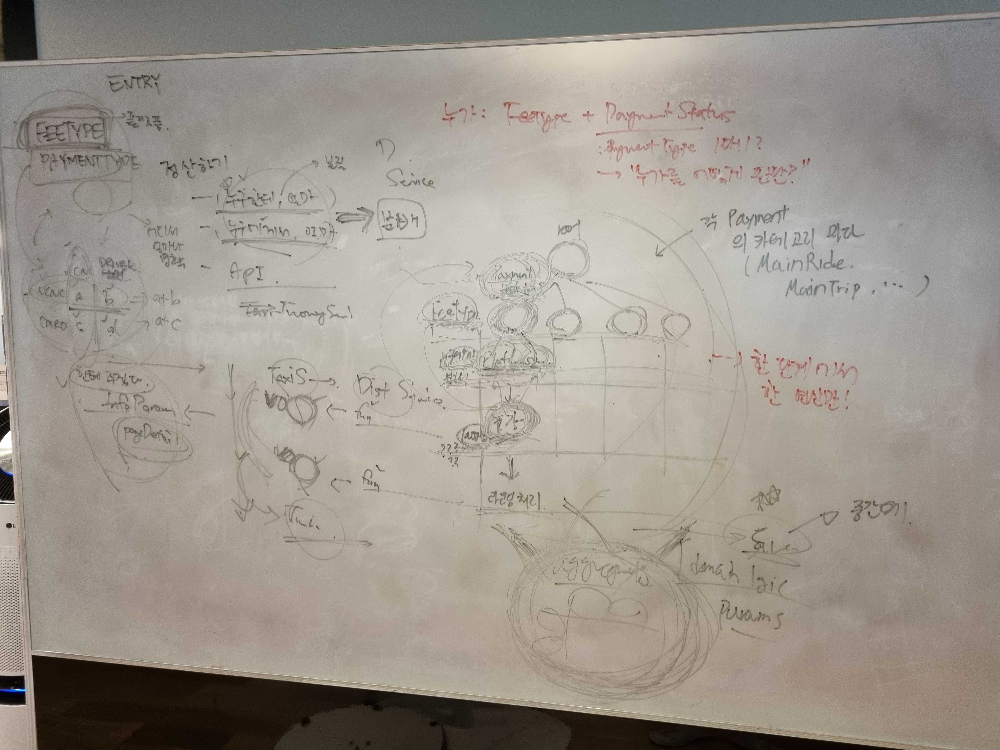
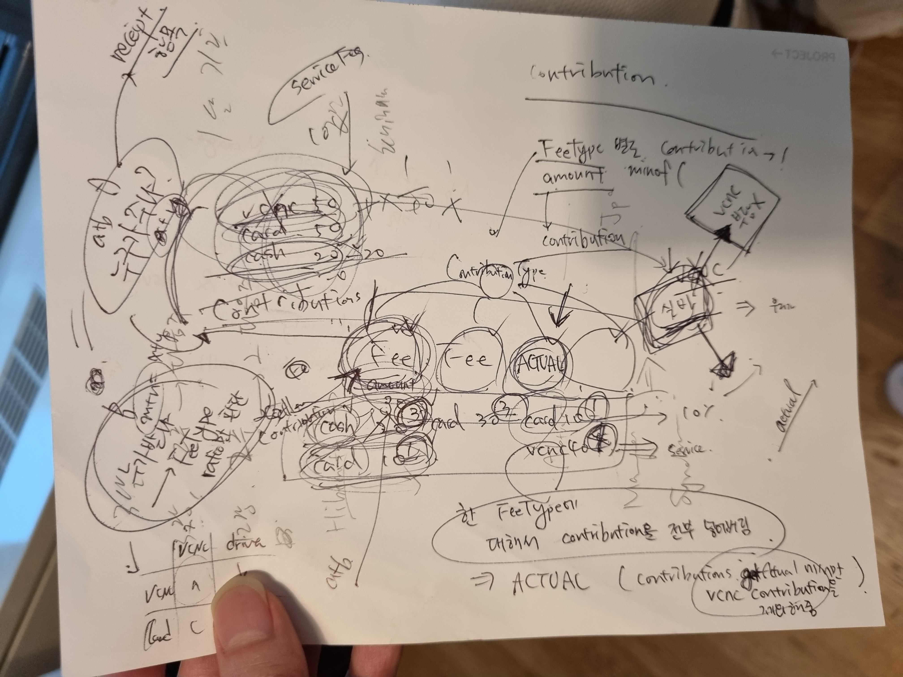
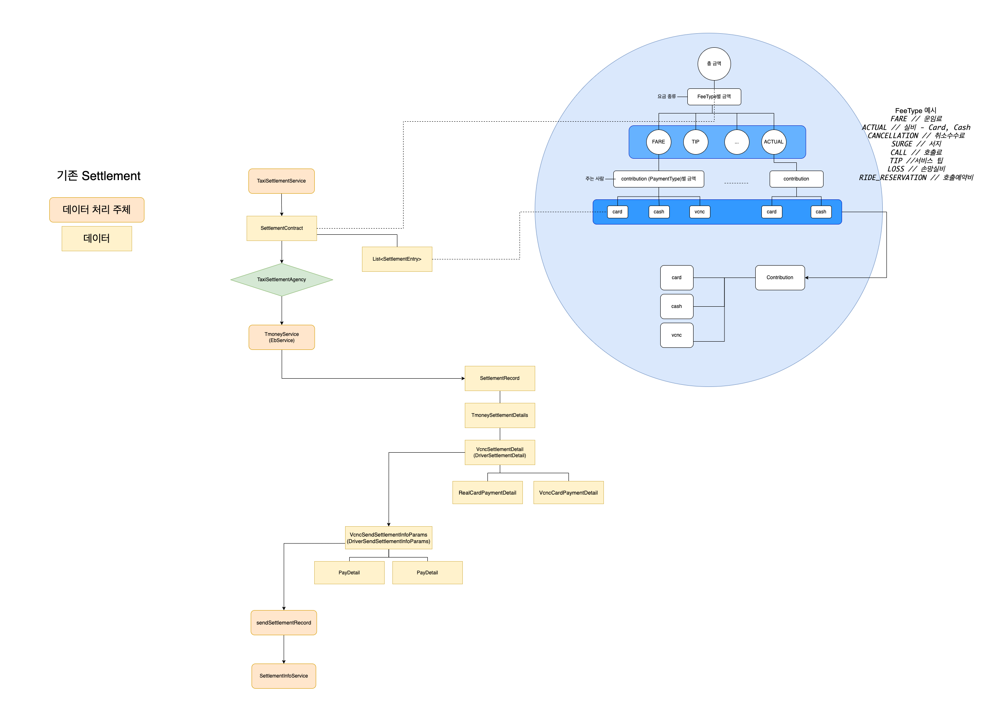
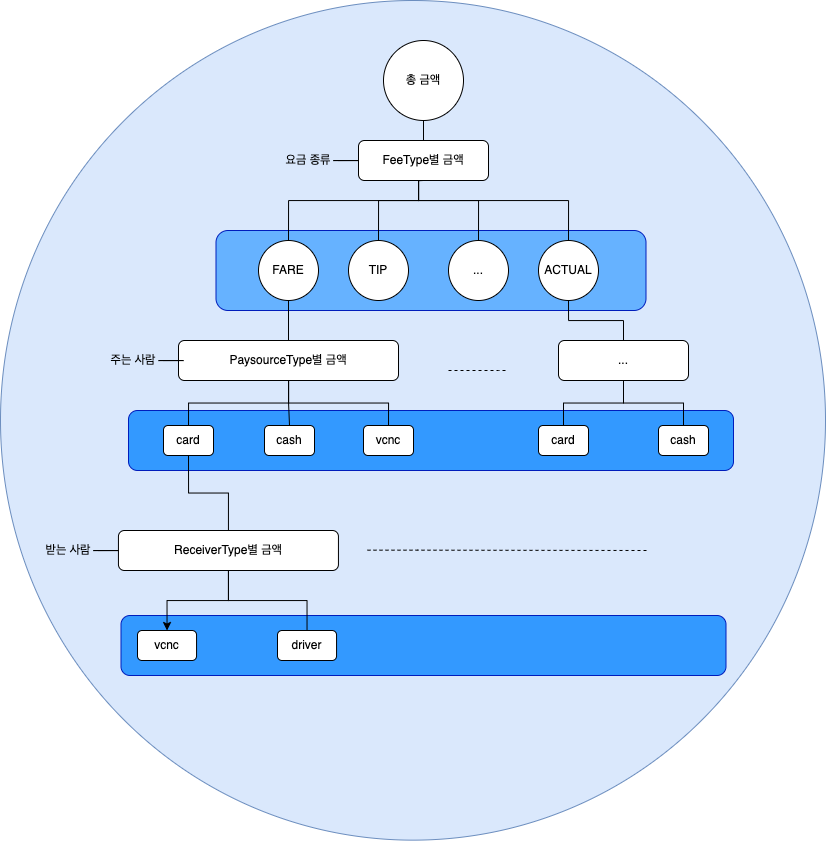
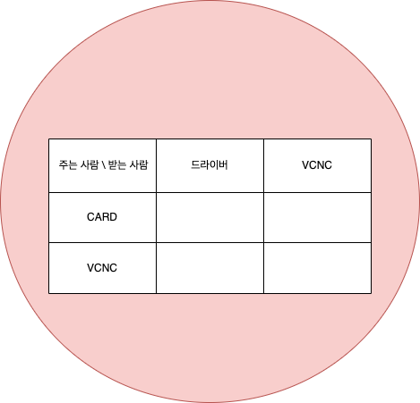
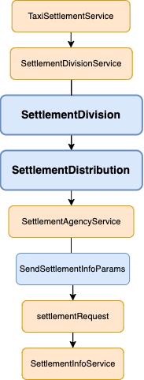

## 도메인 정리의 시작과 정산

### 도메인 정리를 시작하게 된 이유
리뷰 관련 코드를 고치려다가 주문이나 사용자 관련 코드까지 고치는 상황, 여러 도메인끼리 강하게 결합되어 있다면 자주 접해보셨을 수 있을 것 같습니다. <br/>

타다 서버팀 역시 이러한 문제를 겪고 있었습니다.
도메인 사이의 강결합을 풀기 전, 도메인 내부의 높은 복잡도를 먼저 해결하기 위해
[도메인 주도 설계](https://en.wikipedia.org/wiki/Domain-driven_design)를 바탕으로 도메인 정리를 시작했습니다. 

<br/>

### 도메인 주도 설계와 모델 주도 설계
> `도메인`이란 해당 비즈니스에서 다루는 분야라고 정의할 수 있습니다. 타다에서는 라이드헤일링이라는 도메인을 다루고 있으며,
> 매칭, 운행, 결제 등의 서브 도메인으로 이루어져 있습니다. <br/>
> `도메인 주도 설계`(이하 DDD)는 데이터의 연관관계보다는 도메인을 기준으로 설계를 해 나아가는 방법입니다.
> 예를 들어, 운행과 리뷰 관련 데이터가 1:n의 관계를 이루고 있다면 직접적으로 연관관계를 맺는 것이 데이터 기준 설계에서는 맞을 수 있으나,
> 도메인 주도 설계에서는 서로 다른 큰 도메인이기 때문에 직접적인 연관관계를 맺는 것이 옳지 않을 수 있습니다. <br/>
> 이러한 도메인 주도 설계를 잘 구현하기 위한 방법이 `모델 주도 설계`(이하 MDD)입니다. `모델`이란 해당 도메인을 추상화한 것을 이야기하며 플로우차트 등으로 표현할 수 있습니다.
> 모델을 중심으로 기획자/설계자와 개발자가 긴밀하게 협업하는 것이 핵심입니다.

보통 도메인 자체의 복잡도가 높을수록 코드의 복잡도가 올라가므로 도메인 자체의 복잡도를 단순화시키는 것이 중요합니다. 
타다팀에서 도메인 주도 설계와 모델 주도 설계를 통해 이를 해결해나아가는 과정을 다루려고 합니다.

<br/>

### 정산 도메인부터 시작한 이유
정산을 DDD와 MDD를 적용하는 첫 도메인으로 정한 이유는 크게 세 가지입니다.

`첫째`, 정산은 결제된 금액을 드라이버와 타다팀에 분배하는 과정입니다. 따라서 정산은 서비스 흐름의 **마지막**에 존재하며, 비교적 다른 도메인과의 **결합도가 낮습니다**. <br/>
`둘째`, 도메인 지식과 코드의 **복잡성**이 매우 높아 **기능을 추가하는 데에 큰 어려움**이 있었습니다. <br/>
`셋째`, **도메인 전문가가 명확**하지만 사용하는 언어의 의미가 달라 **커뮤니케이션에 어려움**을 느끼고 있었습니다.

앞으로 이 글에서는 두번째와 세번째 이유에 집중하여 아래 순서대로 프로젝트를 살펴보려고 합니다. 
1. 정산 도메인 지식 및 기존 구현의 문제점
2. 정산 도메인의 모델을 정의하고 도메인 전문가분들과 모델을 다듬는 과정
3. 모델을 바탕으로 구현한 코드

<br/>

## 기존 정산 도메인 파악하기
### 도메인 지식 및 구현 파악하기
정산 도메인에 대한 지식과 코드가 흩어져 따로 관리되고 있었기 때문에, <br/> 
관련된 모든 코드를 파악하고 다양한 직군의 구성원과의 여러 논의를 거쳐 흩어진 도메인 지식을 모았습니다. 

<div style="margin-top: 10px; display: flex; justify-content: center; width: 100%">
  <div style="max-width: 249px; width: 50%;">
    
  </div>
  <div style="margin-left: 4px; max-width: 249px; width: 50%;">
    
  </div>
</div>
<figcaption>기존 정산 코드와 도메인을 이해하기 위한 노력들</figcaption>

<br/>

### 기존 모델 도출
정산 처리 과정과 정산 도메인의 핵심을 한 눈에 볼 필요가 있었기 때문에, 파악한 지식과 기존 구현을 토대로 모델을 도출해내었습니다.
<div style="margin-top: 10px; display: flex; justify-content: center; width: 100%">
  <div style="margin-left: 4px; max-width: 500px; width: 100%;">
    
  </div>
</div>
<figcaption>기존 정산 모델 도출</figcaption>

기존 모델의 가장 큰 문제는 역할이 명확하지 않은 데이터가 무분별하게 사용되고 있다는 점이었습니다.
모델 주도 설계에는 객체지향적 사고가 적합하기 때문에 데이터와 객체의 역할과 책임을 명확히 하고자 했습니다. 

<br/>

## 기존 정산 도메인의 문제점
### 타다 정산 도메인의 복잡성
문제를 더 자세히 살펴보기 전, 타다 정산 도메인에 대한 간략한 이해가 필요합니다.</br> 

1. 전체 금액은 운임료, 탄력요금, 호출예약비 등 `여러 항목`으로 **구성**됩니다.
2. 이용 금액은 할인에 따라 `이용자`와 `타다팀`이 **부담**합니다.
3. 금액 중 일부는 플랫폼 수수료로 `타다팀`에게 분배되고, 나머지는 `드라이버`에게 **분배**됩니다.
<br/>

여기서 요금을 분류하는 기준이 `요금 항목`, `누가`, `누구에게` 로 3가지인 것을 알 수 있습니다. 
정책에 따라 이 세 기준 중 어떤 기준을 사용하여 수수료 등을 계산할 것인지 달라지기 때문에,
코드가 매우 복잡해지는 이유 중 하나였습니다. 

<br/>

### 책임의 잘못된 분리
기존 모델의 구성요소 중 가장 중요한 객체인 SettlementEntry와 SettlementContract의 역할은 다음과 같습니다. <br/>
```text
SettlementEntry: 요금 항목과 "누가"를 기준으로 나눈 요금을 계산
SettlementContract: SettlementEntry를 통해 "누구에게"를 기준으로 나눈 요금을 계산
```
그렇다면 SettlementEntry과 SettlementContract의 역할을 나눌 필요가 있을까요?

정산의 핵심은 **누가, 누구에게** 얼마를 주는지 결정하고 분배하는 것입니다. 

하지만, SettlementEntry는 요금 항목과 `누가`를 기준으로 나눈 금액이고,
SettlementContract에서는 `누구에게`를 기준으로 분배할 금액을 결정해줍니다. 우리가 궁극적으로 필요한 `누가 누구에게`의 책임이 **서로 다른 객체에 분리**되어 있는 셈입니다.

이렇다보니, SettlementEntry와 SettlementContract가 생성된 뒤에도 두 객체가 정산 프로세스 전체에 거쳐 사용되고 있으며, `누가 누구에게`의 책임까지 포함하는
SettlementDetails라는 새로운 객체를 만들어 처리하고 있습니다.

결론적으로 `누가, 누구에게`를 기준으로 금액을 나누는 책임만을 가진 **단일한** 객체를 만들 필요가 있다고 생각했습니다.

<br/>

## 새 모델 정의하기
그래서 `누가 누구에게` 얼마를 내야하는지를 정하는 **SettlementDistribution**이라는 객체를 중심으로 정산 도메인 모델을 다시 설계 했습니다.
모델의 주요 구성요소는 SettlementDivision과 SettlementDistribution입니다.

### 모델 구성요소 - SettlementDivision, SettlementDistribution

<div style="margin-top: 10px; display: flex; justify-content: center; width: 100%">
  <div style="margin-left: 4px; max-width: 500px; width: 100%;">
    
  </div>
</div>
<figcaption>새 모델의 SettlementDivision</figcaption>

SettlementDistribution을 만들기 이전에 우리가 알고 있는 정보는 유저와 타다팀이 내야하는 총 요금, 각 요금 항목마다
플랫폼 수수료 비율 등의 정보입니다. <br/>
해당 데이터로 SettlementDistribution을 만들기는 어렵기 때문에
`요금 항목`, `누가`, `누구에게`의 세 기준으로 나눈 금액인 **SettlementDivision**을 계산하고, 다시 합치는 방식으로 SettlementDistribution을 도출하기로 했습니다.

<div style="margin-top: 10px; display: flex; justify-content: center; width: 100%">
  <div style="margin-left: 4px; max-width: 500px; width: 100%;">
    
  </div>
</div>
<figcaption>새 모델의 SettlementDistribution</figcaption>

**SettlementDistribution**은 핵심 데이터로서 `누가 누구`에게 얼마를 주어야하는지 정보를 가진 데이터입니다.
SettlementDistribution을 통해 누가 누구에게 얼마를 주어야하는지 정산 대행사에 요청할 객체를 만듭니다.

<br/>

### 모델의 전체 흐름
새 모델의 전체적인 그림은 다음과 같습니다.

<div style="margin-top: 10px; display: flex; justify-content: center; width: 100%">
  <div style="margin-left: 4px; max-width: 249px; width: 35% ;">
    
  </div>
</div>
<figcaption>새 모델의 전체 흐름</figcaption>

흐름이 더 간결해지고 책임이 명확해진 것을 확인할 수 있습니다.

<br/>

## 정산 전문가와 논의
MDD의 핵심이 모델을 통해 도메인 전문가와 개발자가 긴밀하게 협업하는 것이라고 생각했기 때문에 
실제 정산 업무를 담당하시는 분들과 여러 번의 논의를 거치며 모델을 다듬어갔습니다.

논의가 진행됨에 따라 `division으로 금액 나누기 -> distriubtion 기준으로 합치기 -> 정산 요청하기`의 큰 흐름은 바뀌지 않았지만, 세부 설계에 많은
개선점이 있었습니다.

논의 과정에서 파악한 문제 중 하나를 살펴보려고 합니다.

<br/>

### 사용하지 않으나 구현을 복잡하게 하는 것

실제 정산 담당자들이 사용하지 않아 코드상에 필요 없는 개념들을 제거하여 코드의 복잡성을 더 줄일 수 있었습니다.

`PaymentType`은 enum 값으로, 요금 항목에 대한 돈을 누가 내는지 나타내고 있었습니다. 해당 enum에는 `CARD`, `CASH`, `VCNC`의 세 항목이 있었습니다.

이 enum은 단순히 누가를 가리키는 것이 아니라, 요금이 청구된 대상과 실제 돈을 내는 대상을 합친 `복합적인 의미`를 갖고 있습니다. </br>
예를 들어 PaymentType.CASH는 사용자가 내야하는 돈이지만 결제가 실패하여 타다팀이 먼저 드라이버에게 내는 돈을 의미합니다.

복합적 의미를 한 enum이 가져야 했던 이유는 미수금 때문이었습니다. 하지만 실제 정산 업무에서는 해당 `paymentType`을 통해 미수금 여부를 판단하지 **않고** 있다는 것을 알게 되었고,
단순히 `누가`의 의미를 나타내는 `paySourceType`으로 `paymentType`을 대체하여 코드의 복잡도를 훨씬 줄일 수 있었습니다.

도메인 전문가와 여러번의 논의를 거치며 기획/설계 - 모델 - 구현이 매우 밀접하게 연관되어 있어 구현상의 복잡도를 기획과 설계 단계에서 해결할 수 있다는 것을 깨달았습니다.

## 새 모델을 통한 구현
이제 기존 구현과 새 구현을 비교하며 어떤 개선점이 있었는지 살펴보겠습니다. 아래는 실제 타다 정산 코드의 일부입니다.

### 기존 정산 메인 함수 VS 새 정산 메인 함수
**기존 메인 함수**
```kotlin
fun settle(ride: Ride?, ...) {
    ...
    val settlementAgency = when {
        ...
    }
       ...
    val entries = getSettlementEntries(ride, ...)
    ...
    val (settlementContract, ASettlementRecord, ...) = when (settlementAgency) {
        // 정산 대행사에 따라 처리
        TaxiSettlementAgency.A -> {
            val settlementContract = ASettlementContract(entries, ...)
            val record = AService.settle(...)
            Triple(settlementContract, record, null)
        }
        ...
    }
    ...
}
```
기존 정산 메인 함수를 보면 `SettlementEntries -> SettlementContract`의 흐름을 확인할 수 있습니다.
여러 타입에 대한 정산 분기, 정산과 관련 없는 데이터를 가져오는 것, 정산대행사에 따른 분기 등 너무 많은 요소가 한 함수에 있었습니다.

또한, SettlementEntries와 SettlementContract의 책임이 명확하지 않기 때문에 SettlementContract가 매우 많은 함수를 걸쳐 사용되고 있었습니다.
해당 문제는 정산대행사 관련 함수를 살펴보며 다시 다루겠습니다.

**새 메인 함수**

```kotlin
fun settle(ride: Ride, ...) {
    val settlementAgency = TaxiSettlementAgency.get(ride)
    ...
    val divisions = divisionService.getSettlementDivision(ride, payment)
    val distributions = divisions.toDistribution()
    ...
    when (settlementAgency) {
        TaxiSettlementAgency.A -> AService.settleRide(distributions, ...)
        ... // 정산 대행사에 따라 요청
    }
}
```
새 정산 메인 함수를 위에서 살펴본 모델을 토대로 코드를 작성했기 때문에 
`division으로 금액 나누기 -> distriubtion 기준으로 합치기 -> 정산 요청하기` **모델의 주요 흐름**이
코드에서도 명확히 나타나는 것을 볼 수 있습니다.

리팩토링을 통해 `150`줄 가량 되던 메인 함수를 `20`줄 정도로 줄일 수 있었으며
각 객체의 책임이 명확하여 가독성, 응집성, 결합도가 개선이 되었습니다.

### 기존 정산대행사 관련 함수 VS 새 정산대행사 관련 함수
정산대행사에 따라 다른 방식으로 정산 요청을 보내야하기 때문에 세부 구현이 달라집니다. 메인 함수 이후 정산대행사 A에 요청을 보내는 코드를 살펴봅시다. 

**기존 구현 - 낮은 응집도와 높은 결합도**
```kotlin
fun settle(ride: Ride?, ..., settlementContract: ASettlementContract): ASettlementRecord? {
    ...
    val settlementRecord = createSettlementRecord(ride, ...)
        ...
        sendSettlementRecord(settlementRecord).subscribe()
        ...
    return settlementRecord
}
```

```kotlin
private fun createSettlementRecord(ride: Ride?, ..., settlementContract: ASettlementContract): ASettlementRecord {
    ...
    val (driverSettlementDetail, vcncSettlementDetail) 
        = getSettlementDetailPair(settlementContract, ...)
    ...
    val details = ASettlementDetails(
        ...,
        driverSettlementDetail = driverSettlementDetail,
        vcncSettlementDetail = vcncSettlementDetail,
        ...
    )
    ...
    val settlementRecord = ASettlementRecord(..., details, ...)
    ...
}
```

```kotlin
private fun getSettlementDetailPair(settlementContract: ASettlementContract, ...): Pair<ASettlementDetail?, ASettlementDetail?> {
    val payAmountVcncContribution = settlementContract.getPayAmount(...)
    ...
    val driverSettlementDetail = ASettlementDetail(
         ..., payAmountVcncContribution, ...
    )
    ...
}
```
위는 정산대행사 A의 `AService.settle() -> AService.createSettlementRecord() -> AService.getSettlementDetailPair()`의 흐름으로,
누가 누구에게 얼마를 지급해야하는지 도출하는 과정입니다.
SettlementContract가 정산 메인 함수에서 SettlementDetail을 만드는 곳까지 **네 함수**에 걸쳐 인자로 넘어가는 것을 알 수 있습니다. <br/>
위의 코드에 나타나지 않은 데이터까지 `ASettlementContract`, `SettlementDetail`, `SettlementRecord`, `SendSettlementInfoParams` 등이 연관 되어 있기 때문에
관련 변경사항이 생길 경우 네 함수와 해당 데이터 모두를 확인하고 수정해야 했으며 객체를 생성하는 로직과 이외의 도메인 로직이 섞여있어 한번에 너무 많은 정보를 다뤄야하는 문제도 있었습니다.

**새 구현 - 높은 응집도와 낮은 결합도**
```kotlin
fun settleRide(distribution: SettlementDistribution, ...) {
    val ASettlementRequests = distribution.toASettlementParams(...)

    ...
    
    AClient.send(ASettlementRequests, ...)
}
```

새 구현에서는 기존의 `AService.createSettlementRecord() -> AService.getSettlementDetailPair()`의 연산들을 분리해 알맞는 객체에 배정했습니다.
금액을 나누는 것에 대한 수정사항은 `SettlementDivisionService`를,
다시 합치는 것은 `SettlementDivision.toDistribution()`을 수정하면 되므로 관련 로직이 엉켜있던 기존로직보다 응집도와 결합도가 개선이 되어 변경에도 대응이 용이해졌습니다.

또한, toDistribution(), toSettlementParams() 등 **factory 메서드**를 사용하여
객체 생성을 캡슐화하였기 때문에 `객체를 생성`과 로직의 `흐름`을 명확히 구분할 수 있게 되었습니다. 따라서 필드 수정이 필요할 때와 로직 흐름의 수정이 필요할 때를
명확히 구분하여 해당 수정사항에 집중하기 용이해졌습니다. 

## 결론
파악하기 어려운 도메인 지식, 모델을 기준으로 구현하기 어려운 부분, 그리고 관련 호환성을 챙기는 것까지 
정산에 도메인 주도 설계를 적용하는 데에 어려운 난관들이 많았습니다. 

하지만, 현재까지 정합성 오류 0건일 정도로 성공적으로 프로젝트를 진행하고 있습니다. <br/>
특히 가독성과 확장성의 큰 개선은 앞으로 정산 도메인의 유지보수에, 
공통 모델 정의은 도메인 전문가와의 긴밀한 의사소통에 매우 도움이 될 것으로 기대하고 있습니다. <br/>
개인적으로도 DDD와 MDD를 단순히 글로 공부하는 것이 아닌, 실제로 시행하면서 깨닫는 것이 많아 뜻깊은 프로젝트가 되고 있습니다. 

도메인 내부를 정리하는 것 다음으로는 도메인 간의 강결합을 풀고 도메인 자체를 정의하는 것을 목표로 하고 있습니다.