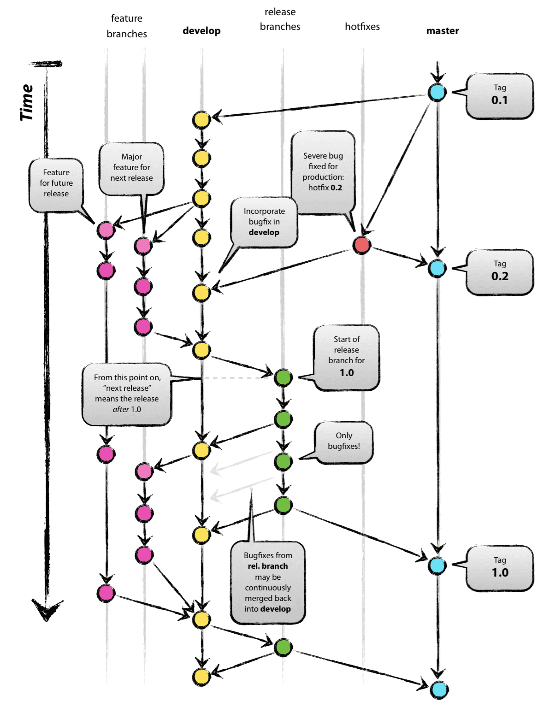
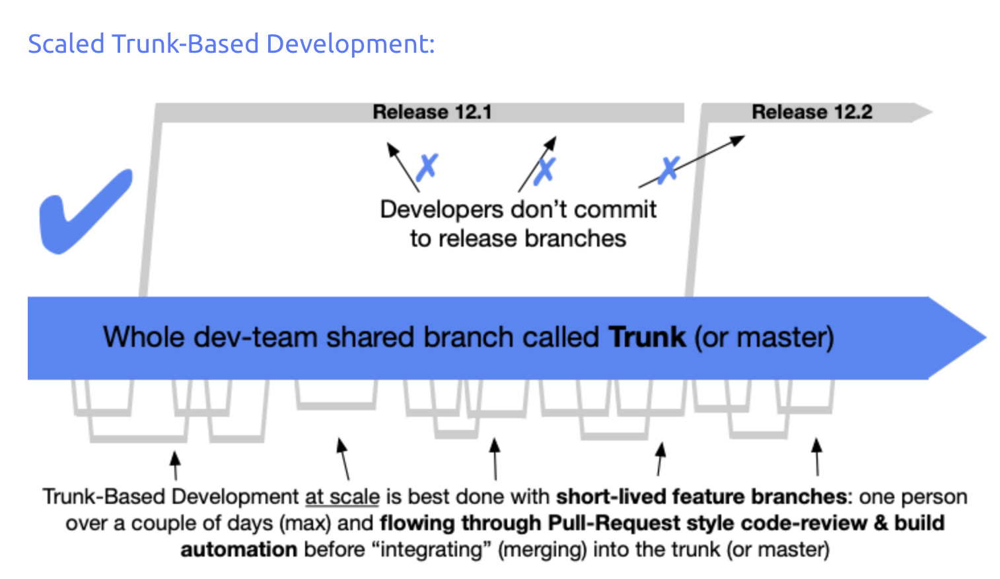
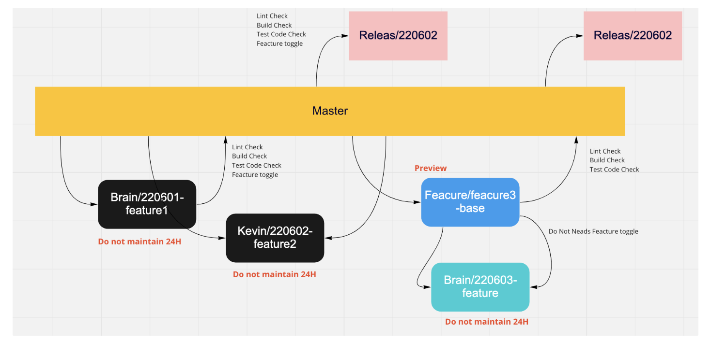

  &nbsp;인터널 팀에서 새로운 Micro 서비스 DRS, AB Test Tool 등을 만들면서 브랜치 전략을 선정하려 했습니다. 기존에 사용하던 Git Flow 전략이랑 요즘 많이 쓴다는 Trunk Based Development(이하 TBD)전략이랑 고민을 하였고 고민 끝에 TBD를 선택하게 되었습니다. 국내에 TBD에 관한 글이 많이 있지만 아직 어떻게 적용했는지 장단점은 어떠한지 공유하는 글은 많지 않아 저희가 6개월 동안 TBD를 하면서 느꼈던 점을 공유해 보고자 합니다.

## Git Flow 전략

국내에서 [Git Flow](https://nvie.com/posts/a-successful-git-branching-model/)를 많이 사용하고 있고 타다팀 또한 처음 타다를 오픈할때 부터 Git Flow 전략을 이용해 개발하고 있었습니다. 
Git Flow 전략에 대해서 간단히 설명 드리면 
feature, develop, release, hotfix, master 5개의 브랜치로 이루어져 있고 정기적으로 5개의 브랜치를 통합하면서 형상을 유지 시킵니다.


<figcaption>git flow 전략</figcaption>

오랜 기간동안 Git Flow 전략을 사용하면서 느꼈던 단점들을 설명해 드리겠습니다.

- develop branch에서 개발된 A라는 기능과 B라는 기능이 release로 나가기 위해서는 둘다 QA가 완료 되거나 A만 QA가 완료 되었을 경우는 A를 체리픽 해서 출시를 했어야 했습니다. 이러한 방식은 완전한 스냅샷을 출시하지 못한다는 단점을 가지고 있습니다.

- release에서 Hotfix되고 해당 코드를 develop branch로 다시 돌아오는 커밋들은 (저희들은 연어라고 불렀습니다.)  Develop Branch와 종종 Confit을 발생 시켰고 이를 푸는데 많은 공수를 들였어야 했습니다.

- 마지막으로 Branch 간의 커밋을 이동시키는 PR이 너무 많아서 이 PR을 챙기는 공수가 필요했습니다. 이는 한명이 주로 진행을 했는데 전체 PR의 변경사항을 알지 못하고 Confit을 풀다보면 사고가 나기도 했습니다.

Git Flow를 만든 사람(nive)이 웹앱을 고려하고 만든 전략이 아니다. 하고 2020년 3월에 글을 올렸습니다. 타다앱는 Android, Native 로 되어 있어 버전 관리를 하고 있으나. 인터널 팀에서는 내부 사용자들이 사용하는 웹앱으로 주로 제품이 구성되어 있습니다.  결국 MSA, 에자일의 빠른 배포, DevOps에 장점을 잘 소화 시키기 위해서 TBD 전략을 고민하게 되었고 도입을 결정하게 되었습니다.

## TBD

[TBD](https://trunkbaseddevelopment.com/) 전략에 대해서 간단히 말씀 드리면 
영속하는 Branch는 Main Branch만 존재하고 모든 개발자는 Main에 직접 푸시를 하거나 Short-Lived Branch만 허용합니다.
Main Branch는 언제든지 배포 가능한 상태가 되어야 하고 Hotfix를 위한 기능도 Main Branch에 푸시 하여 배포하는 방식으로 배포 합니다.


<figcaption>TBD 전략</figcaption>

도입하기 앞서 몇가지 rule을 정했습니다.

- 영속하는 Branch는 Main(Trunck) 하나 뿐이다.
- `Main Branch는 언제든지 배포 가능한 상태여야 한다.`
- Feature flag를 달기 편하거나, 안달아도 큰 문제가 없는 (Main Branch가 배포가능한 상태에 영향을 끼치지 않는) PR은 main에서 Branch를 딴다. (Black Branch)
    - Black Branch 는 24시간 이상 영속하면 안된다. → 최소 단위의 PR을 작성하고 빠르게 리뷰하고 빠르게 머지한다.
    - Black Branch는 main에 머지될때 Lint, Build, Test Code 를 체크한다.
- Feature flag를 달기 힘든 기능은 Base를 만든다. (Blue Branch)
    - Base에 기능이 추가될때마다 Branch를 만들어서 머지한다. (역시 24H 이상 존재하면 안됨)
    - Base에 Preview 라벨을 달아서 테스트를 하고 배포가능한 상태가 되면 Main Branch에 배포한다.
- main에서 누구나 필요에 의하면 Release Branch를 따서 배포를 한다. (배포 후 Branch는 삭제)


<figcaption>TBD 전략</figcaption>

## CI, CD

도입을 위해 TBD에 필수 기능인 CI,CD를 구축 하였습니다.

- 개발자는 main(trunck)브랜치에서 새로운 브랜치를 만들어 개발을 합니다. 3시간 개발이 끝나면 Github를 통해 PR을 올리고 할당된 리뷰어에게 리뷰를 받습니다. PR이 Merge가 되려면, build, lint, test가 통과해야 합니다. github action을 사용하였습니다.

- 개발자가 만약 Feature Flag를 만들 수 없다면, PR을 만들고 preview 태그를 붙여 base branch를 만듭니다. 그리고 그 base에서 새로운 branch를 만들고 base branch에 PR을 올려 똑같이 리뷰를 받습니다. base branch에 preview 기능을 통해 QA를 하고 통과를 하면 main에 merge를 합니다. 역시 build, lint, test를 통과해야 합니다.

- 모든 개발자는 배포를 원하는 시점에 main branch에서 release prefix로 시작하는 branch를 만들어 github에 push 합니다. 그럼 역시 github action이 build, lint, test를 돌리고 통과가 된다면 dockerfile을 통해 이미지를 만들고 ECR에 push를 합니다.

- ECR에 push된 이미지는 쿠버네티스에 설정되어 있는 keel이 이미지 버전이 업데이트 된것을 확인하고 이미지를 자동으로 upgrade를 합니다. upgrade가 완료되면 Slack으로 알림이 도착 합니다.

2번에 Feature flag를 달기 위해 아래와 같은 예제 코드로 구현 하였습니다.

```java

  if(featureFlagService.isProduction()) {
    preDriverService.create()
  } else {
    preDriverService.createInNewFeature()
  }

```

좀더 다른 사람들에게 기능의 간섭을 안생기게 하기 위해서는 [Branch By Abstraction](https://trunkbaseddevelopment.com/branch-by-abstraction/) 이라는 방법을 통해서 구현해 볼 수 있습니다.
[예제 코드](https://www.branchbyabstraction.com/java.html#choice)도 잘 설명되어 있는 링크 참고 바랍ㄴ다.

이번에는 3번 preview를 위한 github action code를 잠시 소개해 드리겠습니다. (설명 추가)

```yml

    steps:
      - name: Checkout
        uses: actions/checkout@v2

      - name: Configure AWS credentials (preview)
        uses: aws-actions/configure-aws-credentials@v1
        with:
          aws-access-key-id: ${{ secrets.AWS_DEV_ACCESS_KEY_ID }}
          aws-secret-access-key: ${{ secrets.AWS_DEV_SECRET_ACCESS_KEY }}
          aws-region: ap-northeast-1

      - name: Login to Amazon ECR
        id: login-ecr
        uses: aws-actions/amazon-ecr-login@v1

      - name: Deploy Preview docker image
        run: |
          ./bin/deploy-preview.sh ${{ github.event.pull_request.number }}

      - name: Find Comment
        uses: peter-evans/find-comment@v1
        id: fc
        with:
          issue-number: ${{ github.event.pull_request.number }}
          comment-author: VCNC-Bot
          direction: last
          token: ${{ secrets.BOT_ACCESS_TOKEN }}
          body-includes: ':rocket: Preview Link : https://${{ github.event.pull_request.number }}.tadatada.com'

      - name: Uninstall if already helm installed
        if: ${{ steps.fc.outputs.comment-id != 0 }}
        run: |
          aws ssm send-command \
            --document-name "AWS-RunShellScript" \
            --parameters 'commands=["sudo su - deploy -c \"./bin/uninstall-preview-helm.sh ${{ github.event.pull_request.number }} \""]' \

      - name: Comment
        uses: peter-evans/create-or-update-comment@v1
        if: ${{ steps.fc.outputs.comment-id != 0 }}
        with:
          issue-number: ${{ github.event.pull_request.number }}
          comment-id: ${{ steps.fc.outputs.comment-id }}
          body: ':wastebasket: ~~https://${{ github.event.pull_request.number }}.tadatada.com'/~~'
          token: ${{ secrets.BOT_ACCESS_TOKEN }}
          edit-mode: replace

      - name: Deploy Helm Chart
        run: |
          aws ssm send-command \
            --document-name "AWS-RunShellScript" \
            --parameters 'commands=[""./bin/deploy-preview-helm.sh ${{ github.event.pull_request.number }}\""]' \

      - name: URL Health Check
        uses: vcnc-hex/url-health-check-action@v2
        with:
          url: https://${{ github.event.pull_request.number }}.tadatada.com/api/healthz
          max-attempts: 30
          request-timeout: 10s
          retry-delay: 3s
          max-time: 1m

      - name: Uninstall when deployed fail
        if: ${{ failure() }}
        run: |
          aws ssm send-command \
            --document-name "AWS-RunShellScript" \
            --parameters 'commands=[""./bin/uninstall-preview-helm.sh ${{ github.event.pull_request.number }}\""]' \

      - name: Comment URL Link
        uses: peter-evans/create-or-update-comment@v1
        with:
          issue-number: ${{ github.event.pull_request.number }}
          body: ':rocket: Preview Link : https://${{ github.event.pull_request.number }}.tadatada.com'
          token: ${{ secrets.BOT_ACCESS_TOKEN }}
```

## 회고

모든 준비를 마치고 개발을 시작 하였습니다.

역시 처음 적용해 보는 Branch 전략이었기 때문에 처음 계획대로 되지 않은점도 많았습니다.

우선 기존에 Git Flow 전략에는 Confit을 해결하는 공수를 아끼자는 생각이 있었습니다.
그러나 Micro Service로 운영되고 있는 서버에서 개발하는 인원이 1~2명 정도로 적다보니깐 Confit 자체가 잘 안일어 나고 있었습니다.
이 문제는 단점이라기 보다는 TBD의 매력을 100% 느끼려면 큰 서비스에서 많은 개발자가 참여할 때 느껴질 것이라고 생각이 들었습니다.

그리고 Feature Flag를 다는 일이 생각보다 많은 추가 Burden으로 작용했습니다. 간단한 기능을 개발하려고 해도 항상 고민을 하면서 짜야 했습니다.
하지만 Feature Flag를 추가하는 것도 팀원들이 익숙해 지다 보니 더 속도가 더욱 빨라지는 것을 경험 했습니다.

그래도 확실히 좋아진점에 대해서 말씀을 드리겠습니다.
우선 PR을 작게 쪼개는건 코드리뷰 차원에서 많은 도움이 되었습니다. 코드 Line 수가 많아지면 코드리뷰 하기가 어려운 점이 많은데 코드리뷰의 부담을 많이 줄일 수 있었습니다.

그다음 배포가 자유로워져서 고객에게 제품의 가치가 전달하는 속도가 매우 빨랐습니다.
기존에는 쌓아왔던 기능을 한번에 배포를 했다면 main를 항상 배포가능한 상태로 개발하라!! 라는 규칙에 의해서 언제나 배포를 하고 싶은 사람은 배포할꺼라고 공유만 하고 언제든지 Main Branch의 형상을 배포할 수 있었습니다.


저희 인터널 프로덕트 팀에서는 이 글에서 해결해 나간 상황처럼 다양한 문제를 기술 스택의 한계를 가지지 않고 슬기롭게 해결해 나갈 개발자를 찾고 있습니다. :)
