안녕하세요, 타다에서 iOS 개발을 담당하고 있는 황득연입니다.

**모듈화**는 현재 iOS 개발 생태계에서 **가장 핫한 키워드**입니다. 많은 회사의 iOS 팀에서 모듈화를 도입하고 있으며, 이를 통해 **빌드 속도 향상, 의존성 분리, 협업 효율화** 등을 기대하게 됩니다. 각 팀의 특성과 프로젝트 상황에 따라 그 효과가 크게 달라질 수 있습니다.

많은 개발자들이 모듈화의 필요성은 느끼지만, 실제로 자신들의 프로젝트에 어떠한 이점이 있을지 확신하기 어렵습니다. 대부분의 모듈화 관련 글은 **추상적인 이점이나 모듈화의 도입 방법**에 집중되어 있으며, 실제 적용 사례나 구체적인 장점에 대한 설명이 부족한 경우가 많습니다. **Feature 단위의 모듈로 나누어진 슈퍼 앱**의 사례를 보더라도, 개발 인력이나 프로젝트 상황을 고려할 때 이러한 접근이 현실적으로 와닿지 않을 수 있습니다.

이번 글에서 타다가 **왜 모듈화를 도입**했는지, 그리고 이를 **어떻게 효과적으로 적용하고 있는지**에 대한 구체적인 경험을 공유하고자 합니다.

※ 타다는 Tuist를 이용하여 모듈화를 적용하였습니다.

이 글은 3부로 나누어져 있습니다.
- **1부: 타다가 모듈화를 해야 했던 이유**
- 2부: Preview 모듈 도입
- 3부: 모듈화를 활용한 SwiftUIRIBs 로의 마이그레이션
---

## 1부: 타다가 모듈화를 해야 했던 이유

### 빌드속도 향상

**모듈화**를 한다는 것은 단순히 종속된 코드를 분리하는 것 이상의 의미를 갖습니다. 이는 독립적인 모듈을 만들어, **병렬 컴파일**이 가능하도록 구조를 최적화하는 작업입니다. 즉, 잘 설계된 모듈화는 빌드 과정을 **병렬**로 처리할 수 있게 하여 **빌드 시간을 단축**시킬 수 있습니다. 

프로젝트의 **규모가 커짐**에 따라 빌드 속도는 자연스럽게 **느려**지게 되므로 모듈화를 효과적으로 적용하는 것이 중요합니다.

설명에 들어가기 앞서, 컴파일 과정에 대하여 먼저 설명드리겠습니다. 

※ 모듈 내의 파일 간의 디펜던시도 고려해야 하지만, 이 글에서는 크게 중요한 요소로 다루지 않으므로 생략하도록 하겠습니다.

  

    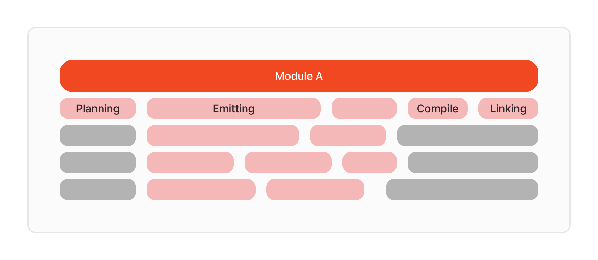
    </img>
  

<figcaption>기본 모듈 빌드 타임라인</figcaption>

4코어 CPU 환경에서 컴파일을 한다고 가정하겠습니다. 위 그림처럼 모듈 A가 존재하는 상황에서 컴파일을 하게 되면 컴파일러는 각 CPU 코어에 파일들을 **블록 단위**로 할당하여 컴파일을 수행합니다. 모듈의 크기가 커질수록, 각 블록에 포함되는 파일의 수가 많아지게 되어 블록의 길이도 늘어나게 됩니다. 이러한 컴파일 블록에는 **단일 또는 다수의 파일**이 포함될 수 있습니다.

이 과정에서 중요한 네 가지 개념은 다음과 같습니다.
1. **Planning**: 컴파일러가 어떤 파일을 컴파일해야 하는지 계획을 세우고, **종속성 그래프**를 작성합니다. 이 단계에서는 모듈 내의 모든 파일을 분석하고, 어떤 순서로 컴파일할지 결정하게 됩니다.
2. **Emitting**: 컴파일러가 각 파일의 **중간 표현(Intermediate Representation, IR)을 생성**하는 과정입니다. 이 과정에서 파일의 크기와 복잡성이 빌드 시간에 영향을 미칠 수 있습니다.
3. **Compiling**: 중간 표현을 실제 기계어로 변환하고, **최종 바이너리 파일**을 생성하는 과정입니다. 이 단계에서는 모듈이 클수록 빌드해야 할 코드의 양이 많아지기 때문에 더 오랜 시간이 소요될 수 있습니다.
4. **Linking**: 개별적으로 컴파일된 파일들을 결합하여 하나의 실행 가능한 프로그램이나 라이브러리를 생성하는 단계입니다. 이 과정에서 **외부 라이브러리나 모듈 간의 참조를 연결**하게 됩니다. 뒤에 디펜던시가 있는 모듈이 없다면 이 과정은 생략됩니다.

모듈이 클수록 각 단계에서 소요되는 시간이 증가합니다. 빌드 특성 상 **Planning**, **Compiling**, **Linking** 단계에서는 동일 모듈 내의 파일들을 병렬로 컴파일 할 수 없습니다.  

빌드는 크게 CI/CD 파이브라인에서의 **클린 빌드**와 UI 또는 비즈니스 로직을 구현하는 과정에서의 **증분 빌드**, 이렇게 두 가지가 존재합니다. 다음은 각각의 측면에서 모듈화와 빌드와의 관계에 대해서 설명해드리겠습니다.

### 클린빌드

Swift 컴파일러는 컴파일 시 **자동으로 병렬 처리를 최적화하여 빌드**를 수행합니다. 이는 모듈화를 하지 않더라도 컴파일러가 각 파일을 최적의 방식으로 병렬 처리할 수 있다는 의미입니다.

  

    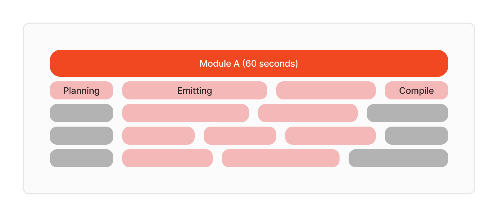
    </img>
  

<figcaption>단일 모듈 타임라인</figcaption>

그러나, 단일 모듈에서 효율적인 빌드가 이루어지던 상황이, **잘못된 모듈화**로 인해 오히려 비효율을 초래할 수 있다는 점을 유의해야 합니다. 모듈화는 신중하게 접근해야 하며, 병렬 컴파일의 장점을 살리는 방향으로 설계되지 않으면 **빌드 시간을 늘리는 역효과**가 발생할 수 있습니다.

위의 단위 모듈 A를 **모듈 A와 모듈 B**로 나누어 보겠습니다.

  

    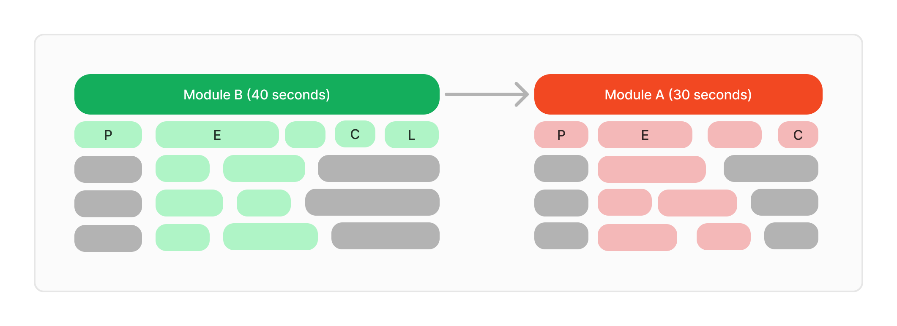
    </img>
  

<figcaption>직렬 종속 관계의 모듈 타임라인</figcaption>

모듈 A와 모듈 B가 **직렬 관계**를 형성하면, **Planning**, **Compiling**, **Linking** 단계에서 병렬적으로 컴파일이 이루어지지 않아 큰 컴파일 공백이 발생할 수 있습니다. 그리고 컴파일 블록들도 길기 때문에 컴파일 공백이 길어질 여지가 많아집니다. 결과적으로 이러한 구조는 빌드 프로세스에서 **병목 현상**을 일으켜, **모듈 A 하나만 있을 때**보다 컴파일 시간이 길어지게 됩니다.

이러한 직렬 종속 관계가 여러 모듈에 걸쳐 발생할 경우, **공백이 누적되면서** 전체 컴파일 시간이 더 길어질 수 있습니다. 따라서, 모듈화로 인한 비효율을 최소화하기 위해서는 모듈을 **병렬화** 할 필요가 있습니다.

이 문제를 해결하기 위해 모듈 B를 **모듈 B와 모듈 C**로 나누어 병렬화를 해보겠습니다.

  

    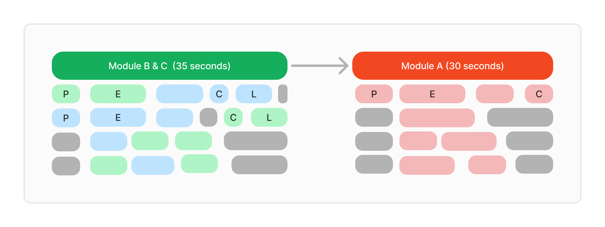
    </img>
  

<figcaption>병렬 종속 관계의 모듈 타임라인</figcaption>

이처럼 병렬화를 통해 컴파일 공백이 생기는 것을 최소화 할 수 있게 됩니다. 따라서 모듈화를 할 때 **병렬 컴파일이 가능**하도록 디펜던시를 분리하고 병렬적으로 컴파일될 수 있게 모듈을 잘 나누는 것이 매우 중요합니다. 이로 인해 병목 현상을 줄이고 **전체 컴파일 시간을 단축**할 수 있습니다. 

모듈을 더 세분화하여 병렬 처리 가능성을 높인다면, 빌드 속도를 더욱 개선할 수 있을 것입니다.

  

    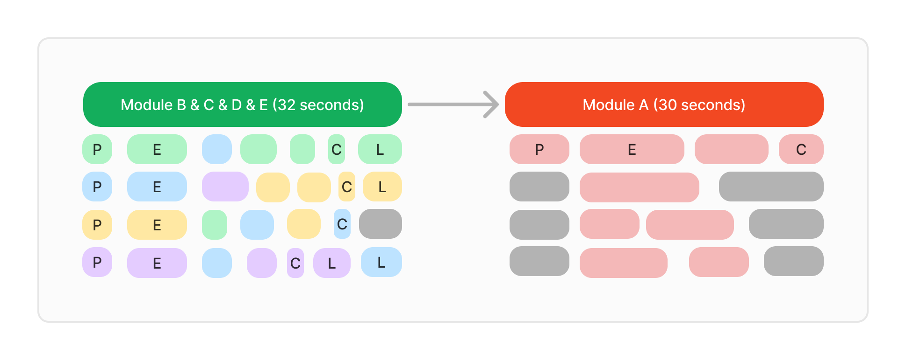
    </img>
  

<figcaption>병렬 종속 관계의 모듈 타임라인</figcaption>

이렇게 클린 빌드 관점에서 빌드 속도를 향상시킨다는 것을 모듈화를 통해 생길 수 있는 빌드 비효율을 최소화한다는 의미가 됩니다. 하지만 모듈화를 **과도**하게 도입하는 경우, **빌드 시간 단축의 효율이 떨어지며** 오히려 **관리 복잡성이 증가**할 수 있습니다. 따라서 적절한 수준에서 프로젝트에 최적화된 모듈화를 진행하는 것이 중요합니다.

#### 증분 빌드

개발 과정에서 코드가 **예상대로 작동하는지 확인하는 일**은 필수입니다. 이를 위해 코드를 수정한 후 빌드를 자주 실행하게 되며, 이러한 작업에서는 증분 빌드의 빈도가 클린 빌드보다 훨씬 높습니다. 따라서, **증분 빌드의 효율성**을 높이는 것은 실제 개발 생산성에 직접적인 영향을 미칩니다.

Swift 컴파일러는 성능이 꾸준히 개선되면서 증분 빌드를 점점 더 효율적으로 처리하고 있습니다. 하지만 이러한 효율화에도 불구하고, 증분 빌드 시간 단축에는 **한계**가 존재합니다.

먼저 단일 모듈의 예시를 통해 설명드리겠습니다.

  

    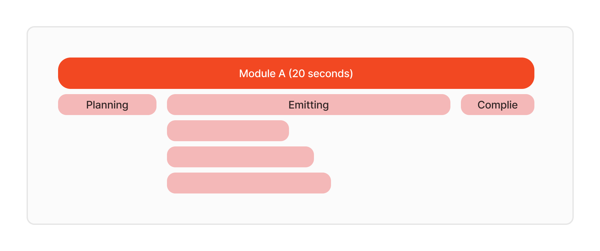
    </img>
  

<figcaption>규모가 큰 모듈 타임라인</figcaption>

모듈의 크기가 클수록 **파일 컴파일 외의 시간(Planning, Emitting, Compiling)** 소요가 크게 증가합니다. 위의 그림에서 볼 수 있듯이, 실질적인 파일 수정이 **적음**에도 불구하고, 전체 빌드 시간이 길어지는 문제가 발생합니다.

모듈 A의 크기를 줄이고 동일한 상황에서 증분 빌드를 진행해보겠습니다.

  

    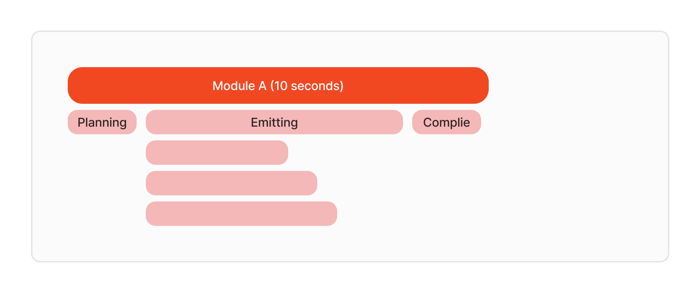
    </img>
  

<figcaption>규모를 줄인 후 모듈 타임라인</figcaption>

결과적으로, 동일한 파일을 수정했음에도 증분 빌드 시간이 단축된 것을 확인할 수 있습니다. 특히, App Target과 같이 **자주 변경되는 모듈의 크기**를 줄일수록 이러한 빌드 시간 단축 효과는 더욱 두드러지게 나타날 것입니다.

다수의 모듈로 구성된 구조에서 증분 빌드가 이루어질 때도, **병렬 컴파일**이 가능하도록 설계하는 것이 매우 중요합니다.

  

    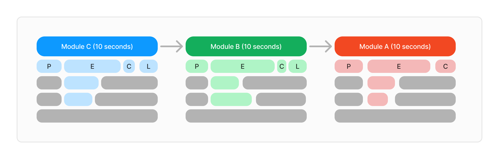
    </img>
  

<figcaption>직렬 종속 관계 모듈 타임라인</figcaption>

직렬 종속 관계에서는 클린 빌드와 유사하게 비효율이 발생할 수 있습니다. 추가적으로, 증분 빌드에서는 **유휴(Idle) 코어**가 발생하고, **Emitting 시간이 파일 컴파일 시간보다 길어지는** 등의 문제가 발생할 수 있습니다. 이를 병렬화를 통해 해결할 수 있습니다.

  

    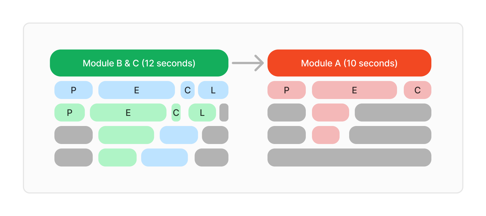
    </img>
  

<figcaption>병렬 종속 관계 모듈 타임라인</figcaption>

증분 빌드 특성 상 다수의 모듈보다는 **단일 또는 소수 모듈에서의 빌드**가 빈번히 발생하고, 수정된 코드들의 모듈의 디펜던시가 병렬 관계일 것을 보장할 수 없습니다. 따라서 자주 수정될 모듈 크기를 줄이는 것이 더욱 중요할 것입니다.

#### 결론

**모듈 크기를 줄이고 병렬화** 함으로써 **빌드 시간이 단축**되고 **개발 생산성이 크게 향상**되는 것을 확인할 수 있습니다. 타다 프로젝트에서도 이러한 모듈화 전략을 통해 실질적인 효과를 보았으며, 이는 대규모 프로젝트에서 특히 유용한 접근 방식임을 확인했습니다.

### **새로운 아키텍처 도입**

현재 타다는 더 나은 퍼포먼스와 직관적인 UI 구성을 위해 기존 UIKit으로 그리던 뷰 방식에서 **SwiftUI로 전환**하고 있습니다. 하지만 타다 프로젝트의 아키텍처는 RIBs(타다 프로젝트에 맞게 개선된 **TadaRIBs**)를 사용하여 UIKit에 최적화된 구조로 되어 있습니다.

그렇기에 불가피하게 SwiftUI를 UIKit과 **함께 사용**하고 있습니다. 이러한 혼합 사용은 예상치 못한 이슈를 유발할 수 있으며, 개발 과정에서 두 프레임워크 간의 **충돌이나** **비효율성**이 발생할 가능성이 큽니다. 예를 들어, **UIKit의 라이프사이클과 SwiftUI의 상태 관리를 동시에 처리**해야 하는 상황에서 복잡성이 증가할 수 있으며, **SwiftUI의 장점을 적극 활용**하지 못합니다.

이러한 문제를 해결하기 위해 저희는 점진적으로 **SwiftUIRIBs** 아키텍처로의 마이그레이션을 진행하고 있습니다. SwiftUIRIBs는 기존의 RIBs 아키텍처를 SwiftUI에 최적화한 새로운 구조로, SwiftUI의 선언적 UI 구성 방식을 RIBs의 모듈식 아키텍처에 접목시킨 것입니다.

  

    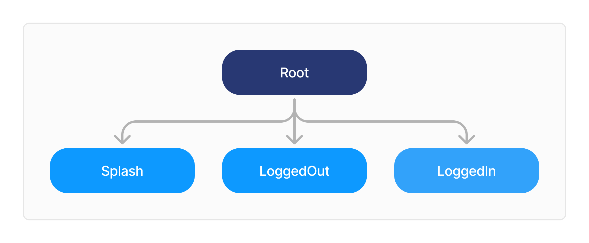
    </img>
  

<figcaption>기존 타다의 RIBs State</figcaption>

전환의 첫 단계로, **LoggedOut** 모듈부터 **SwiftUIRIBs**로의 마이그레이션을 시작했습니다. 타다의 앱 구조는 크게 **Splash**, **LoggedOut**, **LoggedIn** 상태로 구분되며, 이 세 가지 주요 RIB는 각각 독립적인 관계를 유지합니다. Splash RIB은  매우 단순하고, LoggedIn RIB은 규모가 크기 때문에 상태가 매우 다양합니다. 반면, LoggedOut RIB은 **상대적으로 단순하고 규모가 작기** 때문에, **SwiftUIRIBs** 아키텍처를 먼저 도입하고 테스트하기에 이상적인 후보였습니다.

이 과정에서 **모듈화**는 매우 중요한 역할을 합니다. **모듈화된 구조** 덕분에, 특정 모듈을 **독립적으로 전환**하고 필요할 경우 쉽게 **롤백**할 수 있는 유연성을 가지게 됩니다. 또한, 모듈화를 통해 각 모듈이 **SwiftUI**로 전환될 때마다 그 모듈의 성능과 안정성을 개별적으로 테스트할 수 있어 효율적입니다.

타다는 **LoggedOut** 모듈의 모든 뷰를 먼저 **SwiftUI**로 리팩토링했습니다. 이 과정에서 SwiftUI와 기존 RIBs 비즈니스 로직을 통합하며, 새로운 아키텍처가 **최적의 성능과 유연성**을 발휘할 수 있도록 구현하였습니다. 자세한 내용은 3부에서 다뤄보도록 하겠습니다.

  

    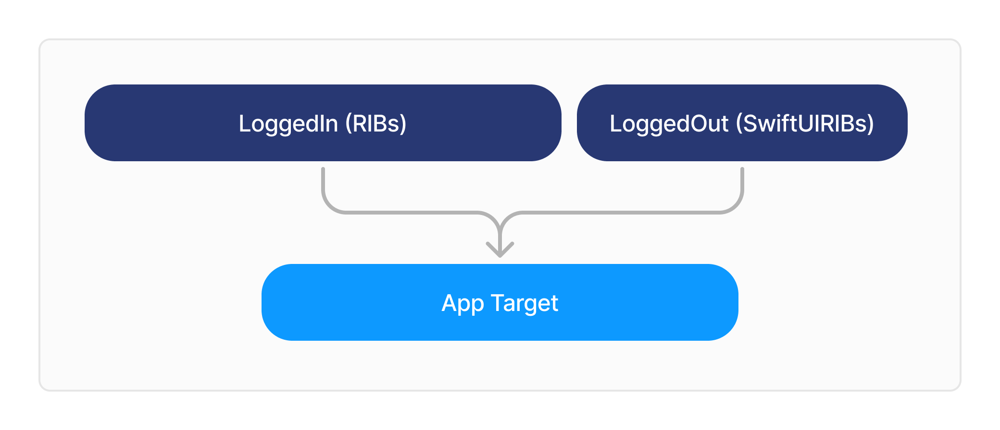
    </img>
  

<figcaption>SwiftUIRIBs를 점진적 마이그레이션하는 모듈 구조</figcaption>

### **여러 App(또는 App Extension) Target**

타다 iOS 프로젝트에는 여러 개의 **App** 또는 **App Extension** 타겟이 존재합니다. 각 타겟은 서로 다른 기능을 제공하지만, **공통적**으로 사용하는 **코드와 리소스**가 많습니다. 이러한 공통 코드는 각 타겟이 동일한 기능을 중복으로 구현하지 않도록, 효율적으로 관리되어야 합니다. 이 문제를 해결하기 위해 타다는 **모듈화**를 적극적으로 도입하여 공통 코드를 중앙에서 관리하고, 각 타겟에 주입하는 방식으로 개발을 진행하고 있습니다.

**모듈화**를 통해 우리는 공통 코드를 별도의 모듈로 분리하여, 여러 타겟 간의 중복을 최소화했습니다. 예를 들어, **네트워크 로직**, **데이터 모델**, 그리고 **리소스 파일**(이미지, 색상, 글꼴 등)과 같은 요소들이 상위 공통 모듈에서 관리됩니다. 이렇게 공통 모듈을 사용하면, 각 타겟이 이러한 기능을 재사용할 수 있어, 코드의 일관성과 유지보수성이 크게 향상됩니다.

  

    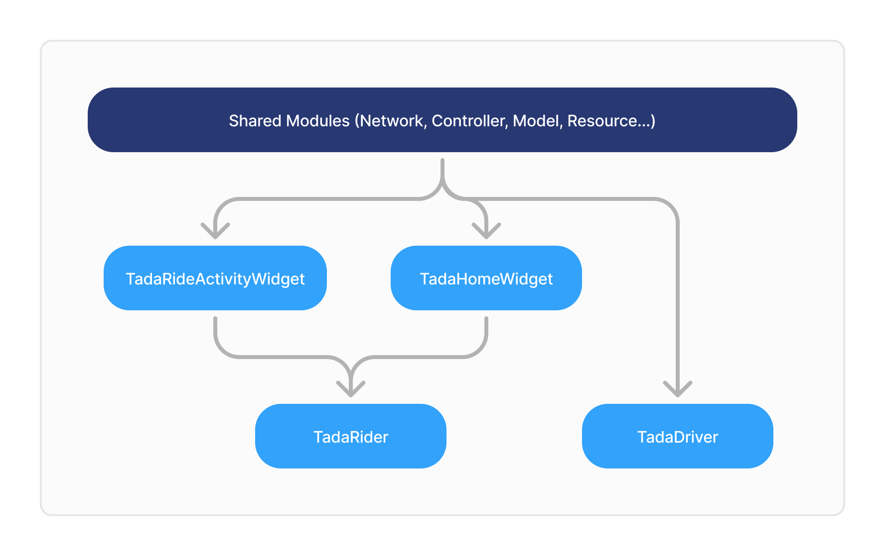
    </img>
  

<figcaption>모듈을 공유하는 구조</figcaption>

1. **TadaRideActivityWidget**: 타다의 **Live Activity와 Dynamic Island**를 지원하는 **Widget Extension**입니다. 이 모듈은 사용자가 탑승 전후의 실시간 상태를 **잠금 화면**이나 **Dynamic Island**에서 바로 확인할 수 있게 해줍니다.
2. **TadaHomeWidget**: 타다의 기본 홈화면 **Widget Extension**입니다. 이 모듈은 사용자에게 집, 회사 또는 즐겨찾는 장소로의 **빠른 호출**을 도와줍니다.
3. **TadaRider**: 타다의 메인 앱으로, **라이더**들이 사용하는 핵심 애플리케이션입니다. 이 앱은 사용자들이 차량을 호출하고, 실시간으로 차량 위치를 확인하며, 탑승 경로와 요금을 추적할 수 있도록 돕습니다. 
4. **TadaDriver**: 타다의 드라이버 앱으로, **드라이버**들이 사용하는 필수 애플리케이션입니다. **TadaDriver**는 드라이버가 실시간으로 탑승 요청을 수락하며, 경로를 안내받는 데 사용됩니다. 

현재 **TadaDriver**는 **Android**에서만 구현되어 있지만, 향후 **iOS** 지원을 대비하여 공통 모듈을 확장 가능하게 구현하고 있습니다. 

이처럼 모듈화의 효과는 여러 타겟을 관리하는 데 있어 특히 두드러집니다. 뿐만 아니라, **확장성**도 크게 향상됩니다. 앞으로 더 많은 **App** 또는 **App Extension** 타겟이 추가되더라도, 이 모듈화된 구조 덕분에 새로운 타겟이 공통 모듈을 쉽게 참조하고, 필요한 기능을 빠르게 구현할 수 있습니다. 

결과적으로, 타다는 **모듈화**를 통해 **여러 타겟**의 코드 관리가 더 효율적이고 체계적으로 이루어지도록 하였으며, 이는 프로젝트의 유지보수성과 확장성을 한층 강화하는 데 기여하고 있습니다.

## Preview 모듈

프로젝트 규모가 커질수록 **SwiftUI**의 **Preview** 성능이 현저히 저하되는 문제가 발생합니다. 이는 복잡한 프로젝트에서 디펜던시를 로드하고 처리하는 데 시간이 오래 걸리기 때문입니다. **Preview** 기능을 효율적으로 사용하기 위해서는, **Preview**에 포함되는 모듈의 종속성을 최소화하고 필요한 코드만 포함하도록 설계해야 합니다.

타다에서는 이 문제를 해결하기 위해 **Preview 모듈**을 구현했습니다. 이 모듈은 기본적으로 UI에 필수적인 최소한의 디펜던시만 포함하도록 설계되었으며, 프로젝트의 다른 부분에서 불필요한 종속성을 배제하여 **SwiftUI Preview**의 로딩 속도를 최적화했습니다. 이를 통해, 타다에서 신속하게 UI를 미리보고 수정할 수 있게 되었습니다.

타다가 **Preview 모듈**을 어떻게 구현했는지, 그리고 이를 실제 개발 과정에서 어떻게 활용하고 있고  개발 속도와 생산성에 어떤 영향을 미쳤는지 2부에서 보다 자세히 다뤄보도록 하겠습니다. 

## 요약

1. **빌드 속도 향상**과 **효율적인 증분 빌드**를 위해 모듈을 세분화하고 병렬 컴파일을 가능하게 하여, 전체 프로젝트의 컴파일 시간을 단축했습니다. 
2. **SwiftUIRIBs**로의 전환을 시작으로, 비교적 규모가 작은 모듈을 통한 새로운 아키텍처를 도입하는 과정에서의 리스크를 최소화하고 점진적 마이그레이션을 하였습니다. 
3. **공통 모듈**을 통해 여러 App 및 App Extension 타겟을 효율적으로 관리하고, 중복된 코드를 제거하여 유지보수성과 확장성을 높였습니다.
4. **Preview 모듈**을 통해 **SwiftUI Preview**의 성능을 극대화하여 개발 속도를 향상시키고 유지 보수의 용이성을 증가시켰습니다.

이 모든 과정은 **타다**의 개발 팀이 어떻게 모듈화를 통해 복잡한 프로젝트 환경에서도 **높은 생산성**을 유지하며, 지속적으로 **새로운 기술을 도입**하고 있는지를 보여주는 좋은 예시가 되기 바랍니다. 특히 모듈화를 고민하는 모든 분들에게 도움이 되길 바랍니다.
