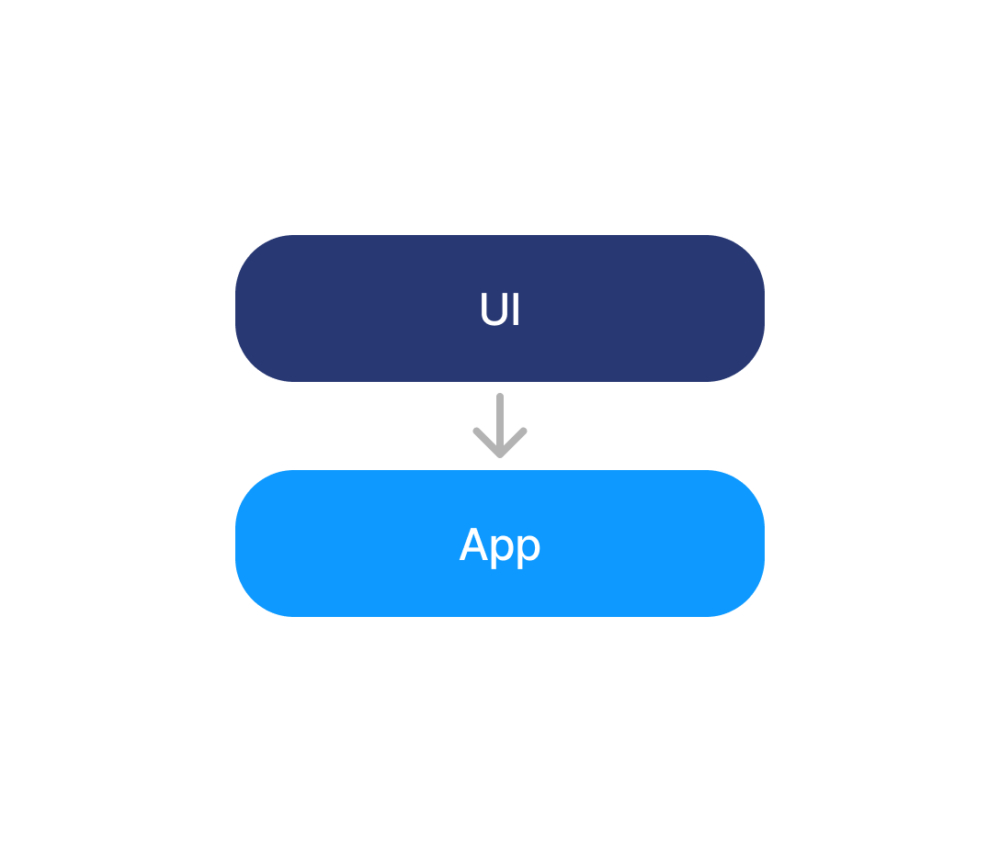

안녕하세요, 타다에서 iOS 개발을 담당하고 있는 황득연입니다.

모듈화는 현재 iOS 개발 생태계에서 가장 핫한 키워드입니다. 대표적으로 빌드 속도 개선, 의존성 관리의 용이성, 협업 효율성 증대와 같은 이점들이 알려져 있어, 많은 개발자들이 모듈화를 도입하고 있습니다. 모듈화는 단순히 모듈을 잘 나누는 것에 그치지 않고, 잘 나눈 모듈을 프로젝트에 얼마나 효과적으로 활용하느냐가 핵심이라고 생각합니다. 물론 빌드 속도 개선만으로도 만족스러운 결과를 얻을 수 있지만, 그 이상의 가치를 실현할 수 있는 방법을 고민해볼 필요가 있습니다. 이는 각 팀의 개발 리소스와 프로젝트 특성 등에 따라 달라질 것입니다.

타다에서는 이러한 고민을 바탕으로 모듈화를 도입하였고, 모듈화를 활용한 구체적인 경험에 대해 2부로 나누어 공유하려고 합니다.

※ 타다는 Tuist를 이용하여 모듈화를 적용하였습니다.

- **1부: 모듈화를 통한 SwiftUI Preview 효율화**
- 2부: SwiftUIRIBs으로의 마이그레이션

---

## 1부: 모듈화를 통한 SwiftUI Preview 효율화

### UI 모듈의 도입하게 된 배경

많은 개발자들이 프로젝트 규모가 커질수록 디버깅 효율화에 대해 고민을 합니다. 빌드 속도 증가부터 복잡한 상태 관리에 이르기까지 다양한 문제로 불편함을 겪고 여러 방법을 통해 효율성을 개선하려고 노력합니다.

저희 팀은 SwiftUI Preview를 활용하지 못해 UI 작업을 디버깅하는 데 많은 시간이 걸렸습니다. 특히, 드라이버와의 매칭 및 실시간 통신 등 Server-Driven 상태를 처리하는 과정에서 단순한 UI 디버깅에 예상보다 더 많은 시간이 소요되는 경우가 빈번했습니다. 이러한 문제를 해결하기 위해 UI 모듈화를 도입하여 디버깅 효율성을 높이기로 했습니다.

### 기존 프로젝트에서의 SwiftUI Preview

UI를 작업하는 중간중간 예상대로 구현되고 있는지 확인하는 과정이 필수적입니다. 단순한 UI를 확인하는 데 프로젝트 전체를 빌드하는 것은, 모듈화를 통해 빌드 시간을 단축했다 하더라도 여전히 매우 비효율적입니다. 이러한 비효율을 해결하기 위해, Xcode는 SwiftUI Preview라는 기능을 제공하고 있습니다. 

하지만 실제 프로젝트에서 Preview 기능이 항상 원활하게 동작하지 않을 수 있으며, 타다 프로젝트에서는 다음과 같은 문제가 발생하였습니다.

**1. 프로젝트 크기와 복잡성**

프로젝트가 커지고 복잡해질수록, Xcode는 더 많은 파일과 모듈을 로드하고 컴파일해야 합니다. 따라서 Preview 로딩 속도는 상당히 지연됩니다.

**2. Third-Party 라이브러리**

프로젝트 빌드 시에 프로젝트에서 사용하는 Third-Party 라이브러리를 포함합니다. 이는 Preview 로딩 속도를 지연시킬 뿐만 아니라, 일부 Third-Party 라이브러리가 Xcode의 SwiftUI Preview와 완전히 호환되지 않는 경우 정상적으로 해당 기능을 사용하지 못합니다.

타다에서는 위와 같은 이유로 Preview를 정상적으로 사용하지 못하고 있었습니다.

### UI 모듈의 도입

단순한 프로젝트에서는 UI가 외부 코드의 종속성 없이 독립적으로 작동할 수 있습니다. 예를 들어, 아래 예시 코드와 같이 기본적인 SwiftUI 컴포넌트만 사용하는 경우, 별도의 종속성이 필요 없습니다

```swift
struct TadaAddView: View {
  var body: some View {
    HStack {
      Image(uiImage: .add)
      
      Text("추가")
        .font(.system(size: 15))
        .foregroundStyle(Color.black)
    }
  }
}
```

하지만 실제 서비스 환경에서는 단순한 SwiftUI 컴포넌트만으로 모든 UI를 구현하는 데 한계가 있습니다. 데이터 모델, 커스텀된 UI 컴포넌트, 유틸리티 코드 등 여러 코드 파일에 의존성이 생깁니다. 

기존 타다 프로젝트의 문제는 UI 코드들이 RIBs 프레임워크와 코어 모듈(네트워크, 로컬 스토리지) 등 UI 구현에 필수가 아닌 코드들을 바라봐야 한다는 문제점이 있었습니다. 그렇기 때문에 SwiftUI Preview는 종속성이 있는 모든 코드를 컴파일하기 때문에 Preview 로드하는 과정에서 많은 시간이 걸렸습니다.

따라서 저희는 이 문제점을 해결하기 위해 Feature 모듈 내에 UI 모듈을 만들었고, UI에 실질적으로 필요한 모듈을 분리함으로써 불필요한 모듈의 종속성을 제거하였습니다.

### 타다 프로젝트 구조

<div style="justify-content: center; width: 100%;">
  <div style="width: 100%; margin: -20px 0;">
    
    </img>
  </div>
</div>

#### Shared

타다의 전반적인 코드 베이스에서 공통으로 사용되는 핵심 유틸리티와 기능들을 제공합니다.

- TadaFoundation: 프로젝트 전반에서 사용되는 First-Party Extension 파일들과 외부 디펜던시가 없는 다양한 유틸리티 코드들을 담고 있습니다.
- TadaLogger: 타다 자체 커스텀된 로깅 및 Firebase와 Amplitude 등과 같은 Third-Party 라이브러리를 사용하기 위한 로깅 인터페이스를 제공합니다.
- TadaModel: 타다 서비스에서 사용되는 데이터 모델과 이와 관련된 Extension 파일들로 구성되어 있습니다. 서버와 통신하는 DTO 파일들을 포함합니다.
- TadaUtility: 프로젝트 전반에서 사용되는 Third-Party 관련 Extension 파일들과 외부 디펜던시가 있는 유틸리티 코드들을 담고 있습니다.

#### CoreUI

타다의 UI를 구성하는 데 필수적인 요소들을 제공합니다.

- TadaResource: Image, Animation, Color, Font 등 타다의 다양한 에셋을 관리하고, 이를 쉽게 사용할 수 있도록 돕는 자동화된 유틸리티 코드들을 포함합니다.
- TadaMap: NaverMap SDK와 연계된 유틸리티 코드들로 구성되어 있으며, 지도 기능을 효율적으로 구현하는 데 필요한 도구들을 제공합니다.
- TadaUIKit: UIKit과 SwiftUI를 기반으로 공통으로 사용될 수 있는 다양한 UI 컴포넌트, ViewModifiers, 유틸리티 등을 제공합니다.

#### Core

타다 서비스의 핵심 로직과 기능들을 담고 있는 모듈입니다. 

- TadaDataStore: 로컬 데이터 관리와 이를 효율적으로 다루기 위한 유틸리티 코드들을 포함합니다.
- TadaRIBs: RIBs 패턴을 기반으로 한 타다 앱의 아키텍처를 구현하는 핵심 모듈입니다.
- TadaCoreKit: App 또는 App Extension 타겟에서 필요한 다양한 기능들을 제공하는 로직들이 포함되어 있습니다. 이 모듈들은 네트워크, 키체인, 유틸리티 코드 등 다양한 핵심 기능을 지원합니다.

#### Feature

타다의 다양한 기능을 모듈 단위로 분리하여 관리하고 있습니다. 각 기능은 Interface, UI, Implementation으로 나뉘어져 있으며, 이 중 UI 모듈에서는 SwiftUI Preview를 활용해 개발 및 디버깅 효율성을 극대화하고 있습니다. 

#### App

- TadaRider: 타다의 메인 앱으로, 유저들이 사용하는 앱입니다. 이 앱은 사용자들이 차량을 호출하고, 실시간으로 차량 위치를 확인하며, 탑승 경로와 요금을 추적할 수 있도록 돕습니다.
- TadaHomeWidget: 타다의 홈 화면에서 사용하는 Widget Extension입니다. 이 모듈은 사용자에게 집, 회사 또는 즐겨 찾는 장소로의 빠른 호출을 도와줍니다.
- TadaRideActivityWidget: 타다의 Live Activity와 Dynamic Island를 지원하는 Widget Extension입니다. 이 모듈은 사용자가 탑승 전후의 실시간 상태를 바로 확인할 수 있게 해줍니다.

### UI 모듈

UI 모듈은 View, ViewModel, 그리고 View에 필요한 여러 Model Extension 코드로 구성되어 있습니다. 실제로 모든 UI 작업은 이 모듈 내에서 이루어지며, SwiftUI Preview 기능 또한 해당 모듈에서 사용됩니다.

<div style="justify-content: center; width: 100%;">
  <div style="width: 100%; margin: -20px 0;">
    
    </img>
  </div>
</div>

위 그림과 같이 UI 모듈은 UI에 필수적인 Interface 모듈과 CoreUI 모듈을 바라보게 됩니다. 이처럼 프로젝트의 많은 코드 중에서 UI에 필수적인 코드만을 주입하여 SwiftUI Preview 성능을 극대화하고, 결과적으로 개발 퍼포먼스가 크게 향상되었습니다.

분리된 모듈들이 실제로 UI에 어떻게 주입되는 지 아래 예시를 통해 확인해 볼 수 있습니다.

```swift
struct TadaProfileView: View {
  @ObservedObject var viewModel: TadaViewModel(
    profile: Person(name: "황득연")             // TadaModel
  )
  let interactor: TadaInteractable
  
  var body: some View {
    TadaButton(                               // TadaUIKit
      logKey: RiderViewClick.TADA_LOGO_BUTTON // TadaLogger
      action: {
          interactor.didTapButton()
      }, 
      label: {
        HStack {
          TadaResourceImages.profileImage     // TadaResource
            .frame(width: 32, height: 32)

          viewModel.profile.name 
            .fontStyle(.body1Bold)
        }
      }
    )
    .overlay(if: viewModel.showLoading) {     // TadaFoundation
        LoadingView()
    }
  }
}

// MARK: - Preview
#Preview {
  TadaProfileView(
    viewModel: TadaViewModel(profile: .mock),
    interactor: MockTadaInteractor()
  )
}
```

### SwiftUI Preview를 활용한 효율적인 UI 개발

모듈화를 통해 성능이 개선된 SwiftUI Preview 기능을 활용하여 UI 디버깅을 보다 편하게 수행할 수 있습니다. 타다에서 어떻게 Preview를 활용하고 있는지 예시를 통해 설명드리겠습니다.

사용자가 차량과 매칭이 되고 탑승하는 상태를 보여주는 **MatchedView**가 있습니다. 이 View는 크게 두 가지 주요 상태를 처리합니다.

1. 유저와 드라이버가 매칭이 된 상태
2. 차량 탑승 후 목적지로 이동 중인 상태

```swift
#Preview {
  MatchedView(
    viewModel: MatchedViewModel(ride: .acceptedMock),
    interactor: MockMatchedInteractor(),
    mapPaddingProvider: MockMapPaddingProvider()
  )
  .previewDisplayName("배차 완료 상태")
  
  MatchedView(
    viewModel: MatchedViewModel(ride: .pickedUpMock),
    interactor: MockMatchedInteractor(),
    mapPaddingProvider: MockMapPaddingProvider()
  )
  .previewDisplayName("탑승 중 상태")
}
```

위 예시에서는 두 가지 주요 상태에 대한 Preview를 간단히 확인할 수 있습니다. 상태는 크게 두 가지로 나뉘지만, 그 안에는 다양한 상태가 존재합니다. 탑승 중 상태를 예시로 보겠습니다.

탑승 중 상태에는 다양한 경우의 수가 존재하며, 이를 각각 구체적으로 나누면 다음과 같은 상태들이 있습니다:

1. **드라이버:** 드라이버가 프로필을 등록했는지, 리뷰를 했는지 등
2. **라이더:** 라이더가 직접 탑승하는지, 아니면 타인이 탑승하는지
3. **차량:** 예약 차량, 실시간 차량, 이벤트 차량 등
4. **경로:** 출발지에서 바로 도착지로 가는지, 중간에 경유지가 있는지
5. **요금:** 탄력 요금제인지, 할인이 적용되었는지, 혹은 무료인지 등
6. **결제 계정:** 개인 계정인지 비즈니스 계정인지
7. **결제 수단:** 개인카드 인지 법인카드 인지, 또는 카드 결제 인지 토스 결제 인지 등
8. **기타**: 이 외에도 여러 상태가 존재합니다.

이처럼 다양한 상태를 모두 Preview에 하드 코딩하기에는 코드가 방대해질 수 있습니다. 따라서, 타다에서는 각 상태에 맞는 Mock 데이터를 활용하여 필요한 상태들을 빠르게 테스트하고, Hot Reload 기능을 통해 실시간으로 UI를 디버깅할 수 있도록 하고 있습니다.

```swift
#Preview {
  MatchedView(
    viewModel: MatchedViewModel(
      ride: .pickedUpMock(
        driver: .thumbnailMock,                // or .noThumbnailMock, etc...
        rider: .normalMock,                    // or .longNameMock, etc...
        rideType: .nxt,                        // or .plus, etc...
        rideProductType: .realtime,            // or .reservation, etc...
        vehicle: .nxtMock,                     // or .plusMock, etc...
        origin: .homeMock,                     // or .customMock, etc...
        destination: .workspaceMock,           // or .customMock, etc...
        waypoints: [.gangNamStationMock],      // or .customMock, etc...
        estimation: .noDiscountedMock,         // or .discountedMock, etc...
        paymentProfile: .businessMock,         // or .personalMock, etc...     
        paymentMethod: .personalCardMock,      // or .bizCardMock, etc...
        discountDescription: .noDiscountedMock // or .discountedMock, etc...
      )
    ),
    interactor: MockMatchedInteractor(),
    mapPaddingProvider: MockMapPaddingProvider() // TadaMap
  )
  .previewDisplayName("탑승 중인 상태")
}
```

위 예시에서 볼 수 있듯이, Mock 데이터를 활용하여 다양한 상태를 손쉽게 설정하고 테스트할 수 있습니다. 이 방식은 다양한 상태에 따른 UI를 확인할 때 매우 유용하며 개발 시간을 단축할 수 있습니다. 아래는 실제로 SwiftUI Preview를 사용하는 영상입니다.

<div style="justify-content: center; width: 100%;">
  <div style="width: 100%;">
    
  </div>
</div>

가벼워진 종속 관계로 인해 SwiftUI Preview의 Hot Reload의 속도가 굉장히 빠른 것을 볼 수 있습니다. 그 결과, Mock 데이터를 활용한 디버깅 과정이 매우 빠르고 효율적으로 진행되며, 이에 따른 시간 소요도 크게 줄어들었습니다. 

### 한계와 추가적인 해결 방안

개발을 하다보면 특정 UI 컴포넌트를 수정하거나 디버깅하는 상황은 빈번히 발생합니다. 그렇기에 전체 UI의 Preview를 이용하여 디버깅하는 것은 상당히 번거롭고 불필요한 일입니다. 이를 위해 세분화된 UI 컴포넌트와 UI 컴포넌트별 Preview를 적극 활용하여, 필요한 부분만 집중적으로 디버깅할 수 있도록 하고 있습니다.

타다의 MatchedView는 다양한 상태에 맞게 여러 UI 컴포넌트로 분리되어 있으며, 각 컴포넌트는 특정 상태에 맞춰 독립적으로 관리됩니다. 예를 들어, 아래와 같은 컴포넌트가 있습니다.

#### UI 컴포넌트
- MatchedDriverProfileView
- MatchedPassengerView
- MatchedStatusView
- MatchedRoutesView
- MatchedCostView
- MatchedPaymentView
- etc…

MatchedCostView를 통해 상태에 따른 UI 변화를 효율적으로 관리하는 방법을 살펴보겠습니다. 이 UI 컴포넌트는 탄력 요금과 할인 적용 여부에 따라 서로 다른 UI를 표시해야 합니다. 아래는 이에 대한 간단한 Preview 예시입니다.

```swift
#Preview {
  MatchedCostView(
    surgeText: TadaResourceStrings.confirmSurgeText("1.35"),
    surgeMultipler: 1.35,
    costText: TadaResourceStrings.confirmEstimatedCost("22500"),
    originalCostText: nil
  )
  .previewLayout(.sizeThatFits)
  .previewDisplayName("탄력 요금이 높고 할인 적용 안 된 경우")

  MatchedCostView(
    surgeText: TadaResourceStrings.confirmSurgeText("1.35"),
    surgeMultipler: 1.35,
    costText: TadaResourceStrings.confirmEstimatedCost("17500"),
    originalCostText: TadaResourceStrings.confirmEstimatedCost("22500")
  )
  .previewLayout(.sizeThatFits)
  .previewDisplayName("탄력 요금이 높고 할인 적용된 경우")

  MatchedCostView(
    surgeText: TadaResourceStrings.confirmSurgeText("0.95"),
    surgeMultipler: 0.95,
    costText: TadaResourceStrings.confirmEstimatedCost("22500"),
    originalCostText: nil
  )
  .previewLayout(.sizeThatFits)
  .previewDisplayName("탄력 요금이 낮고 할인 적용이 된 경우")
  
  MatchedCostView(
    surgeText: TadaResourceStrings.confirmSurgeText("0.95"),
    surgeMultipler: 0.95,
    costText: TadaResourceStrings.confirmEstimatedCost("17500"),
    originalCostText: TadaResourceStrings.confirmEstimatedCost("22500")
  )
  .previewLayout(.sizeThatFits)
  .previewDisplayName("탄력 요금이 낮고 할인 적용된 경우")
  
  ...
}
```

세분화된 UI 컴포넌트는 다양한 상태에서 Preview를 구현하는 데 매우 적합합니다. 이를 통해 엣지 케이스가 발생할 가능성을 줄이고, UI의 다양한 상태 변화를 빠르게 확인할 수 있습니다. 특정 컴포넌트에 집중하여 여러 상태의 Preview를 설정하면 디버깅 속도를 높일 수 있으며, 결과적으로 개발 과정의 효율성을 크게 향상시킬 수 있습니다.

### 끝맺음

타다 iOS 팀은 모듈화를 통해 SwiftUI Preview의 성능을 극대화하고, UI 개발의 효율성을 크게 향상시킬 수 있었습니다. 특히 Mock 데이터를 활용한 Hot Reload와 작은 단위의 UI 컴포넌트를 독립적으로 관리함으로써, 개발 생산성뿐만 아니라 유지보수성도 크게 개선되었습니다. 이처럼 SwiftUI Preview를 통해 빠르고 반복적인 UI 테스트가 가능해져 타다에서 진행하는 다양한 UX/UI 실험에서 유용하게 활용되고 있습니다. 현재는 UI 개발 뿐만 아니라 Feature 모듈을 활용한 디버깅 효율성에 대해 지속적으로 고민하고 있습니다. 

Feature 모듈로의 분리가 부담스러우시거나 불필요하다고 느끼시는 분들은 App Target 또는 App Extension Target의 UI 모듈을 따로 빼서 관리하는 것만으로도 충분하다고 생각합니다.

<div style="justify-content: center; width: 100%;">
  <div style="width: 100%;">
    
  </div>
</div>
  
UI 디버깅에 있어 고민이 있으신 분들에게 도움이 되기를 바랍니다.

